```{r setup, include = F}
require(knitr)
require(magrittr)
require(kableExtra)
require(ggplot2)
require(grid)
require(data.table)
require(UsingR)
require(lfe)

options("kableExtra.html.bsTable" = T)
```

<style type="text/css">
  .reveal h2,h3,h4,h5,h6 {
    text-align: left;
  }
  .reveal p {
    text-align: left;
  }
  .reveal ul {
    display: block;
  }
  .reveal ol {
    display: block;
  }
  .table-hover > tbody > tr:hover { 
  background-color: #696969;
  }
</style>

## Plan for Today

### Interaction Effects

### Difference in Difference

# Interaction Effects
     
## Interaction Effects

We might think that the effect of one variables depends on the level of another.

In these cases, we can investigate interaction effects.

**Binary by Binary**

The effect of gender on earnings might be different across professions. In our data, we can look at the effect of gender on earnings in across Law and Medicine.

## Interaction Effects

**How do we get them?**

Just multiply the two variables together 

**AND** include the two variables use to make the product

$y_i = \beta_0 + \beta_1 x_i+ \beta_2 z_i+ \beta_3 x_iz_i + \epsilon_i$

## Interaction Effects

#### **Continuous by Binary variable**

Rather than fitting different intercepts for groups:

- Slope of $x_1$ depends on group membership ($x_2$)
- Intercept for group ($x_2$) depends on level of continuous variable
- $\hat{\beta_1}$ for $x_1$ will be slope of $x_1$ when $x_2 = 0$
- $\hat{\beta_2}$ for $x_2$ will be mean of $x_2 = 1$ when $x_1 = 0$

**Assumptions** 

- We assume the change is linear 
- Both levels of binary variable present across all levels of continuous variable (common support)
      
## Interaction Effects

#### **Continuous by Continuous variable**

- Slope of $x_1$ depends on value of $x_2$
- Slope of $x_2$ depends on value of $x_1$
- $\hat{\beta_1}$ for $x_1$ will be slope of $x_1$ when $x_2 = 0$
- $\hat{\beta_2}$ for $x_2$ will be slope of $x_2$ when $x_1 = 0$
 
**Assumptions** 

- We assume the change is linear 
- all levels of one variable present across all levels of other variable (common support)
- This is much harder to achieve!
     
## Interaction Effects

```{r, echo = F, include = F, message = F}
iowa = fread('iowa_suffrage.csv')[enlist_pct < 1]

```

We can look at voting for black suffrage in Iowa. In your PS, you looked at the relationship between enlistment rates in the Civil War and the change in voting for suffrage between 1857 and 1868 (pre- and post- war). Does the effect of having veterans in a county depend on their military service?

## Example:

```{r}
lm_iowa = lm(Suffrage_Diff ~ enlist_pct*mean_combat_days, iowa)
summary(lm_iowa)$coefficients
```

## Example:

We can center both variables at $0$ to make it easier to interpret:

```{r}
iowa$enlist_pct_c = iowa$enlist_pct - mean(iowa$enlist_pct, na.rm = T)
iowa$mean_combat_days_c = iowa$mean_combat_days - mean(iowa$mean_combat_days, na.rm = T)

lm_iowa_c = lm(Suffrage_Diff ~ enlist_pct_c*mean_combat_days_c, iowa)
```

## Example:

```{r}
summary(lm_iowa_c)$coefficients
```

Now main effects are interpretable.    
       
## Effect sizes       

For continuous interactions, we need to calculate the **marginal effect**

**marginal effect**: unit effect of $x$ on $y$ at a given value of $z$.

$y_i = \beta_0 + \beta_1 x_i+ \beta_2 z_i+ \beta_3 x_iz_i + \epsilon_i$

Marginal effects have their own standard errors.

- Must be computed using variance-covariance matrix
- Why?: marginal effect is $\beta_1 + \beta_3 z_i$

$Var(aX + bZ) = a^2 Var(X) + b^2 Var(Z) + 2ab Cov(X,Z)$

$Var(\beta_1 + z_i \beta_3) = Var(\beta_1) + z_i^2 Var(\beta_3) + 2z_i Cov(\beta_1,\beta_3)$

## Marginal Effects example:

```{r}
combat_seq = seq(min(iowa$mean_combat_days), 
                 max(iowa$mean_combat_days),
                 length.out = 100)
mfx = lm_iowa$coefficients['enlist_pct'] + 
      lm_iowa$coefficients['enlist_pct:mean_combat_days']*combat_seq
```

## Marginal Effects example:

```{r, echo = F}
plot(combat_seq, mfx, 
     ylab = 'Marginal Effect of Enlistment %',
     xlab = 'Mean Days of Combat',
     main = 'Marginal Effect of Enlistment across\nCombat Experience',
     type = 'l')
rug(iowa$mean_combat_days)
```

## Marginal Effects example:

Standard Errors:

```{r}
cov_mat = vcov(lm_iowa)

m_var = diag(cov_mat)['enlist_pct'] +
  combat_seq^2*diag(cov_mat)['enlist_pct:mean_combat_days'] +
  combat_seq*2*cov_mat['enlist_pct','enlist_pct:mean_combat_days']
mse = sqrt(m_var)

l = mfx - 1.96*mse
u = mfx + 1.96*mse
```

## Marginal Effects example:

```{r, echo = F}
plot(combat_seq, mfx, 
     ylab = 'Marginal Effect of Enlistment %',
     xlab = 'Mean Days of Combat',
     main = 'Marginal Effect of Enlistment across\nCombat Experience',
     type = 'l', ylim = range(c(l,u)))
rug(iowa$mean_combat_days)
lines(combat_seq, l, lty= 2)
lines(combat_seq, u, lty = 2)
abline(h = 0, col = 'red')
```

## Checking Assumptions:

Continuous-Continuous; Continuous-Binary interactions require big assumptions about:

- common support (no extrapolation)
- linearity (no interpolation)

Hainmueller et al show these problems are very common:

- provide `interflex` package to more flexibly model interactions.


## Checking Assumptions:

```{r, include=T}

require(interflex)

a = inter.raw(Y = 'Suffrage_Diff',
          D = 'enlist_pct_c',
          X = 'mean_combat_days_c',
          data = iowa,
          theme.bw = T)


```


## Checking Assumptions:

```{r, include=T, echo = F}

a$graph
```


## Checking Assumptions:

```{r, include=T}

require(interflex)

b = inter.binning(Y = 'Suffrage_Diff',
          D = 'enlist_pct_c',
          X = 'mean_combat_days_c',
          data = iowa,
          theme.bw = T,
          na.rm = T)

```


## Checking Assumptions:

```{r, include=T, echo = F}
b$graph
```


# Design-Based Strategies

## Adjustment vs. Design:

Solutions to omitted variable bias

**adjustment**: using statistical tools like regression to remove biases, making parametric assumptions (linearity, no extrapolation, etc.) and assumptions about ignorability (all relevant variables controlled).

**design-based**: choosing cases for comparison that remove sources of confounding in the nature of the comparison.


## Connecticut 1956

In 1956, the state of Connecticut responded to high rates of automobile fatalities by imposing harsher penalties for speeding.

To evaluate the efficacy of this "crackdown" on speeding, researchers compared automobile deaths before and after the policy change.

---

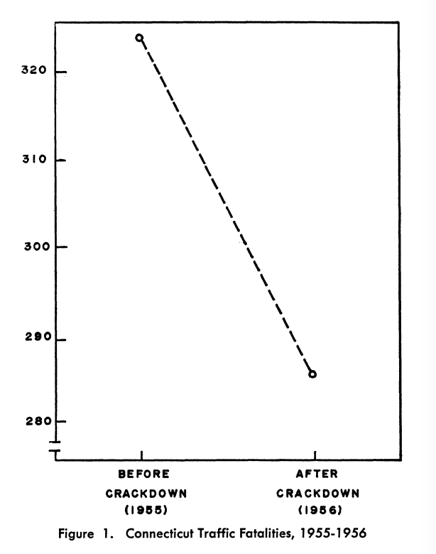

## Connecticut 1956

What kinds of omitted variables does this comparison address?

>- All omitted variables that remain **constant** over time within the state.
>- Advantage: No need to know what these variables are, measure them, specify functional form, etc.

## Connecticut 1956

What kinds of omitted variables does this NOT address?

>- "history": bias related to **other** changes year-to-year changes
>- "maturation":  bias / confounding due to long-term trends
>- "testing": bias /confounding related to selection into "treatment" (what kinds of things led to the policy adoption)
>- "instrumentation": treatment induces change in measurement (non-random measurement error)
>- "regression": cases select into treatment due to extreme events, followed by return to the norm


---

Which problems does this figure address?

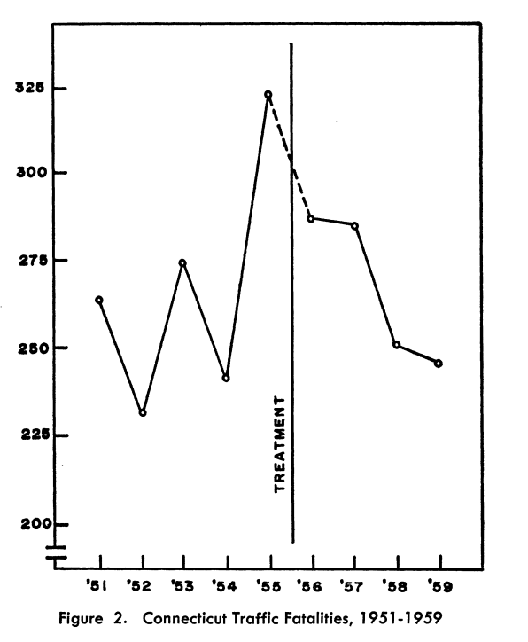


## Interrupted Time Series:

Design that formalizes previous image:

- After modeling the time trend, does "treatment" induce a change?
    - assuming no simultaneous confounders, selection effects, changes in measurement, "regression"

## Interrupted Time Series:

Estimate (linear) interrupted time series:

$Y_i = \beta_0 + \beta_1 event_i + \beta_2 time_i + \beta_3 event_i \times time_i + \epsilon_i$

Where $event_i$ is $0$ prior to the event, $1$ after; $time_i$ is number of days (or whatever unit of time) since the event (e.g., $0$ on the day, $-1$ the day before, $1$) the day after.

- frequently let time trend be non-linear.

## Interrupted Time Series:

### An Application: Mummolo 2017

Can top-down change in police oversight reduce bias in policing?

- Change in NY City Frisk policy: overnight police must provide explicit documentation of why they make a stop
- Does this change excessive use of force?

## Interrupted Time Series:

What is the point of this?

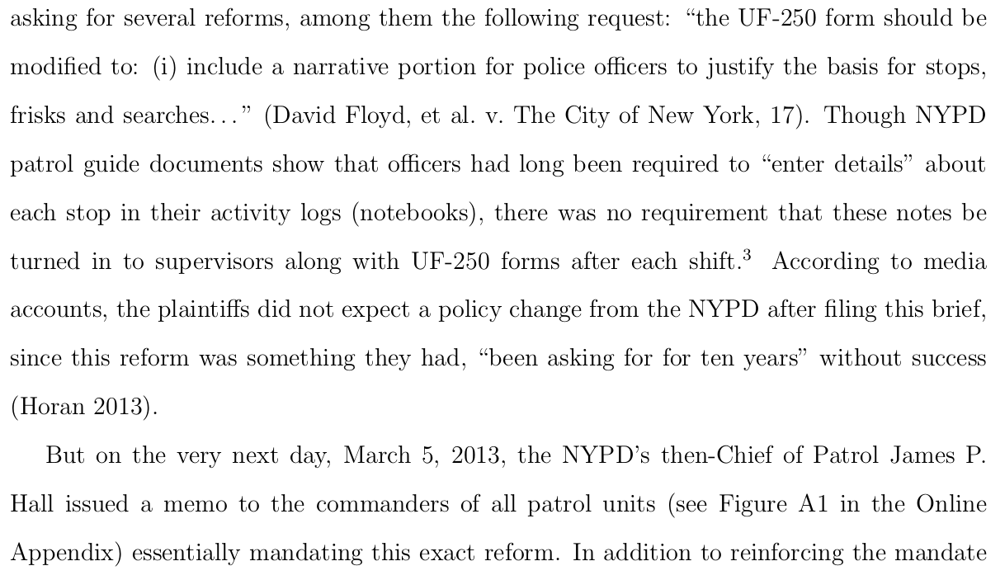


## Interrupted Time Series:

What is the point of this?

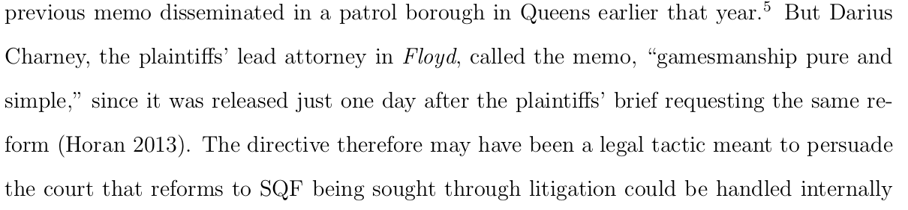


## Interrupted Time Series:


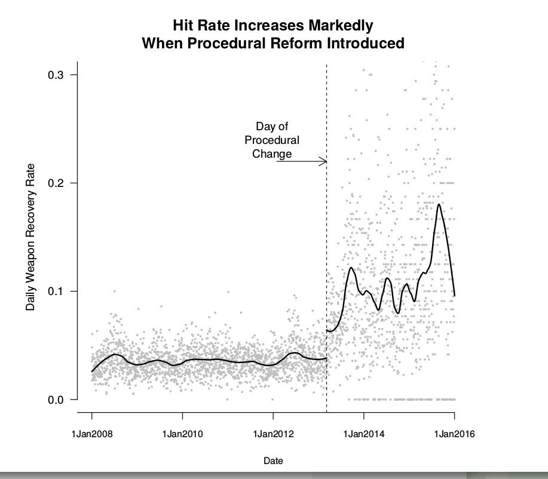


## Interrupted Time Series:


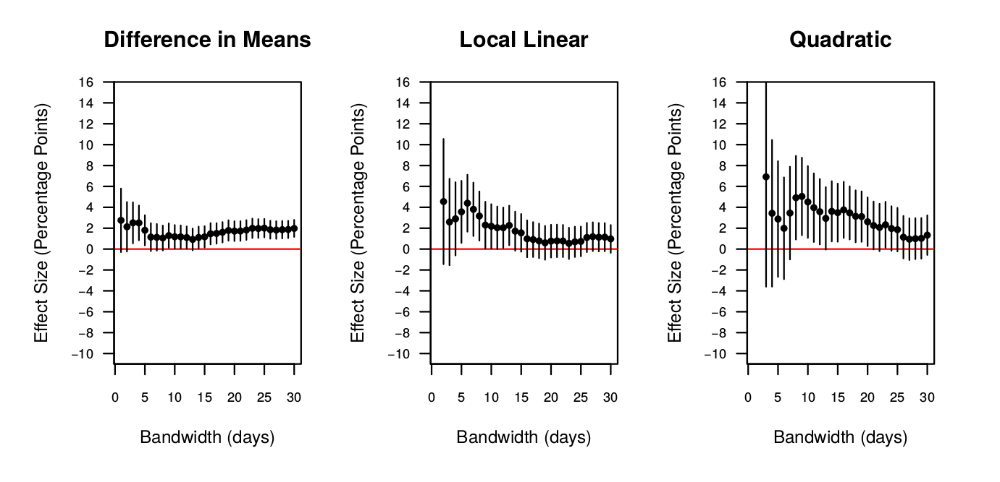


## Interrupted Time Series:


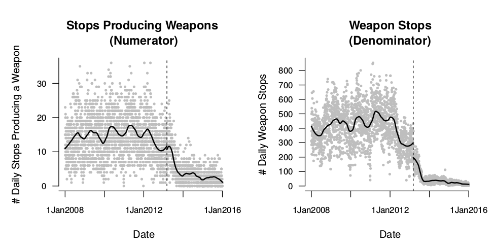


## Interrupted Time Series:


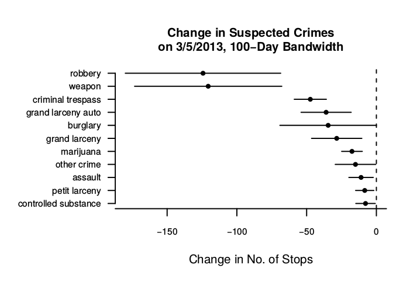


## Interrupted Time Series:

What is the point of this?

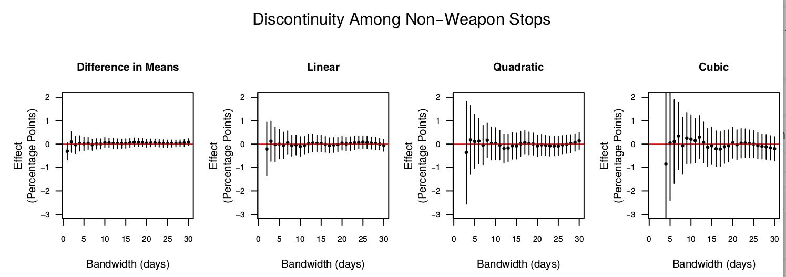

## Interrupted Time Series:

How does Mummolo address each of these concerns?

- "history": bias related to **other** changes year-to-year changes
- "maturation":  bias / confounding due to long-term trends
- "testing": bias /confounding related to selection into "treatment" (what kinds of things led to the policy adoption)
- "instrumentation": treatment induces change in measurement (non-random measurement error)
- "regression": cases select into treatment due to extreme events, followed by return to the norm


## Interrupted Time Series:

Central limitations:

- We have no "counterfactual" for the case **after "treatment"**
- Any **time-varying confounders** can still induce bias.
- How quickly does treatment take effect? How slowly does effect dissipate?
    - Mummolo, e.g., estimates effect directly at the implementation date.


## Difference-in-Difference:

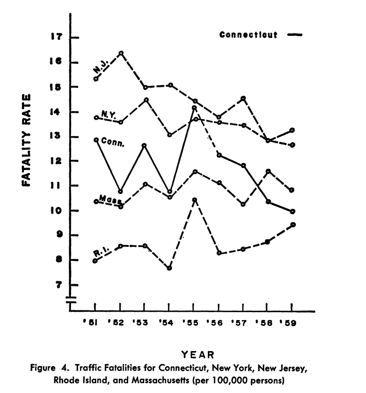

## Difference-in-Difference:

Extend the interrupted time-series:

- Compare $post - pre$ change in cases with "treatment" units versus "control"
    - $Treated_{post} - Treated_{pre}$ (first difference)
    - $Control_{post} - Control_{pre}$ (first difference)
    - $(Treated_{post} - Treated_{pre}) - (Control_{post} - Control_{pre})$ (Second difference)
    
- This can reveal the unbiased causal effect, assuming "parallel trends"
    - That is to say: "control" cases are not counterfactuals for "treated" case, but are the counterfactual *trend*

## Difference-in-Difference:

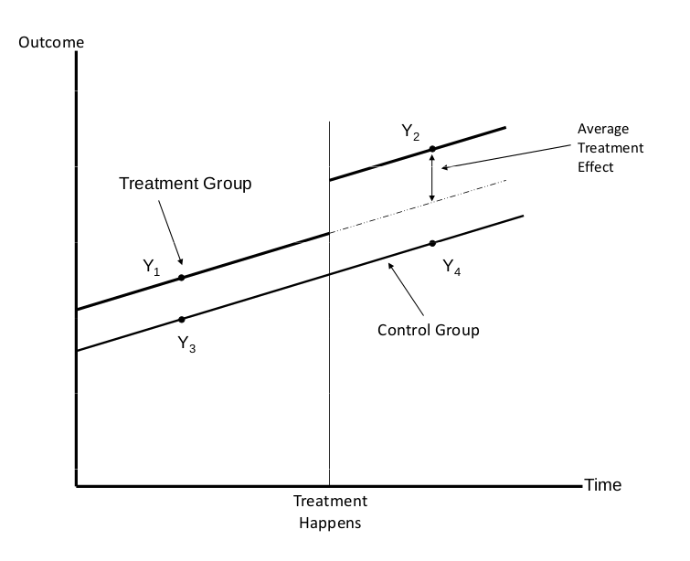

## Difference-in-Difference:

If parallel trends assumption holds, what kinds of confounding does this design eliminate?

>- Any time-invariant confounders within units
>- Any time-varying confounders that are **shared** by both treated cases and un-treated cases

>- Crucial to choose right "control" cases to have parallel trends or e.g. share as many time-varying confounders.

## Difference-in-Difference:

Implementation:

- With two "treatment" conditions, two time periods: calculate differences in means
- Use regression, with interaction term.

## Difference-in-Difference:

Example: Card and Krueger (2000)

> Do increases in the minimum wage increase unemployment in fast food?

- Examine bordering areas in New Jersey and Pennsylvania before and after increase in NJ minimum wage


## Difference-in-Difference:

Two ways to use regression:

$$Y_it = \beta_0 + \beta_1 treat_i + \beta_2 post_{t} + \beta_3 treat_i \times post_{t} + \epsilon_{it}$$

Where $treat_i$ is an indicator for being a unit that is ever treated. $post_t$ is an indicator for the observation being after the treatment takes place (1 if yes, 0 if no).


$$Y_{post} - Y_{pre} = \beta_0 + \beta_1 treat_i + \epsilon_i$$

## Difference-in-Difference:

How do we validate the **parallel trends** assumption?

- We cannot test fully, but we can check.

**Placebo Tests**:

- If "treatment" happens between time $t$ and $t+1$, we should not see an effect between $t-1$ and $t$?
- If design is right, there should be no effects of the treatment **prior** to the treatment taking place.
- If we "pass" placebo test, does not reject possibility that something **other than "treatment"** caused a change.
- You need multiple pre-treatment data points

## Difference-in-Difference:

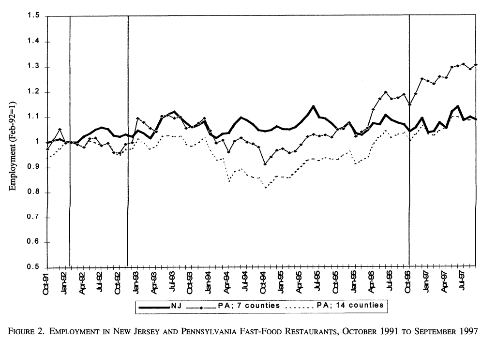

## Difference-in-Difference:

If we have multiple time-periods, multiple cases, we get **generalized difference-in-differences**:

- case-specific intercepts (dummy for each case: e.g. "country fixed effects"): capture time-invariant confounders within cases
- time-specific intercepts (dummy for each period of time): capture time-varying confounders that are shared across cases

## Difference-in-Difference:

$$Y_{it} = \alpha_i + \alpha_t + \beta X_{it}  + \epsilon_{it}$$

- $\alpha_i$ is a dummy for each unit $i$
- $\alpha_t$ is a dummy for each time period $t$
- $X_{it}$ is an indicator for the presence of the treatment in case $i$ and time $t$
- Why does the interaction of treatment and time period drop out of the model?

## Difference-in-Difference:

This model is equivalent to the following:

$$Y_{it} - \overline{Y_i} =  (\beta X_{it} - \overline{X_i}) + (\epsilon_{it} - \overline{\epsilon_i})$$

Or taking the difference of $X$ and $Y$ of each case from its mean. Any variables $Z_i$ that do not vary  over time are removed (and thus cannot confound).

## Fixed Effects

Example:

```{r, echo = F}
df = data.frame(g = rep(letters[1:5], each = 4),
                x = 1:20,
                y = 3 + rep(1:5, each = 4) + 0:-3 + rnorm(20, sd = 0.25) )
plot(df$x, df$y, xlab = 'X', ylab = 'Y', main = "Pooled Relationship between X and Y")
```

## Fixed Effects

Example:

```{r, echo = F}
plot(df$x, df$y, xlab = 'X', ylab = 'Y', main = "Pooled Relationship between X and Y")
abline(lm(y ~ x, df))
```

## Fixed Effects

Example:

```{r}
summary(lm(y ~ x, df))$coefficients
```   


## Fixed Effects

Example:

```{r, echo = F}
plot(df$x, df$y, xlab = 'X', ylab = 'Y', main = "Pooled Relationship between X and Y\nby group", type = 'n')
text(df$x, df$y, labels = df$g)
abline(lm(y ~ x, df))
```

## Fixed Effects

In this case, the overall relationship between $X$ and $Y$ is positive. But within each unit ($a \dots e$), the relationship is negative!

Unobserved factors might make each unit have higher levels of x and higher levels of y, but as x increases within a unit (where these unobserved factors are constant), y decreases.

**fixed effects** allow us to extract this within unit relationship between $X$ and $Y$

Contrast to **pooled effects** where we compare all observations to each other, not accounting for any unit-specific effects

## Fixed Effects

**How to use fixed effects**

We add dummy variables for each unit

**What does this do?**

- Estimates a separate intercept for each unit (or group) within the data
- Residual of $X$, is now the variation in $X$ around the mean within that unit.
- Eliminates any confounding related to **unchanging** attributes of the unit

>- Why is that?

>- Doesn't account for any confounding by variables that **change** over time

## Fixed Effects

Fixed effects results:

```{r}
summary(lm(y ~ x + g, df))$coefficients
```

## Fixed Effects

```{r, echo = F}
df$x_r = lm(x ~ g, df)$residuals
df$y_r = lm(y ~ g, df)$residuals
plot(df$x_r, df$y_r, xlab = "Residual X", ylab = "Residual Y", main = "Residual Y on X \nAfter Group Fixed Effects")
abline(lm(y_r ~ x_r, df))
```

## An Example:

What was the effect of enlistment in the US Civil War on voting for the Republican party?

$$GOP_{ie} = \alpha_i + \alpha_e + \beta Enlist_i \times PostWar_e + \epsilon_y + \epsilon_i$$

- $i$ is a county
- $e$ is a state-election (election year in a specific state)
- $y$ is a year between 1854 and 1880
- $PostWar$ indicates if election is after 1861 ($1$) or before ($0$)

## An Example:

A placebo test/relaxed assumptions

$$GOP_{ie} = \alpha_{i} + \alpha_{e} + 
\sum_{y = 1854}^{1920} \beta_y EnlistmentRate_i * Year_y + \epsilon_i + \epsilon_y$$

## An Example:


## Differences-in-Differences:

Key Assumptions:

- parallel trends: treated and untreated have same changes over time except for shift in treatment.
- equivalently: no time-varying omitted variable bias; no omitted variables correlated with changes in treatment, changes in outcome

Caveats:

- careful: check parallel trends
- careful: what happens when units are treated at different times?
- careful: STANDARD ERRORS! Clustering may not save you with small $N$.