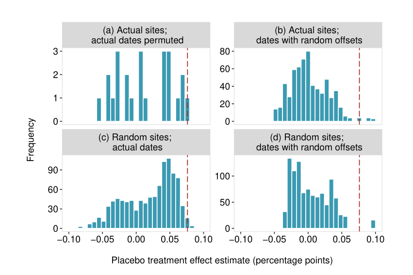

```{r setup, include = F}
require(knitr)
require(magrittr)
require(kableExtra)
require(ggplot2)
require(grid)
require(data.table)
require(UsingR)
require(modelsummary)
require(tidyverse)
require(haven)
require(fixest)
options("kableExtra.html.bsTable" = T)

```

# Uncertainty

<style type="text/css">
  .reveal h2,h3,h4,h5,h6 {
    text-align: left;
  }
  .reveal p {
    text-align: left;
  }
  .reveal ul {
    display: block;
  }
  .reveal ol {
    display: block;
  }
  .table-hover > tbody > tr:hover { 
  background-color: #696969;
  color: #FFFFFF;
  }
</style>


---

### Outline

- Perspectives on Uncertainty
- Review of Sampling Distributions (quick)
- How we estimate sampling distributions
- How we use sampling distributions:
    - hypothesis tests
    - confidence intervals
    - equivalence tests

---

# Uncertainty

---

So far...

- We have covered assumptions required for regression to give us unbiased estimate of causal effect.

- We have considered the **ways this can go wrong** $\to$ choices we can make in analyses to see if our conclusion of a causal effect is wrong

- But we have not considered whether we could see observed effects **by chance**

---

To see what could have happened by chance, we need "sampling distributions"

 > "You give me the rule, and I consider its latitude for erroneous outputs. We're actually looking at the probability distribution of the rule, over outcomes in the sample space. This distribution is called a sampling distribution." (Mayo 2018)

What are the other (*counterfactual*) outcomes that we could have observed through implementing this procedure/test?


---


**unbiased**  causal effect estimates; correctly describing **sampling distributions** 

both require **correctly describing counterfactuals**


# Recap


Sampling Distributions (quickly)

---

### Paluck (2010)

>  Intolerance: "I would not like that group to belong to my community association"; (1 = totally disagree; 4 = totally agree)

| $Region_i$ | $Y_i(1)$ | $Y_i(0)$ |
|---------|---------|---------|
| 1       | 3       | 2       | 
| 2       | 4       | 4       | 
| 3       | 4       | 2       | 
| 4       | 2       | 3       | 
| 5       | 2       | 4       | 
| 6       | 4       | 1       | 

---

### What are the unit treatment effects? ($\tau_i$)

| $Region_i$ | $Y_i(1)$ | $Y_i(0)$ |
|---------|---------|---------|
| 1       | 3       | 2       | 
| 2       | 4       | 4       | 
| 3       | 4       | 2       | 
| 4       | 2       | 3       | 
| 5       | 2       | 4       | 
| 6       | 4       | 1       | 

---

### What is the Average Causal Effect ($ACE$)?

| $Region_i$ | $Y_i(1)$ | $Y_i(0)$ |
|---------|---------|---------|
| 1       | 3       | 2       | 
| 2       | 4       | 4       | 
| 3       | 4       | 2       | 
| 4       | 2       | 3       | 
| 5       | 2       | 4       | 
| 6       | 4       | 1       | 

---

### Imagine we run this experiment 

- We set 3 regions in treatment (soap opera + talk show)

- We set 3 regions in control (soap opera only)

- How many possible random assignments are there?

- What are all possible random assignments (to treatment and control)?
    - on paper/in `R`

---

For each randomization, calculate the $\widehat{ACE}$ (hint, express this in fractions $\frac{x}{3}$)


| $Region_i$ | $Y_i(1)$ | $Y_i(0)$ |
|---------|---------|---------|
| 1       | 3       | 2       | 
| 2       | 4       | 4       | 
| 3       | 4       | 2       | 
| 4       | 2       | 3       | 
| 5       | 2       | 4       | 
| 6       | 4       | 1       | 

---

Let's check our work:

```{r, echo = F}
p_o_table = data.table(region_i = 1:6,
                       y_i_1 = c(3,4,4,2,2,4),
                       y_i_0 = c(2,4,2,3,4,1)
                      )
p_o_table$tau_i = p_o_table$y_i_1 - p_o_table$y_i_0
p_o_table[, tau_i := y_i_1 - y_i_0]

#ACE
ace = mean(p_o_table$tau_i)

randomizations = combn(6,3,simplify = T) %>% t

t_means = apply(randomizations, 1, 
                function(x) 
                  mean(p_o_table[region_i %in% x, y_i_1])
                )

c_means = apply(randomizations, 1, 
                function(x) 
                  mean(p_o_table[!(region_i %in% x), y_i_0])
                )

ace_hats = t_means - c_means

#Expected value of the ACE (hat)
e_ace_hat = mean(ace_hats)


hist(ace_hats,
     xlab = "ACE-hat",
     main = "Sampling Distribution of ACE-hat",
     breaks = 20)
abline(v = ace, col = 'red')

```

--- 

### Sampling Distribution


This histogram is the **exact sampling distribution** of the $\widehat{ACE}$ in this experiment

> "You give me the rule, and I consider its latitude for erroneous outputs. We're actually looking at the probability distribution of the rule, over outcomes in the sample space. This distribution is called a sampling distribution." (Mayo 2018)

What are the other (counterfactual) outcomes that we could have observed through implementing this procedure/test?

---

### Sampling Distributions

What process produces the sampling distribution?

We want to compare what we observe in our test against what we **might have observed** counterfactually, under the **assumed data-generating process**.

- compare what we observe against what we could have observed (if null hypothesis were true, e.g.)

---

### Sampling Distributions


Hypothesis tests, Confidence intervals, Equivalence tests involve:

- estimate some parameter/estimand
- **estimate** sampling distribution (under an ASSUMED data generating process): we estimate standard errors
- what is probability of observing this estimate, using this process, assuming some true value of the parameter/estimand. (or what is probability that we draw conclusion of effect **in error**)

---

### Sampling Distributions

But, we never know the **true sampling distribution**.

We can only estimate and use these estimated sampling distribution...

**if they emerge from some random/stochastic process**

We either **know** (experiment) or must make **assumptions about** (any other research design) that random process.

---

### Sampling Distributions

What kinds of assumptions do we make?

First:

**What** do we want to make **inferences** about? $\to$ different SOURCES of randomness

- statistics is to make inferences about unknown quantities. 
- if the unknown is about a **population** $\to$ it is a descriptive inference
- if the unknown is about **potential outcomes** $\to$ it is a causal inference

---

### Sampling Distributions

What kinds of assumptions do we make?

Second:

At what **level of analysis** does randomness occur? (at what level are we taking **independent** draws?) $\to$ different sampling distributions

- do we sample **individuals** or **groups of individuals**? Are individuals randomized into treatment? Or are villages (with many individuals) randomized into treatment.

---

### Sampling Distributions

What kinds of assumptions do we make?

Third:

What are the assumptions/properties of the **estimator** (for our sampling distribution)?

- There are analytical solutions; bootstrap methods; etc.
- All estimators involve specific assumptions to "work"
- **and** "working well" depends on the attributes of the analysis (e.g. sample size, number of clusters, degree of spatial correlation, etc.)

---

### Sampling Distributions

What kinds of assumptions do we make?

Fourth:

What are the relevant hypotheses to consider?

- Are we comparing against a meaningful null? (e.g., should null be $0$? should we  be doing an equivalence test?)

---

### Sampling Distributions

1. **What** do we want to make **inferences** about? (To start)
2. At what **level of analysis** does randomness occur? (Clustering; Spatial)
3. What are the assumptions/properties of the **estimator**? (So many estimators, we will cover a few)
4. What are the relevant hypotheses to consider? (Briefly at the end)


# Source of Randomness

---

### What is the source of randomness?

[Abadie et al (2020)](https://onlinelibrary.wiley.com/doi/abs/10.3982/ECTA12675) describe three possible types of inferences.

$N$ is observed cases from population $n$. $Z$ is either $1,0$. $Y(z)$ indicates a potential outcome. $R$ is $1,0$ and indicates case $i$ is observed.

1. **Descriptive**: difference in mean of $Y$ across $Z$:  $E[Y|Z==1] - E[Y|Z==0]$ for the population $n$.

2. **Causal**: mean difference in potential outcomes of $Y$ across $Z$: $E[Y(1) - Y(0)]$ for population $n$

3. **Causal-Sample**: mean difference in potential outcomes of $Y$ across $Z$: $E[Y(1) - Y(0)]$ for observed sample $N$

---

Only for details:

$$\theta^{descriptive} = \frac{1}{n_1}\sum\limits_i^n Z_iY_i - \frac{1}{n_0}\sum\limits_i^n (1-Z_i)Y_i$$

$$\theta^{causal} = \frac{1}{n}\sum\limits_i^n Y_i(1) - Y_i(0)$$

$$\theta^{causal,sample} = \frac{1}{N}\sum\limits_i^n R_i(Y_i(1) - Y_i(0))$$

---

### Design vs. Sampling Variability

Imagine we want to examine whether contact with refugees increases support for increasing refugee admission to Canada.

To investigate this, we conduct a **random sample** survey of Canadian adults where we:

(1) measure (without error) whether they have a refugee neighbor
(2) measure (without error) support for increasing refugee admission rates
(3) have knowledge of random assignment of refugee neighbors (with or without compliance)

---

### Design vs. Sampling Variability

If we want to infer **descriptively** the difference in mean support for increasing refugee admission rates among those with a refugee neighbor and those without ...

- among **All Canadian adults**

>- Where does the sampling distribution come from in this case?
>- What happens to the sampling distribution as the number of people surveyed approaches the total population of all Canadians? (does it get narrower? wider? not change?)

---

### Design vs. Sampling Variability

If we want to infer **causally** the effect of a refugee neighbor on  mean support for increasing refugee admission rates...

- among **All Canadian adults**


>- Where does the sampling distribution come from in this case?
>- What happens to the sampling distribution as the number of people surveyed approaches the total population of all Canadians?

---

### Design vs. Sampling Variability

If we want to infer **causally** the effect of a refugee neighbor on  mean support for increasing refugee admission rates...

- among **those in the survey**

>- Where does the sampling distribution come from in this case?
>- What happens to the sampling distribution as the number of people surveyed approaches the total population of all Canadians?

---

### Design vs. Sampling Variability

Some randomness comes from a **random process** of **sampling cases** from a population. As the sample approaches the full population, this variability goes to 0.

Some randomness comes from a **random process** of realizing some **potential outcomes** versus other potential outcomes. As the sample approaches the full population, this variability does not approach 0.

---

### Estimating Sampling Distributions

In practice...

we have one realization of the data generation process. We attempt to estimate the sampling distribution of what---counterfactually---would have happened in other applications of this process.

... we claim/argue that data are produced by a random process. In absence of an experiment, or actual random sample, we must be careful in making this argument.

... absent random-assignment, we implicitly invoke as-if random assignment (given conditional independence).


# Estimating Standard Errors


---

### Estimating Sampling Distributions

We are going to assume for now that **assignment to treatment** is (as-if/conditional on covariates) **randomly assigned** at the  **individual** level.

**Good news**: there are good default choices for all three scenarios that we can use to **estimate**  standard errors (standard deviation of sampling distribution)

**Bad news**: these estimated standard errors are conservative (too big)

If you want to do better than default choices, the estimators can get more complicated. So many possible choices.

---

### Estimating Sampling Distributions

When we estimate sampling distributions, ask:

- Does this SE estimator correspond to the estimand of interest? (causal, descriptive)
- Does this estimator reflect the level at which observations are produced  independently though random process? (units, clusters, spatial, etc.)
- Does my application meet requirements for **asymptotic properties** of estimator to apply?
   - standard errors invoke asymptotic **consistency** under specified conditions (how many observations/clusters/etc)
   - application of standard errors appeals to asymptotic normality


---

### Estimating Sampling Distributions

- Basic framework: sampling vs design errors
- "Robust" standard errors
- How to get them in R
- Other kinds of standard errors

---

### SE$s$ with Least Squares

To understand SEs in least squares, we need to introduce a statistical model. 

$$Y_i = \beta_0 + \beta_1 D_i + \beta_2 X_i + \epsilon_i$$

This is the **population model**: 

- if we are making a descriptive inference, it tells us the coefficients we would get if we could run least squares on the entire **population** of interest.

- if we are making a causal inference, it tells us the coefficients we would get if we could observe **all potential outcomes** for **all cases** (in the sample, or population, depending).

---

### SE$s$ with Least Squares

To understand SEs in least squares, we need to introduce a statistical model. 

$$Y_i = \beta_0 + \beta_1 D_i + \beta_2 X_i + \epsilon_i$$

This is the **population model**: 

>- We've seen some of this ($Y$, and $\beta$) before. What is this $\epsilon_i$?

${n.b.:}$ We **do not** need to assume the that true relationship between $D$ and $Y$ is linear. $\beta_1$ is just the average partial derivative/best linear approximation of the (possibly non-linear) CEF.

---

### SE$s$ with Least Squares

$$Y_i = \beta_0 + \beta_1 D_i + \beta_2 X_i + \epsilon_i$$

Typically, regression standard errors are taught by thinking of $\epsilon_i$ as a random error pulled out of a box.

>- In what way is $\epsilon_i$ a "random error"?


---

### SE$s$ with Least Squares (Classic Interpretation)

The statistical model assumes that this linear equation describes the process generating the data.

$$Y_i = \beta_0 + \beta_1 D_i + \epsilon_i$$

**deterministic** (not random)
$\beta_0 + \beta_1 D_i$

**stochastic** (random error)  (*independent* and *identically distributed*)
$\epsilon_i$

---

```{r, echo = T}
d = rnorm(100); y = 3 + d * 0.5 
```

```{r, echo = F}
plot(d, y, main = bquote(Y[i] == alpha + beta * D[i])); abline(a = 3, b = 0.5)
```

---

```{r, echo = T}
epsilon_i = rnorm(100); y_star = 3 + d * 0.5 + epsilon_i
```

```{r, echo = F}
plot(d, y_star, main = bquote(Y[i] == alpha + beta * d[i] + epsilon[i]))
abline(a = 3, b = 0.5)
```

---

### $\epsilon$ as Model-based Error

This approach is in many textbooks; it derives standard errors as **model-based** errors.

- this is confusing/unsatisfying: what is "pulling an error" out of a box?
- makes unnecessary assumptions (effects are homogeneous; underlying process **actually** linear )

Better to think of $\epsilon$ as design (treatment assignment) or sampling based errors.

---

### $\epsilon$ as Design-based Error

We start with (both) potential outcomes in a "switching" equation:

$$Y_i = (1-D_i)Y_i(0) + D_iY_i(1)$$

$$Y_i = Y_i(0) - D_iY_i(0) + D_iY_i(1)$$

$$Y_i = Y_i(0) + D_i[Y_i(1) - Y_i(0)]$$

$$Y_i = Y_i(0) + D_i\underbrace{\tau_i}_{\text{unit causal effect}}$$

---


$$Y_i = Y_i(0) + D_i\underbrace{\tau_i}_{\text{unit causal effect}}$$


$$Y_i = E[Y(0)] + D_i\tau_i + \overbrace{(Y_i(0)-E[Y(0)])}^{i\text{'s deviation from mean }Y(0)}$$

$$Y_i = E[Y(0)] + D_iE[\tau] + \nu_i + D_i\overbrace{(\tau_i - E[\tau])}^{i\text{'s deviation from mean }\tau}$$

$$Y_i = \beta_0 + D_i\beta_1 + \overbrace{\nu_i + D_i\eta_i}^{i\text{'s deviation from }E[Y|D]}$$

$$Y_i = \beta_0 + D_i\beta_1 + \epsilon_i$$

---

### $\epsilon$ as Design-based Error

$\epsilon_i$ is a random error in the following sense:

- error: individual deviations (heterogeneity) from mean $Y(0)$ and mean $\tau$. (Also note: because of this, $E[\epsilon_i] = 0$)
- random: $\epsilon$ differs as a function of (as-if) random process of assigning treatment (value is different when $D_i = 0$ vs $D_i = 1$)

Additionally:

- **not identically distributed**: possible values of $\epsilon$ for each individual depends on their potential outcomes. (Each unit draws $\epsilon$ out of its own "box")

---

### $\epsilon$ as Design-based Error

If we are **conditioning** as a research design...

Assuming **conditional independence** is necessary for **both** estimating causal effects without bias... 

**and** estimating sampling distribution.


"Conditional independence" assumes "as-if" random assignment to treatment, conditional on covariates. How does this "as-if" random process take place?

---

### $\epsilon$ as Sampling-based Error

$$Y_i = \beta_0 + \beta_1 D_i + \beta_2 X_i + \epsilon_i$$

When we see errors arising from sampling: $\beta_0$, $\beta_1$, $\beta_2$ are the the coefficients we would observe if we did this regression for the **whole population**.

$\epsilon_i$ is the prediction error for individual $i$ from this **population model**.  It is a **random variable** in the sense that only $\epsilon_i$ varies from case to case, and by **randomly sampling individuals**, we randomly sample $\epsilon_i$.

---

```{r echo = F, include = T, message=F, warning=F}
n = 5000
N = 100
x = rnorm(n)
y = x + 0.5*x^2 + -0.5*x^3 + 2*rnorm(n)

pop_m = lm(y ~ x)
pop = data.table(x = x, y = y, epsilon = pop_m$residuals)


ggplot(pop, aes(x = x, y = y)) + 
  geom_point(alpha = 0.05) + 
  geom_smooth(method = 'lm', fullrange = T, se = F) +
  ggtitle("Population and Population Model") + 
  theme_bw()

```

---

```{r echo = F, include = T, message=F, warning=F}

pop[, sample := (1:.N) %in% sample(1:n, N)]

ggplot(pop, aes(x = x, y = y )) + 
  geom_point(alpha = 0.05) + 
  geom_smooth(method = 'lm', fullrange = T, se = F) +
  geom_point(data = pop[(sample),], alpha = 1, colour = 'red') +
  geom_smooth(data = pop[(sample),], method = 'lm', fullrange = T, se = F, colour = 'darkred') +
  ggtitle("Sample and Estimated Model") + 
  theme_bw()
```

---

```{r echo = F, include = T, message=F, warning=F}

pop[, sample := (1:.N) %in% sample(1:n, N)]

ggplot(pop, aes(x = x, y = y )) + 
  geom_point(alpha = 0.05) + 
  geom_smooth(method = 'lm', fullrange = T, se = F) +
  geom_point(data = pop[(sample),], alpha = 1, colour = 'red') +
  geom_smooth(data = pop[(sample),], method = 'lm', fullrange = T, se = F, colour = 'darkred') +
  ggtitle("Sample and Estimated Model") + 
  theme_bw()
```

---

```{r echo = F, include = T, message=F, warning=F}

pop[, sample := (1:.N) %in% sample(1:n, N)]

ggplot(pop, aes(x = x, y = y )) + 
  geom_point(alpha = 0.05) + 
  geom_smooth(method = 'lm', fullrange = T, se = F) +
  geom_point(data = pop[(sample),], alpha = 1, colour = 'red') +
  geom_smooth(data = pop[(sample),], method = 'lm', fullrange = T, se = F, colour = 'darkred') +
  ggtitle("Sample and Estimated Model") + 
  theme_bw()
```

---


```{r echo = F, include = T, message=F, warning=F}
k = 1000
out = data.frame(alpha_hat = rep(NA, k), beta_hat =  rep(NA,k))
for(i in 1:k){
  pop[, sample := (1:.N) %in% sample(1:n, N)]
  bs_m = lm(y ~ x, pop[(sample)])
  out[i,] = bs_m$coefficients
}

ggplot(pop, aes(x = x, y = y )) + 
  geom_point(alpha = 0.05) + 
  geom_smooth(method = 'lm', fullrange = T, se = F, colour = 'darkred') +
  geom_abline(intercept = out$alpha_hat, slope = out$beta_hat, colour = 'red', linetype = 'dashed', alpha = 0.025) + 
  theme_bw() + labs(title = 'Lines from 1000 possible samples')
```

---

### SEs with Least Squares

Whether we have random variability induced by design or sampling, we can't directly observe our vector of coefficients $\pmb{\beta}$.

But we can estimate it:

$$\pmb{\widehat{\beta}} = (\mathbf{X}'\mathbf{X})^{-1}\mathbf{X}'\mathbf{Y}$$

- Note: $\pmb{\widehat{\beta}}$ is a random vector; each element is a **random variable**. **Why?**

---

$Y_i = \pmb{X_i\beta} + \epsilon_i$

$\epsilon_i$ is random variable.

If we were to repeat the drawing of $\epsilon$ again - a different sample, a different (as-if) randomization - we would get different estimates: $\pmb{\widehat{\beta}}$.

This gives rise to a **sampling distribution** for $\pmb{\widehat{\beta}}$.

- this sampling distribution can be characterized by a **standard error**
- because least squares is extension of the mean (a function of sums), CLT $\implies$ asymptotic normality as $n \to \infty$

---


```{r, echo = F, warning=F, message=F}

ggplot(out, aes(x = beta_hat)) + geom_histogram() + theme_bw() + ggtitle(bquote("Sampling Distribution of "~.(bquote(hat(beta))))) +
  xlab(bquote(hat(beta)))

```

---

### SE$s$ with Least Squares

- Each element of $\pmb{\widehat{\beta}}_{p \times 1}$ is a random variable
    - each $\widehat{\beta}_p$ has a variance 
    - and a **covariance** with other $\widehat{\beta}_{q\neq p}$
- These variances and covariances are found in the variance-covariance matrix of $\pmb{\widehat{\beta}}$
    - a $p \times p$ matrix
    - **Diagonal** elements are the **variances** for $\widehat{\beta}_{1} \dots \widehat{\beta}_p$
    - **off-diagonal** elements are **covariances**; (joint sampling distributions)
    - matrix is **symmetric**
    
---

Variance-Covariance Matrix

$$\scriptsize{\begin{pmatrix} Var(\widehat{\beta}_1) & Cov(\widehat{\beta}_1,\widehat{\beta}_2) & Cov(\widehat{\beta}_1,\widehat{\beta}_3) &\ldots & Cov(\widehat{\beta}_1,\widehat{\beta}_p) \\
  Cov(\widehat{\beta}_2,\widehat{\beta}_1) & Var(\widehat{\beta}_2) & Cov(\widehat{\beta}_2,\widehat{\beta}_3) & \ldots & Cov(\widehat{\beta}_2,\widehat{\beta}_p) \\ 
  Cov(\widehat{\beta}_3,\widehat{\beta}_1) & Cov(\widehat{\beta}_3,\widehat{\beta}_2) & Var(\widehat{\beta}_3) & \ldots & Cov(\widehat{\beta}_3,\widehat{\beta}_p) \\ 
  \vdots & \vdots & \vdots & \ddots & \vdots \\
  Cov(\widehat{\beta}_p,\widehat{\beta}_1) & Cov(\widehat{\beta}_p,\widehat{\beta}_2) & Cov(\widehat{\beta}_p, \widehat{\beta}_3) & \ldots & Var(\widehat{\beta}_p)\end{pmatrix}}$$


---

### SEs with Least Squares

**How do we use the variance-covariance matrix?**

- The square-root of diagonal elements (variances) gives **standard error** for each estimate in $\pmb{\widehat{\beta}}$ (hypothesis testing, confidence intervals)

- The off-diagonal elements can help answer: $\beta_2 + \beta_3 \neq 0$. We need $Cov(\beta_2, \beta_3)$ to get $Var(\beta_2 + \beta_3)$. (complex hypothesis testing, e.g. interaction effects )

---

### Variance-Covariance Matrix

Because we only observe one realization of the data generating process, we cannot observe the sampling distribution(s) that are described by this variance-covariance matrix.

We must **estimate** it.

Commonly we use an **analytic** approach. (An equation we can use to estimate)

---

A derivation (only the endpoint is necessary)

$\pmb{\widehat{\beta}} = \pmb{\beta} + (\mathbf{X}'\mathbf{X})^{-1}\mathbf{X}'\epsilon$, So:

$$cov(\pmb{\widehat{\beta}}|X) = E((\pmb{\widehat{\beta}} - \pmb{\beta})(\pmb{\widehat{\beta}} - \pmb{\beta})' | X)$$

$$ = E(  ((\mathbf{X}'\mathbf{X})^{-1} \mathbf{X}'\epsilon)((\mathbf{X}'\mathbf{X})^{-1} \mathbf{X}'\epsilon)' | X)$$

$$ = E(  ((\mathbf{X}'\mathbf{X})^{-1}\mathbf{X}'\epsilon)(\epsilon'\mathbf{X}(\mathbf{X}'\mathbf{X})^{-1}) | X)$$

$$ = (\mathbf{X}'\mathbf{X})^{-1}\mathbf{X}'E(\epsilon\epsilon'|X)\mathbf{X}(\mathbf{X}'\mathbf{X})^{-1}$$

What really matters here is: $E(\epsilon\epsilon'|X)$

---

### Variance-Covariance Matrix

All analytic variance-covariance matrix estimators are "sandwiches":

$$ (\mathbf{X}'\mathbf{X})^{-1}\mathbf{X}'E(\epsilon\epsilon'|X)\mathbf{X}(\mathbf{X}'\mathbf{X})^{-1}$$

$(\mathbf{X}'\mathbf{X})^{-1}\mathbf{X}'$ is the "bread"; $E(\epsilon\epsilon'|X)$ is the "meat". 

The bread is always the same. As we change assumptions about the random process, we make different choices of "meat". (Insert your own charcuterie analogy here)

---

### Variance-Covariance Matrix

In groups: if $\epsilon$ is a vector that is $n \times 1$ with elements $(\epsilon_1 \ldots \epsilon_n)$. 

1. What are the dimensions of the result of this calculation: $\epsilon\epsilon'$?

2. What are the elements on the **diagonal**? (What value do they take - in terms of $\epsilon_i$?)

3. What is the **expected value** of the elements on the **off-diagonal**  (We have assumed that $\epsilon_i$ are **independent** of each other. And by design, in the population model, $E[\epsilon_i] = 0$)

---

### Variance-Covariance Matrix

- If $i \neq j$, the elements of the matrix are $\epsilon_i\epsilon_j$. Because, by assumption, $E[\epsilon_i] = 0$, this is the same as $(\epsilon_i - E[\epsilon_i])(\epsilon_j - E[\epsilon_j])$: a covariance. Because $\epsilon$s are **independent**,  $E[\epsilon_i\epsilon_j] = E[\epsilon_i]E[\epsilon_j] = 0 \times 0 = 0$ 
- but, for $i = j$, $\epsilon_i^2 = (\epsilon_i - E[\epsilon_i])^2$ (a **variance**)

---

### Variance-Covariance Matrix

Because we don't observe $\epsilon_i$, we have to **estimate** them by plugging in **residuals**.

$$\hat{\epsilon_i} = e_i = Y_i - \mathbf{X_i\widehat{\pmb\beta}}$$
where $\mathbf{X_i}$ is the full design matrix, including $D_i$

---

### Robust Standard Errors:

If we plug in $e_i^2$ in for $\epsilon\epsilon'$, we get:

**Eicker-Huber-White SE** estimator: often called the "robust" standard errors. They are "robust" in the sense that they make no assumption about the $\epsilon_i$ other than that they are **independent**.

- $ehw$ SEs are conservative or just right for sampling or design-based variability.

(Return to matrix on Board)

---

### Robust Standard Errors:

These should be our default standard errors (see Aronow and Miller pp. 153-154)

- but `lm`, most software does not give you these standard errors.


---

### Robust Standard Errors:

**What are the assumptions/properties of our estimators**?

The $ehw$ SE estimator generates **estimates**, not miracles.

- only applies if assumptions are correct, asymptotic properties "kick in"
- this estimator is not **unbiased** but **consistent** are $n \to \infty$
- If $n$ is too small, $ehw$ SEs can be too small (see Angrist and Pischke section )

---

### Robust Standard Errors:

The "robust" SE estimators come in other flavors, with different asymptotic properties

- $ehw$ is "HC0", but there are HC1, HC2, HC3, HC4, HC5.
- $HC0$ and $HC1$ work best if $N >> 200$
- $HC3$ works if $N > 30$ (should be default, but doesn't always compute)


---

In "ordinary" least squares (OLS)  we assume:
 
 $\epsilon_i$ are **independent** *and* **identically distributed**. That is, they come from a single distribution with the same variance.

- **heteroskedasticity** vs **homoskedasticity**
- In the "meat" matrix, off-diagonals are still $0$ by assumed independence.
- But assume $\epsilon_i$ are **identically distributed**, so $Var(\epsilon_i) = \sigma^2$ for all $\epsilon_i$. Estimate $\widehat\sigma^2 = Var(e_i)$, plug in $\widehat\sigma^2$ on diagonal.

These are the default standard errors in `lm`, most software.

[note on multi-collinearity](#collinear)

---

### Robust Standard Errors:

In `R`:

- `sandwich` package (to get robust errors)
- `lmtest` package
- `fixest` package
- pass standard errors to table-making package

---

### Robust Standard Errors:

In `R`:

1. Estimate your model
2. Plug model into robust variance-covariance estimator (usually `vcovHC` from `sandwich` package)

3a. Take `sqrt` of diagonal, manually.

3b. In "pretty" format using `coeftest` from `lmtest` package, or in `modelsummary` tables.

---

```{r}
suffrage = read.csv("https://www.dropbox.com/scl/fi/y5wvmmhhknzbpdufaql9p/referenda_vote.csv?rlkey=1z2hromullprdzumkrawu5n21&dl=1")
```

2. create `enlist_rate = veterans/mil_age`
3. Regress `suff65_yes` on `enlist_rate`, `suff57_yes`, and `state` using `lm`. 
4. Use the `vcovHC` function in the `sandwich` package to get the HC0  vcov matrix (call it `vcov_hc0`)
5. Use the `vcovHC` function in the `sandwich` package to get the HC3 vcov matrix (call it `vcov_hc3`).
6. Use `diag` and `sqrt` to get the robust standard errors 
7. Compare homoskedastic to HC0 and HC3 standard errors for `enlist_rate`.

---


```{r, echo = F, message = F, warning = F}
veterans = suffrage %>% as.data.table
veterans[, enlist_rate := veterans/mil_age]
```

```{r,  message = F, warning = F}
require(sandwich)
require(lmtest)
#1: Estimate OLS / conventional Standard Errors
lm_suff = lm(suff65_yes ~ enlist_rate + suff57_yes + state, 
             data = veterans)

#2: Estimate robust variance covariance matrix:
vcov_robust = vcovHC(lm_suff, type = "HC3")

#3: SE
vcov_robust %>% diag %>% sqrt
#coeftest(lm_suff, vcov. = vcov_robust)
```


---

Or, you can make nice looking tables more easily...

```{r, eval = F, message=F, warning = F}
require(modelsummary)
modelsummary(lm_suff, vcov = c('classical', paste0("HC", 0:3)), 
             gof_omit = 'Log.Lik.|F|AIC|BIC|Adj', 
             stars = T)

```

---

```{r echo = F, message=F, warning = F}
require(modelsummary)
modelsummary(lm_suff, vcov = c('classical', paste0("hc", 0:3)), 
             gof_omit = 'Log.Lik.|F|AIC|BIC|Adj|RMSE',
             stars = T)

```


---

### Robust Standard Errors:

We should default to them.

- May be conservative (especially if estimand is descriptive, as sample approaches population)
- but with smaller $n$ maybe biased
- In practice, always a good idea to check conventional and robust standard error in different flavors. Be specific in reporting which robust error estimators you use.

# Different Random Assignment Process

---

### Different Sampling Distributions

We obtain $ehw$ standard errors when potential outcomes/sampling processes are random and **independent**.

What if there is **dependence** in the $\epsilon_i$? 

Rather: what if assignment to treatment is not randomly assigned to individuals, but to groups?


---

### Clustered Standard Errors:

There are estimators for standard errors for situations in which errors are not independent of each other across observations:

- Recall the experiment by Paluck from earlier: villages were assigned to treatment, but villagers were her unit of analysis.
- Likely to be similarities in the $\tau_i$ or $Y_i(0)$ among people from the same village. When we assign all people in a village to treatment, there is dependence in the $\epsilon_i$ we get.

---

### Clustered Standard Errors:

Ignoring dependence of errors usually **underestimates** sampling variability of an estimator. Why?

>- Luckily we have a solution: change the "meat" in our variance-covariance matrix.

---

### Clustered Standard Errors:

Extends robust standard errors:

Allows for arbitrary **dependence** of errors **within groups**...

  - could be same unit OVER time;
  - could be different units AT THE SAME time;
  - could be both!
  
...by permitting off-diagonal covariance $\epsilon_i\epsilon_j$  to be non-zero for $i \neq j$ but $i$ and $j$ are part of the same "cluster". (to the board)

---

### Clustered Standard Errors:

Similar to $ehw$ standard errors...

- we plug in the values of $e_i$ for $\epsilon_i$.
- biased but **consistent** as **number of clusters** gets larger. Usually needs tens of clusters (~40 +), **if clusters are of similar size** 
- if we have imbalanced cluster sizes, few clusters, special alternatives estimators might be needed.

---

### Clustered Standard Errors:

Unlike $ehw$ standard errors...

- Clustered standard errors can drastically change the standard error estimates.
- Sometimes they are smaller, because errors are negatively related within groups.


---

### Clustered Standard Errors:

In `R`: many options:

1. `felm` in `lfe` extends `lm` for panel models and includes clustering options
2. `feols` in `fixest` includes clustering options
3. `sandwich`: (finally!) has clustered errors options
4. Can also bootstrap them: `multiwayvcov`

---

### Clustered Standard Errors:

```{r, message=F, warning = F}
require(fixest)

m = feols(suff65_yes ~ enlist_rate + suff57_yes  | state, 
          cluster = ~ state, 
          data = veterans) 
```

---

```{r echo = F}

mm = lm(suff65_yes ~ enlist_rate + suff57_yes +  state, 
          data = veterans) 


modelsummary(list(mm,mm,m), vcov = list('classical', "HC0", NULL),
             gof_omit = 'Log.Lik.|F|AIC|BIC|Adj|RMSE|Within',
             coef_omit = "Intercept|state",
             stars = T)

```


Standard Errors are way smaller (but, with 2 clusters, not reliable!)

---

### Clustered Standard Errors:

Many specific features of these estimators to pay attention to: 

[Cameron and Miller (2015)](https://cameron.econ.ucdavis.edu/research/Cameron_Miller_JHR_2015_February.pdf)

When should we use clustering? [Abadie et al (2023)](https://academic.oup.com/qje/article/138/1/1/6750017)

- level at which "treatment" assigned/level at which sampling is conducted
- level at which plausible spatial or temporal autocorrelation of errors

Alternatively:

- aggregate data within clusters, use $ehw$

---

### Clustered Standard Errors:

When should you cluster? [Abadie et al (2023)](https://academic.oup.com/qje/article/138/1/1/6750017)

- If units sampled and assigned to treatment at (as-if) random, then no clustering
- If assignment to treatment is by cluster, then cluster (but if assignment to treatment is not perfectly clustered, "cluster robust errors" too conservative)
- If you are sampling clusters from a much larger population of clusters (repeated observations of individuals in survey; family members in a survey)


---

### Spatial Standard Errors:

What if treatment $D$ is a function of spatial distance to something (e.g., Kumbh Mela)? Is it possible there are **spatial trends** in your data? Is it possible there is **spatial dependence**?

- **spatial trends**: lots of things are correlated in some spatial way (e.g. North-South patterns in Italy)
- **spatial dependence**: units near each other are not "independent" of each other.

---

### Spatial Standard Errors:

What do we do?

- Conley Standard Errors update "meat" matrix to permit dependence of errors in nearby units
- Generate **placebo distributions**: create simulated "spatial noise" similar to actual spatial dependence in the data
    - because it is "random noise", it creates a sampling distribution **under the null**

---





---

### Spatial Standard Errors

State of the art: [More details](https://www.sciencedirect.com/science/article/abs/pii/S0022199624001545)

[R package](https://morganwkelly.github.io/spatInfer_tutor/tutorial.html)


# Bootstrapping

---

### The Bootstrap

All **sandwich** based estimates of standard errors appeal to **asymptotic** consistency and normality to approximate sampling distribution of $\widehat{\beta}$

The bootstrap takes a different approach:

- **Simulate** sampling distribution directly by resampling observed cases
- Still relies on assumptions about consistency, but not normality
- Many different varieties for different contexts (e.g., clustering)

---

### The Bootstrap {#bootstrap}

**Simulate** sampling distribution

- Draw new "samples" from your data to simulate "draws from the population" 
- Estimate $\widehat{\beta}$
- Repeat
- Calculate standard deviation/calculate coverage quantiles.

---

### Exercise:

1. Set `k` = 1000
2. Generate 
```
bs = data.frame(i = rep(NA, k), beta_hat = rep(NA, k))
```
3. `for` loop from `1:k`.
4. In each iteration, `sample` with replacement from `1:nrow(veterans)` to create `bs_idx`
5. Create `data_bs = veterans[bs_idx, ]`
6. Estimate 

```
m = lm(suff65_yes ~ enlist_rate + suff57_yes + state, 
    data = data_bs)
```

7. Set `bs_out[k, ] = c(k, coef(m)[2])`

---

### Exercise:

1. Calculate `sd` of `bs_out$beta_hat`.
2. Calculate 
```
quantile(bs_out$beta_hat, 
  probs = c(0.025,0.975))
```
3. Plot `hist(bs_out$bs_hat)`

---

### Estimating Standard Errors

There are many choices to make, constant updates to best practices.

Keep in mind:

- Which SE estimator corresponds to the estimand of interest? (causal, descriptive): see [Abadie et al (2020)](https://doi.org/10.3982/ECTA12675)
- Does this estimator reflect the level at which observations are produced  independently though random process? (units, clusters, spatial, etc.) See [Conley and Kelly (2025)](https://academic.oup.com/qje/article/138/1/1/6750017) and [More details](https://www.sciencedirect.com/science/article/abs/pii/S0022199624001545)
- Does my application meet requirements for **asymptotic properties** of estimator to apply?
   - standard errors invoke asymptotic **consistency** under specified conditions (how many observations/clusters/etc)
   - application of standard errors appeals to asymptotic normality
- If the "right" choice isn't obvious, try all "plausible" options.


You may need to look up what the best standard error option for your application


# Tests/Intervals

---

### Equivalence Tests

Sometimes we need to specify different null hypotheses:

- In a difference-in-difference we want to show that there are **no meaningful differences** in trends between treated and untreated cases **prior to treatmeant** (evidence in favor of parallel trends assumption)
- In a natural experiment, we want to show that there are **no meaningful differences** between treated and untreated cases on variables that could be confounders (evidence in favor of as-if random assignment process).

---

### Equivalence Tests

In these cases, we want to find evidence that the true difference is $0$.

If we use the conventional hypothesis test where $H_0: \beta = 0$, the $p$ values indicate the **false positive rate** of rejecting the null when in truth there is no difference.

But in this instance, we are concerned about the **false negatives**. 

We don't want a test that stacks the deck **in favor** of our hypothesis.

---

### Equivalence Tests

Analogous to this situation:

We want a COVID test that we plan to use as evidence that we **don't have COVID** and so can safely spend time with immunocompromised people.

But the COVID test we use has been designed to minimize **false positives**. 

What could go wrong?

>- Worst case scenario, the "test" is just a piece of paper. 0% false positive rate but 100% false negative rate.

---

### Equivalence Tests

To solve this problem and get useful $p$ values, we can transform this into an equivalence test. We transform the null hypothesis.

Let us assume that there is some level of imbalance that we consider negligible, lets call that $\delta$.

Our new null hypothesis is:

$H_{01}: \beta <= -\delta$ OR $H_{02}: \beta >= \delta$

That is, two one-sided tests (TOST).


---

### Equivalence Tests

TOST:

If the probability of observing $\hat{\beta}$ under both null hypotheses is less that $\alpha$ we can reject the null, and then accept the alternative:

$H_1: -\delta < \beta < \delta$: the true parameter is within some acceptable distance to $0$.


---

TOST visualization

```{r normp, echo=FALSE}
library(tidyverse)
ggplot(NULL, aes(c(-3, 3))) +
  geom_area(stat = "function", fun = function(x) {dnorm(x, mean = 2.5, sd = 1)}, fill = "grey80", xlim = c(0.5, 3)) +
  geom_area(stat = "function", fun = function(x) {dnorm(x, mean = 2.5, sd = 1)}, fill = "#00998a", xlim = c(0, 0.5)) +
 geom_area(stat = "function", fun = function(x) {dnorm(x, mean = -2.5, sd = 1)}, fill = "grey80", xlim = c(-3, -0.5)) +
  geom_area(stat = "function", fun = function(x) {dnorm(x, mean = -2.5, sd = 1)}, fill = "#00998a", xlim = c(-0.5, 0)) +  labs(x = "statistic", y = "probability") +
  geom_vline(xintercept = c(0.5)) +
  geom_vline(xintercept = c(2.5,-2.5), colour = 'red') +
  scale_y_continuous(breaks = NULL) +
  geom_segment(aes(x = 0, y = 0.1, xend = 2.5, yend = 0.1), 
               arrow = arrow(length = unit(0.03, "npc"), ends = "both")) + 
  # scale_x_continuous(breaks = 4) +
  theme_classic()

```

---

### Equivalence Tests

These tests can be conducted in `R` using:

- `TOSTER` packages
- `equivalence_test` in `parameters` package

These tests can be inverted to get confidence intervals (range of values for $delta$ which cannot be rejected at $\alpha$)

These tests require, in addition to everything else:

- specifying what range of values counts as "practical equivalence" ($-\delta,\delta$)
- this requires justification, though there are standard recommendations for particular applications (natural experiments, difference in difference)


---

## Conclusion

Need to know how likely we are to observe an effect, even if there is no true effect.

This requires:

- correctly characterizing random process generating sampling distribution
- using appropriate estimators to **estimate** standard error of this distribution
- (usually) invoking asymptotic normality (CLT) of sampling distribution
- specifying the relevant null hypothesis, getting $p$ values, rejecting or not rejecting the null.
- correct implementation, careful interpretation


# Extras

---

### Standard Errors of $\widehat{\beta_p}$ {#collinear}

The variance ($p$th diagonal element of $\widehat{cov}(\widehat{\beta})$) is

$\widehat{Var}(\hat{\beta_p}) = \frac{\hat{\sigma^2}}{nVar(X_p^*)}$

The numerator will shift as a function of the "meat" in the variance-covariance estimator we choose. But the denominator is a function of the "bread".

- variance/standard errors get smaller (more precise): with growing $n$, increased (residual) variation in $X_p$

This has implications for "multicollinearity" as a problem.

---

### Standard Errors and Collinearity

Least squares requires linear independence of columns in design matrix.

When columns in $\pmb{X}$ approach linear dependence (they are nearly perfectly linearly correlated) there can be two "problems" that arise.

1. If two variables are highly correlated, then $Var(X_p^*) \to 0$, because $X_p$ is nearly perfectly predicted by some other variable in $\pmb{X}$. This means that $\widehat{Var}(\hat{\beta_p}) \to \infty$, because it is calculated with $Var(X_p^*)$ in the denominator. 

- This is not a "bias" - the increasing variance is the result of having too little information in $X_p^*$ to draw an inference about its relationship with $Y$.

---

### Standard Errors and Collinearity

Least squares requires linear independence of columns in design matrix.

When columns in $\pmb{X}$ approach linear dependence (they are nearly perfectly linearly correlated) there can be two "problems" that arise.


$2.$ If the correlation is very close to $1,-1$ then there can be numerical instability in computer calculations of coefficients. This is a problem, but occurs only at very high correlations, usually R will let you know.


