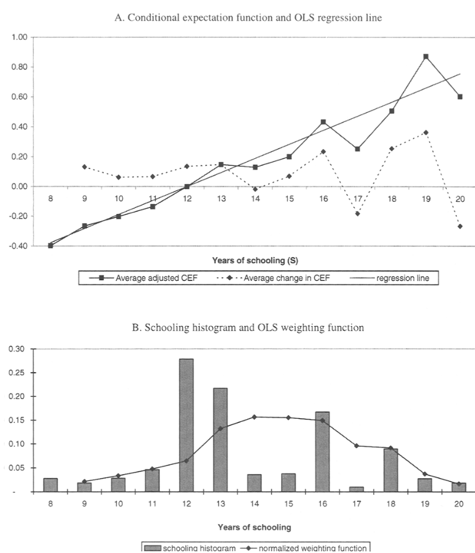

```{r setup, include = F, warning=F, message=F}
require(knitr)
require(magrittr)
require(kableExtra)
require(ggplot2)
require(grid)
require(data.table)
require(UsingR)
require(ggdag)
require(dplyr)
require(haven)
require(tidyverse)
require(fixest)
require(modelsummary)
options("kableExtra.html.bsTable" = T)

acs_data = fread("acs_lawmed.csv")
acs_data[, FEMALE := SEX]
acs_data[, MARST_f := as.factor(MARST)]
acs_data[, MALE := abs(FEMALE - 1)]
acs_data[, sex := as.factor(ifelse(FEMALE == 1, 'Female', 'Male'))]


analysis_df <- 
    readRDS("/home/mdweaver/Dropbox/myanmar-prejudice/02-replication/analysis_df.rds")

ds2000 = read_dta("./DS2000replication.dta") %>% as.data.table
ds2000[, success := pbs2s3]
```

<style type="text/css">
  .reveal h2,h3,h4,h5,h6 {
    text-align: left;
  }
  .reveal p {
    text-align: left;
  }
  .reveal ul {
    display: block;
  }
  .reveal ol {
    display: block;
  }
  .table-hover > tbody > tr:hover { 
  background-color: #696969;
  color: #FFFFFF;
  }
</style>

# Causal Inference with Regression

--- 

### Objectives


**Causal Inference with Regression**

- Conditioning
- Regression and Conditioning
  - Conditional Independence:
    - Omitted Variable Bias
    - Interpolation Bias
  - Positivity:
    - Extrapolation Bias
    - Weighting
- Practical Example

# Conditioning

---

Recall:

When there is possible confounding, we want to "block" these causal paths using conditioning

---

In order for conditioning to estimate the $ACE$ without bias, we must assume

$1$. **Ignorability**/**Conditional Independence**: within strata of $X$, potential outcomes of $Y$ must be **independent** of cause $D$ (i.e. within values of $X$, $D$ must be as-if random)

  - all 'backdoor' paths are blocked
  - no conditioning on colliders to 'unblock' backdoor path

---

In order for conditioning to estimate the $ACE$ without bias, we must assume
  
$2$. **Positivity**/**Common Support**: For **all** values of treatment $d$ in $D$ and all value of $x$ in $X$: $Pr(D = d | X = x) > 0$ and $Pr(D = d | X = x) < 1$

  - There must be variation in the levels of treatment **within every strata** of $X$

---

In order for conditioning to estimate the $ACE$ without bias, we must assume

    
3. **No Measurement Error**: If conditioning variables $X$ are mis-measured, bias will persist.

  - We'll revisit this in the context of regression


---

### Two Ways of Conditioning:

- **imputation**/**matching**: "plug in" unobserved potential outcomes of $\color{red}{Y(1)}$ ($\color{red}{Y(0)}$) using observed potential outcomes of $Y(1)$($Y(0)$) from cases with **same**/**similar** values of $\mathbf{X_i}$.
- **reweighting**: reweight members of "treated" and "untreated" groups based on $Pr(D_i | \mathbf{X_i})$

---

### Conditioning by Imputation

We find effect of $D$ on $Y$ within each subset of the data uniquely defined by values of $X_i$. 

$\widehat{ACE}[X = x] = E[Y(1) | D=1, X = x] - E[Y(0) | D=0, X = x]$ 

for each value of $x$ in the data.

Under the Conditional Independence Assumption, $E[Y(1) | D=1, X=x] = \color{red}{E[Y(1) | D=0, X=x]}$ and $E[Y(0) | D=0, X=x] = \color{red}{E[Y(0) | D=1, X=x]}$

We **impute** the missing potential outcomes... with the **expected value** of the outcome of observed cases with same values of $x$, different values of $D$.

---

### Conditioning by Imputation

what have we seen that looks like these values: e.g., $E[Y(0) | D=0, X=x]$?

>- this a conditional expectation function; something we can estimate using regression

# A Causal Model for Least Squares

---

To understand how we can use regression to estimate causal effects, we need to describe the kinds of causal estimands we might be interested in.

---

### Response Schedule

In the context of **experiments**, each observation has potential outcomes corresponding to their behavior under different treatments

- To estimate $ACE$ of treatment without bias, assumed that  treatment status is **independent** of potential outcomes

---

### Response Schedule

In regression, where levels of treatment might be continuous, we generalize this idea to the "response schedule":

- each unit has a set of potential outcomes across every possible value of the "treatment" 
  - $Y(0), Y(1), Y(2), \dots, Y(D_{max})$
- we can summarize the causal effect of $D$ in two ways:

---

**average causal response function**: 

- what is  $E[Y(d)]$ for all $d \in D$, or what are mean potential outcomes of $Y$ at values of $D$. 
- this is a conditional expectation function, defined in terms of potential outcomes


---

**average partial derivative**: 

- the average **slope** of the (possibly non-linear) average causal response function
- what is the average causal change in $Y$ induced by $D$, averaged over all values $d$ in $D$
- if there are just two levels, the difference between them is the $ACE$

---

### Response Schedule

We can use regression to estimate the *linear approximation* of the average causal response function:

$$Y_i(D_i = d) = \beta_0 + \beta_1 D_i + \epsilon_i$$

Here $Y_i(D_i = d)$ is the potential outcome of case $i$ for a value of $D = d$. 

- this response schedule says that $E[Y(D = d)]$, on average, changes by $\beta_1$ for a unit changes in $D$ (or a weighted average of non-linear effects of $D$... the average partial derivative)
- $\epsilon_i$ is unit $i$ deviation from $E[Y(D = d)]$ 

---

### Response Schedule

If we don't know parameters $\beta_0, \beta_1$, what do we need to assume to obtain an estimate $\widehat{\beta}_1$ that we can give a **causal** interpretation? (On average, change in $D$ **causes** $\widehat{\beta}_1$ change in $Y$)

**We must assume**

- $Y_i$ actually produced according to the response schedule (equation is correctly specified; e.g., linear and additive)
- $D_i$ is independent of $\epsilon_i$:  $D_i \perp \!\!\! \perp \epsilon_i$.

In this scenario, if $D$ were binary and we had randomization, this is equivalent to estimating the $ACE$ for an experiment.

---

### Response Schedule

If we want to use regression for *conditioning*, then the model would look different:

$$Y_i(D_i = d, X_i = x) = \beta_0 + \beta_1 D_i + \mathbf{X_i\beta_i} + \epsilon_i$$

- here we add conditioning variables $\mathbf{X_i}$ to the model. 
- regression is estimating the conditional expectation function $E[Y(d) | D = d, X = x]$: this is what we need for conditioning 

---

$$Y_i(D_i = d, X_i = x) = \beta_0 + \beta_1 D_i + \mathbf{X_i\beta_i} + \epsilon_i$$

Given what we have learned about regression so far...

>- How is using regression to estimate $E[Y(d) | D = d, X = x]$ different from when we exactly matched cases?
>- How do the assumptions required for conditioning translate to the regression context?


---

### Conditioning with Regression

**How it works**:

Imagine we want to know the efficacy of UN Peacekeeping operations [(Doyle & Sambanis 2000)](https://www.jstor.org/stable/2586208) after civil wars:

We can compare the post-conflict outcomes of countries with and without UN Peacekeeping operations.

To address concern about confounding, we condition on war type (non/ethnic), war deaths, war duration, number of factions, economic assistance, energy consumption, natural resource dependence, and whether the civil war ended in a treaty. 

---

122 conflicts... can we find exact matches?

```{r echo = F, message=F, warning=F}

vars = c('wartype', 'untype4', 'logcost', 'wardur', 'factnum', 'trnsfcap', 'treaty', 'develop', 'exp', 'decade')

ds2000[, id := 1:.N]
plot_data = melt(ds2000, 
                 id.vars = c('id', 'untype4', 'pbs2s3'),
                  measure.vars = vars)
plot_data[, Peacekeeping := factor(untype4, levels = c(0,1), labels = c('No', 'Yes'))]
ggplot(plot_data[!(variable %in% c('untype4'))], aes(x = value, group = Peacekeeping, fill = Peacekeeping)) +
  geom_histogram(position = 'identity', alpha = 0.5) + 
  theme_bw() + 
  facet_wrap(~ variable, nrow = 2, scales = 'free') +
  theme(legend.position="bottom")

```

---

Without perfect matches on possible confounders, we don't have cases without a Peacekeeping operation that we can use to substitute for the counterfactual outcome in conflicts with a Peacekeeping force.

We can use regression to *linearly approximate* the conditional expectation function $E[Y(d) | D = d, X = x]$ to plug in the missing values.

$$Y_i = \beta_0 + \beta_D \cdot D_i + \mathbf{X_i\beta_X} + \epsilon_i$$

---

Copy the data, `ds2000`, from here: [https://pastebin.com/bAcmrPdN](https://pastebin.com/bAcmrPdN)

1. Regress `success` on `untype4`, `logcost`, `wardur`, `factnum`, `trnsfcap`, `treaty'`, `develop`, `exp`, `decade`, using `lm()`, save this as `m`
2. Use model to predict *counterfactual* potential outcomes for each conflict:
  - Create a copy of `ds2000`, and flip the value of `untype4` (0 to 1, 1 to 0).
  - Use the `predict(m, newdata = ds2000_copy)` to add a new column called `y_hat` to `ds2000`.

---

Next:

3. Create a new column `y1`, which equals `success` for cases with `untype4 == 1`, and `yhat` for cases with `untype4 == 0`
4. Create a new column `y0`, which equals `success` for cases with `untype4 == 0`, and `yhat` for cases with `untype4 == 1`
5. Calculate `tau_i` as the difference between `y1` and `y0`. Then calculate the mean `tau_i`.
6. Compare to the coefficient on `untype4` in your regression results.

---

```{r}
m = lm(success ~ untype4 + treaty +  wartype + decade + 
                factnum + logcost +  wardur + trnsfcap + develop + exp,
       data = ds2000)

cf_ds2000 = ds2000 %>% as.data.frame
cf_ds2000$untype4 =  1*!(cf_ds2000$untype4)

ds2000[, y_hat := predict(m, newdata = cf_ds2000)]
ds2000[, y1 := ifelse(untype4 %in% 1, success, y_hat)]
ds2000[, y0 := ifelse(untype4 %in% 0, success, y_hat)]
ds2000[, tau := y1 - y0]
ds2000[, tau] %>% mean
```

---

### Results:

<small>

```{r echo = F, warning=F, message=F}
modelsummary(list(`Model 1` = m), 
             estimate  = "{estimate}{stars} ({std.error})",
             statistic = NULL,
             gof_omit = 'Log.Lik.|F|AIC|BIC|Adj', stars = T
             )
```

</small>


---

```{r echo= F, warning=F, message=F, results = 'asis'}
setkey(ds2000, untype4)

k_dat_full = ds2000[, list(`$i$` = 1:.N,
              UN = untype4, 
              y1 = sprintf("%.2f", y1),
              y0 = sprintf("%.2f", y0),
              tau_i = sprintf("%.2f", y1 - y0))]

k_dat_empty = k_dat_full[, list(`$i$`,
              `$UN_i$` = UN, 
              `$Y_i(1)$` = ifelse(UN, y1, "$\\color{red}{E[Y(1) | D = 0, X = x]}$"),
              `$Y_i(0)$` = ifelse(!UN, y0, "$\\color{red}{E[Y(0) | D = 1, X = x]}$"),
              `$\\tau_i$` = "$\\color{red}{?}$")]
k_dat_xbeta = k_dat_full[, list(`$i$`,
              `$UN_i$` = UN, 
              `$Y_i(1)$` = ifelse(UN, y1, "$\\color{red}{\\widehat{\\beta_0} + \\widehat{\\beta_{D}} \\cdot 0 + \\mathbf{X_i\\widehat{\\beta_{X}}}}$"),
              `$Y_i(0)$` = ifelse(!UN, y0, "$\\color{red}{\\widehat{\\beta_0} + \\widehat{\\beta_{D}} \\cdot 1 + \\mathbf{X_i\\widehat{\\beta_{X}}}}$"),
              `$\\tau_i$` = "$\\color{red}{?}$")]


k_dat_empty %>%
  tail(12) %>%
  kbl() %>%
  kable_material(c("striped", "hover"))

```


---

```{r echo= F, warning=F, message=F, results = 'asis'}

k_dat_xbeta %>%
  tail(12) %>%
  kbl() %>%
  kable_material(c("striped", "hover"))

```

---

```{r echo= F, warning=F, message=F}

k_dat_full[, list(`$i$`,
              `$UN_i$` = UN, 
              `$Y_i(1)$` = y1,
              `$Y_i(0)$` = y0,
              `$\\tau_i$` = paste0("$\\color{red}{",tau_i,"}$")
              )] %>%
  .[, `$Y_i(1)$` := cell_spec(`$Y_i(1)$`, color = ifelse(`$UN_i$`, "black", "red"))] %>%
  .[, `$Y_i(0)$` := cell_spec(`$Y_i(0)$`, color = ifelse(!`$UN_i$`, "black", "red"))] %>%
  tail(12) %>%
  kbl(escape = F) %>%
  kable_material(c("striped", "hover"))

```


---

### Conditioning with Regression

**How it works**:

- Rather than "fill" missing potential outcomes of $Y(d)$ with observed outcomes that cases that **match** exactly on $X$, we fit the linear conditional expectation function, plug in the predicted value for counterfactual potential outcome
- Rather than **hold confounders constant**, we ensure zero linear association between confounders and $D$.

---

### Conditioning with Regression

**Assumptions**

1. **Conditional Independence**: within strata of $X$, potential outcomes of $Y$ must be **independent** of cause $D$ (i.e. within values of $X$, $D$ must be as-if random)

  - $\epsilon_i$ contributes to $Y_i$, so determines potential outcomes. Thus, this assumption is equivalent to $D_i \perp \!\!\! \perp \epsilon_i | X_i$.
   - we specify the relationship between $X, D$, and $X,Y$ to be linear and additive. So we must assume that any dependence is *linear and additive*

---

### Conditioning with Regression

**Assumptions**

1. **Conditional Independence**: Questions that arise when using regression:

- what if we've forgotten a variable?
- what if things are not linear and additive?


---

### What if we forgot a variable?

If the true process generating the data is:

$$Y_i = \beta_0 + \beta_1 D_i + \beta_2 X_i + \nu_i$$

with $(D_i,X_i) \perp \!\!\! \perp \nu_i$, $E(\nu_i) = 0$

What happens when we estimate this model with a constant and $D_i$ but exclude $X_i$?

$$Y_i = \beta_0 + \beta_1 D_i + \epsilon_i$$

---

$$\small\begin{eqnarray} 
\widehat{\beta_1} &=& \frac{Cov(D_i, Y_i)}{Var(D_i)}    \\
&=& \frac{Cov(D_i, \beta_0 + \beta_1 D_i + \beta_2 X_i + \nu_i)}{Var(D_i)} \\
&=& \frac{Cov(D_i, \beta_1 D_i)}{Var(D_i)} + \frac{Cov(D_i,\beta_2 X_i)}{Var(D_i)} + \frac{Cov(D_i,\nu_i)}{Var(D_i)}   \\
&=& \beta_1\frac{Var(D_i)}{Var(D_i)} + \beta_2\frac{Cov(D_i, X_i)}{Var(D_i)} \\
&=& \beta_1 + \beta_2\frac{Cov(D_i, X_i)}{Var(D_i)}
\end{eqnarray}$$

So, $E(\widehat{\beta_1}) \neq \beta_1$, it is **biased**

---

### Omitted Variable Bias

When we exclude $X_i$ from the regression, we get: 

$$\widehat{\beta_1} = \beta_1 + \beta_2\frac{Cov(D_i, X_i)}{Var(D_i)}$$

This is **omitted variable bias**

- recall: $\beta_1$ is the effect of $D$ on $Y$
- recall: $\beta_2$ is the effect of $X$ on $Y$

---

Excluding $X$ from the model: $\widehat{\beta_1} = \beta_1 + \beta_2\frac{Cov(D_i, X_i)}{Var(D_i)}$

What is the direction of the bias when:

1. $\beta_2 > 0$; $\frac{Cov(D_i, X_i)}{Var(D_i)} < 0$

2. $\beta_2 < 0$; $\frac{Cov(D_i, X_i)}{Var(D_i)} < 0$

2. $\beta_2 > 0$; $\frac{Cov(D_i, X_i)}{Var(D_i)} > 0$

2. $\beta_2 = 0$; $\frac{Cov(D_i, X_i)}{Var(D_i)} > 0$

2. $\beta_2 > 0$; $\frac{Cov(D_i, X_i)}{Var(D_i)} = 0$

---

### Omitted Variable Bias

This only yields bias if two conditions are true:

1. $\beta_2 \neq 0$: omitted variable $X$ has an effect on $Y$ 

2. $\frac{Cov(D_i, X_i)}{Var(D_i)} \neq 0$: omitted variable $X$ is correlated with $D$. (on the same backdoor path)  

This is why we don't need to include EVERYTHING that might affect $Y$ in our regression equation; **only those variables that affect <u>treatment</u> and <u>the outcome</u>.**

---

### Omitted Variable Bias

Link to DAGs:

- OVB solved when we "block" backdoor paths from $D$ to $Y$.

Link to Conditional Independence:

- OVB is a result of conditional independence assumption being wrong

Link to linearity:

- OVB formula only describes bias induced by exclusion of a confounder that has a **linear** relationship with $D$ and $Y$.

---

### Example: 

Let's turn to a different example: do hours increase earnings? 

Let's say that we estimate this **model**, and we have included all possible confounders.

$$\begin{eqnarray}Y_i = \beta_0 + \beta_1 Hours_i + \beta_2 Female_i + \\ \beta_3 Age_i + \beta_4 Law_i + \epsilon_i\end{eqnarray}$$

And we want to find $\beta_1$ with $\widehat{\beta_1}$

- how are we assuming **linearity**?
- how are we assuming **additivity**?

---

### Example:

If we are imputing missing potential outcomes of earnings for different hours worked using this model...

We need to ask...

- Are relationships between age ($X$) and hours($D$), age ($X$) and income earned ($Y$) **linear**?
- Are the earnings ($Y$) related to gender and age ($X$) in an **additive** way? (relationship between age and earnings the same for men and women?)
- Are the effects of hours worked linear? The same, regardless of gender and age?

---

### Example: D and X

```{r echo = F, include = F, warning=F, message = F}
acs_data[, r_hours := lm(UHRSWORK ~ SEX + AGE + LAW, .SD)$residuals]
acs_data[, r_hours_2 := lm(UHRSWORK ~ SEX*AGE*LAW, .SD)$residuals]
acs_data[, r_hours_3 := lm(UHRSWORK ~ as.factor(SEX)*as.factor(AGE)*LAW, .SD)$residuals]
acs_data[, Gender := ifelse(SEX == 1, "Female", "Male")]
plot_data = acs_data[, list(hours = mean(UHRSWORK), inc = mean(INCEARN), 
                r_hours = mean(r_hours), r_hours_2 = mean(r_hours_2),
                r_hours_3 = mean(r_hours_3),
                n = .N), by = list(Gender, AGE)]
plot_data_2 = acs_data[, list(inc = mean(INCEARN), 
                n = .N), by = list(Gender, UHRSWORK)]
```


```{r echo = F, message=F, warning=F}

ggplot(plot_data, aes(x = AGE, y = hours, colour = Gender, group = Gender, weight = n, size = n) ) + geom_point() + geom_smooth() + xlab("Age (years)") + ylab("Mean Hours Worked") + ggtitle("Hours Worked by Age and Gender") + theme_bw()

```


---

### Y and X

```{r echo = F, message=F, warning=F}

ggplot(plot_data, aes(x = AGE, y = inc, colour = Gender, group = Gender, weight = n, size = n) ) + geom_point() + geom_smooth() + xlab("Age (years)") + ylab("Mean Income") + ggtitle("Income by Age and Gender") + theme_bw()

```

---

### D and Y

```{r echo = F, message=F, warning=F}

ggplot(plot_data_2, aes(x = UHRSWORK, y = inc, colour = Gender, group = Gender, weight = n, size = n) ) + geom_point() + geom_smooth() + xlab("Hours") + ylab("Mean Income") + ggtitle("Income by Hours and Gender") + theme_bw()

```

---

Assuming additivity and linearity:

```{r}
m_linear_additive = lm(INCEARN ~ UHRSWORK + Gender + AGE + LAW, data = acs_data) 
```

<small>

```{r echo = F, warning=F, message=F}
modelsummary(list(`Linear/Additive` = m_linear_additive), 
             estimate  = "{estimate}{stars} ({std.error})",
             statistic = NULL,
             gof_omit = 'Log.Lik.|F|AIC|BIC|Adj', stars = T,
             fmt = 0,
             coef_map = c('UHRSWORK' = 'Hours Worked', 'GenderMale' = 'Male', 'AGE' = "Age (Years)", "LAW" = 'Law')
             )
```

</small>

>- How do we interpret the intercept?

---

```{r echo = F, message=F, warning=F}

ggplot(plot_data, aes(x = AGE, y = r_hours, colour = Gender, group = Gender, weight = n, size = n) ) + geom_point() + geom_smooth() + xlab("Age (years)") + ylab("Mean Residual Hours Worked") + ggtitle("Residual Hours Worked (Assuming Linearity and Additivity)") + geom_hline(yintercept = 0) + theme_bw()

```

Non-linear dependence between D and X, despite regression

---

Assuming linearity, not additivity: linear relationship between *Age* and hours/earnings varies by gender and profession

```{r}
m_linear_interactive = lm(INCEARN ~ UHRSWORK + Gender*AGE*LAW, data = acs_data)
```

<small>

```{r echo = F, warning=F, message=F}
modelsummary(list(`Linear/Additive` = m_linear_additive, `Linear/Interactive` = m_linear_interactive), 
             estimate  = "{estimate}{stars} ({std.error})",
             statistic = NULL,
             gof_omit = 'Log.Lik.|F|AIC|BIC|Adj', stars = T,
             fmt = 0,
             coef_map = c('UHRSWORK' = 'Hours Worked', 'GenderMale' = 'Male', 'AGE' = "Age (Years)", "LAW" = 'Law')
             )
```

</small>

---

```{r echo = F, message=F, warning=F}

ggplot(plot_data, aes(x = AGE, y = r_hours_2, colour = Gender, group = Gender, weight = n, size = n) ) + geom_point() + geom_smooth() + xlab("Age (years)") + ylab("Mean Residual Hours Worked") + ggtitle("Residual Hours Worked (Assuming Linearity but NOT Additivity)") + geom_hline(yintercept = 0) + theme_bw()

```

Non-linear dependence between D and X, despite regression

---

Assuming neither linearity or additivity: fit an intercept for every combination of gender, profession, and age in years. (technically linear, but not an assumption)

```{r}
m_full = lm(INCEARN ~ UHRSWORK + as.factor(Gender)*as.factor(AGE) + LAW, data = acs_data)
```

<small>

```{r echo = F, warning=F, message=F}
modelsummary(list(`Linear/Additive` = m_linear_additive, `Linear/Interactive` = m_linear_interactive, `Nonlinear/Interactive` = m_full), 
             estimate  = "{estimate}{stars} ({std.error})",
             statistic = NULL,
             gof_omit = 'Log.Lik.|F|AIC|BIC|Adj', stars = T,
             fmt = 0,
             coef_map = c('UHRSWORK' = 'Hours Worked', 'GenderMale' = 'Male', 'AGE' = "Age (Years)", "LAW" = 'Law')
             )
```

</small>

---

```{r echo = F, message=F, warning=F}

ggplot(plot_data, aes(x = AGE, y = r_hours_3 %>% round, colour = Gender, group = Gender, weight = n, size = n) ) + geom_point() + geom_smooth() + xlab("Age (years)") + ylab("Mean Residual Hours Worked") + geom_hline(yintercept = 0) + ggtitle("Residual Hours Worked (Assuming neither Linearity nor Additivity)")

```

No dependence between $D$ and $X$, after regression

---

###  Conditional Independence in Regression

Even if we included **all** variables on backdoor path between $D$ and $Y$, regression may still produce  biased estimate:

- we assume the conditional expectation function is linear and additive. 
- but the world might be non-linear and interactive 
- even absent OVB, **our decisions** about how to **specify the regression equation** can lead to bias: $\Rightarrow$ **model dependence**
- Our imputation of missing potential outcomes is biased due to choices we make about **how to impute** (linear/additive)


This bias can take two forms.

---

### (2) Interpolation Bias: 

Typically: we approximate the relationship between variables in $X$ and $D$ to be additive and linear. If this approximation is wrong, we can have bias.

- By forcing relationship between $X$ and $D$ to be linear and additive, conditioning on $X$ may not remove non-linear association between $X$ and $D$, $X$ and $Y$. $\to$ bias.
- This unmodeled relationship will become part of $\epsilon_i$ (because $X$ affects $Y$), and will not be independent of $D_i$ (because there is a non-linear dependence between $X$ and $D$).
- In other words, regression may "impute" wrong counterfactual values of $Y$.

---

What is wrong with interpolation bias?

- In conditioning, we want to compare $Y_i(D_i = 1)|X_i$ to $Y_i(D_i = 0)|X_i$ for cases where values of confounding variables $X_i = x$ are the same
- In regression, we compare $Y_i(D_i = 1)|X_i$ against **linear prediction** of $\widehat{Y}(D_i = 0)|X_i$.
- This approximation may fail, sometimes spectacularly...

---

```{r, echo = F, message=F}
n = 100
x = rnorm(n, sd = 2) %>% round
d = ((4 + 0.75*x - 0.5*x^2 + rnorm(n, sd= 2))/3) %>% pnorm %>% rbinom(n = n, size = 1, prob = .)
x[d == 0] = x[d==0] - 0.5
y = 2 + d + -0.5*x+ x^2 + rnorm(n)

m = lm(y ~ d + x)
r_d = lm(d ~ x)$residuals

y_alt = predict(m, newdata = data.frame(d = 1 - d, x = x))
plot_data = data.table(x = x,
           d = d %>% as.factor,
           y = y,
           y_alt = y_alt,
           d_alt = (1 - d) %>% as.factor,
           var_d = r_d^2
           )

dens_data = plot_data[, list(raw = .N/100, adj = (.N/100)*mean(var_d)) , by = x]
dens_data[, adj := adj / sum(adj)]
setkey(dens_data, x)
ggplot(plot_data, aes(x = x, y = y, color = d)) + geom_point(size = 2) + geom_point(aes(x = x, y = y_alt, color = d_alt), alpha = 0.4, size = 3, stroke = 0,  stat = 'unique', shape = 17) + theme_bw() + ggtitle("Interpolation Bias") 
```

transparent triangles indicate $\color{red}{\widehat{Y}}$ imputed by regression.


---

```{r, echo = F, message = F, warning=F}
require(modelsummary)

m1 = lm(y ~ d + x)
x2 = x^2
m2 = lm(y ~ d + x + x2)

modelsummary(list(m1,m2), gof_omit = 'Log.Lik.|F|AIC|BIC|Adj', stars = T)
```


---


```{r, echo = F, message=F}
n = 100
x = rnorm(n, sd = 2) %>% round
d = ((4 + 0.75*x - 0.5*x^2 + rnorm(n, sd= 2))/3) %>% pnorm %>% rbinom(n = n, size = 1, prob = .)
x[d == 0] = x[d==0] - 0.5
y = 2 + d + -0.5*x+ x^2 + rnorm(n)

m = lm(y ~ d + x)
r_d = lm(d ~ x)$residuals

y_alt = predict(m, newdata = data.frame(d = 1 - d, x = x))
plot_data = data.table(x = x,
           d = d %>% as.factor,
           y = y,
           y_alt = y_alt,
           d_alt = (1 - d) %>% as.factor,
           var_d = r_d^2
           )

dens_data = plot_data[, list(raw = .N/100, adj = (.N/100)*mean(var_d)) , by = x]
dens_data[, adj := adj / sum(adj)]
setkey(dens_data, x)
ggplot(plot_data, aes(x = x, y = y, color = d)) + geom_point(size = 2) + geom_point(aes(x = x, y = y_alt, color = d_alt), alpha = 0.4, size = 3, stroke = 0, stat = 'unique', shape = 17) + theme_bw() + ggtitle("Interpolation Bias") +
geom_line(data = dens_data, aes(x = x, y = raw * 100), inherit.aes = F) + 
  geom_line(data = dens_data, aes(x = x, y = adj * 100), inherit.aes = F, color = 'red') 
```

Actual (black) vs Regression (red) weights

---

### Interpolation Bias:

When we  **approximate** of the relationship of confounding variables $X$ with $D$ and $Y$ through **linearity** (or any imposed functional form) and **additivity**, we may generate **interpolation bias** even if there is no omitted variable bias.


---

### Conditional Independence

In the regression context, Conditional Independence involves

- assuming that potential outcomes of $Y$ are independent of $D$, conditional on values of $X$ (as always, a very big assumption)
- assuming that we have the chosen correct **functional form** of relationship between $Y,D,X$.

If we are wrong, regression's linear and additive approximation of true CEF may lead us astray.

- Can detect problems with scatterplot of $D$ and $X$; $Y$ and $X$
- Can choose more flexible model (non-linear/interactive)
- Linear/additive apprx. may be acceptable because least squares is best linear apprx. of non-linear functions **within the region where we have data**.

---

### Positivity and Regression

$2$. **Positivity**/**Common Support**: For **all** values of treatment $d$ in $D$ and all value of $x$ in $X$: $Pr(D = d | X = x) > 0$ and $Pr(D = d | X = x) < 1$

  - There must be variation in the levels of treatment **within every strata** of $X$
  - Without positivity, we cannot get an estimate of the $ACE$ or average causal response function, because there are subsets of the data that are missing values (can only get $ACE$ for subset of cases with positivity)

---

### Positivity and Regression


Regression **seems** to solve the problem of lacking positivity

- on one hand: regression fills in missing potential outcomes using linear estimate of CEF

---

### Example:

Does being a democracy cause a country to provide better public goods?

We decide to estimate the following regression model. Let's assume that there is no omitted variable bias.

$Public \  Goods_i = \beta_0 + \beta_1 Democracy_i +$ $\beta_2 ln(Per \ Capita \ GDP_i) + \epsilon_i$

---

Download simulated data from here:

[https://pastebin.com/zW4wiqxp](https://pastebin.com/zW4wiqxp)

---

$1$. Estimate $Public \  Goods_i = \beta_0 + \beta_1 Democracy_i + \beta_2 ln(Per \ Capita \ GDP_i) + \epsilon_i$ using the `lm` function. What is the effect of democracy on public goods?

$2$. What does this model assume about the relationship between per capita GDP and public goods for democracies? For non-democracies?

$3$. Plot public goods on GDP per capita, grouping by democracy

```
require(ggplot2)
ggplot(data_9, aes(x = l_GDP_per_capita, y = public_goods, colour = Democracy %>% as.factor)) + geom_point()
```

---

$4$. What is the true functional form of the relationship between GDP per capita and public goods for Democracies? For non-democracies where GDP per capita is $> 0$? 

$5$. Create a new variable for per capita GDP $< 0$.

$6$. Repeat the regression from (1) for cases where `l_GDP_per_capita` $ < 0$. Why is the estimate of $\widehat{\beta_1}$ different?

---

### In this example:

We observe no non-democracies with GDP per capita as high as some democracies, but must condition on GDP per capita.

### Options:

- Using regression ($1$ on previous slide): we linearly and additively **extrapolated** from the model what public goods for non-democracies with high per capita GDP would be (where we have no data, only the model)

---

```{r, echo = F, message = F, warning = F}
data_9 = fread('./example_9.csv')
m_extrap = lm(public_goods ~ Democracy + l_GDP_per_capita, data_9)

y_alt = predict(m_extrap, newdata = data.frame(Democracy = 1 - data_9$Democracy, 
                                             l_GDP_per_capita = data_9$l_GDP_per_capita))
plot_data = data.table(l_GDP_per_capita = data_9$l_GDP_per_capita,
           Democracy = data_9$Democracy %>% as.factor,
           public_goods = data_9$public_goods,
           public_goods_cf = y_alt,
           d_alt = (1 - data_9$Democracy) %>% as.factor)

ggplot(plot_data, aes(x = l_GDP_per_capita, y = public_goods, color = Democracy)) + geom_point(size = 2) + geom_point(aes(x = l_GDP_per_capita, y = public_goods_cf, color = d_alt), alpha = 0.4, size = 3, stroke = 0,  stat = 'unique', shape = 17) + theme_bw()
```


---

or

- Using regression ($6$ on previous slide): we restricted our analysis to the region of the data with common support (range of GDP per capita values that contain both democracies and non-democracies). Linear interpolation, but the model is not extrapolating to regions without data.

---

### (3) Extrapolation Bias

Typically: we approximate the relationship between variables in $X$ and $D$ to be additive and linear. 

If $D = 1$ never occurs for certain values of $X$ (e.g. $X > 0$), regression model will use additivity and linearity (or ANY functional form$^*$) to **extrapolate** a predicted value of what $D = 1$ would look like when $X > 0$.

- King and Zeng show that extrapolations are very **sensitive to model choice**: small changes in assumptions create large changes in estimates.

$^*$: Linearity might not even be the **worst** for extrapolation.

---

### Positivity and Regression

Regression **seems** to solve the problem of lacking positivity:

- on one hand: regression fills in missing potential outcomes using linear estimate of CEF
- on the **other hand**: regression extrapolates out to infinity, even where this is no data (recall: interpreting the intercept). 
- if there is a lack of positivity, our results may depend on extensive extrapolation **beyond the data**. 
- linear approximations of potential outcomes where we have no data likely to be **terrible** (no data to determine the best linear fit)
- a lack of positivity **exacerbates** problems of regression

---

```{r echo = F, message=F, warning=F}

vars = c('wartype', 'untype4', 'logcost', 'wardur', 'factnum', 'trnsfcap', 'treaty', 'develop', 'exp', 'decade')

ds2000[, id := 1:.N]
plot_data = melt(ds2000, 
                 id.vars = c('id', 'untype4', 'pbs2s3'),
                  measure.vars = vars)
plot_data[, Peacekeeping := factor(untype4, levels = c(0,1), labels = c('No', 'Yes'))]
ggplot(plot_data[(variable %in% c('treaty', 'develop'))], aes(x = value, group = Peacekeeping, fill = Peacekeeping)) +
  geom_histogram(position = 'identity', alpha = 0.5) + 
  theme_bw() + 
  facet_wrap(~ variable, scales = 'free') +
  theme(legend.position="bottom")

```

Is there common support here? Let's just condition on these two variables

---

```{r echo = F, warning = F, message = F}
m_lin = lm(success ~ untype4 + treaty + develop ,
       data = ds2000)

cf_ds2000 = ds2000 %>% as.data.frame
cf_ds2000$untype4 =  1 - (cf_ds2000$untype4)

ds2000[, y_hat := predict(m_lin, newdata = cf_ds2000)]
ds2000[, d_alt := factor(1-untype4, levels = 0:1, labels = c("No", "Yes"))]
ds2000[, Peacekeeping := factor(untype4, levels = 0:1, labels = c("No", "Yes"))]

ggplot(ds2000, aes(x = develop, y = success, color = Peacekeeping)) +
  geom_point() + 
  geom_point(aes(x = develop, y = y_hat, color = as.factor(d_alt)), shape = 17, alpha = 0.2) + 
  theme_bw() + 
  ggtitle("Linear and Additive")
```

---

```{r echo = F, warning = F, message = F}
m_alt = lm(success ~ untype4 * treaty * develop ,
       data = ds2000)


ds2000[, y_hat := predict(m_alt, newdata = cf_ds2000)]
ds2000[, d_alt := factor(1-untype4, levels = 0:1, labels = c("No", "Yes"))]
ds2000[, Peacekeeping := factor(untype4, levels = 0:1, labels = c("No", "Yes"))]

ggplot(ds2000, aes(x = develop, y = success, color = Peacekeeping)) +
  geom_point() + 
  geom_point(aes(x = develop, y = y_hat, color = as.factor(d_alt)), shape = 17, alpha = 0.2) + 
  theme_bw() + 
  ggtitle("Linear and Interactive")
```

(Allow effects of peacekeeping to vary across treaty and development)

---

### Positivity and Regression

Positivity requirement speaks to **what subsets of the data** contribute to our causal estimate:

- in exact matching, subsets of $X$ without variation in $D$ get weight of $0$

>- If regression returns weighted average partial derivative of $ACRF$...

>- What are the weights?
>- In terms of cases?
>- In terms of values of $D$?

---

### Positivity and Regression: Weights

[Aronow and Samii (2016)](https://doi.org/10.1111/ajps.12185) discuss how regression weights cases:

In a regression context, cases contribute to estimating $\beta_D$ as a weighted average:

$$\beta_D = \frac{1}{\sum\limits_i^n w_i}\sum\limits_i^n \tau_iw_i$$
Where $w_i = [D_i - E(D_i | X_i)]^2$: the square of $D$ residual on $X$.

---

### Positivity and Regression: Weights

These weights are **lower** when $D$ is more closely predicted by $X$.

These weights are **higher** when $D$ is less well predicted by $X$.

Thus, for cases where values of $X$ nearly perfectly predict $D$, there is close to zero positivity, and weights are closer to zero:

- in the best case scenario where $D$ is truly linear in $X$, these weights make sense
- if $D$ is not linear in $X$, then these weights also reflect errors in model and **upweight** cases which are fit poorly.

---

### Positivity and Regression: Weights

Regression weights may behave usefully (less weight where we have less variation in $D$), but **change** causal estimand:

- we need to ask, for what set of cases are we estimating effects?
- the weights used are only easily interpreted under specific conditions

---

### Positivity and Regression: Weights

If $D$ is continuous, regression **also** places more or less weight on different values of $d$:

---




# Conditioning with Regression in Practice

---

### How do we address these issues?

- Omitted Variable Bias
- Interpolation Bias
- Extrapolation Bias
- Weighting

---

### Omitted Variable Bias

#### Solutions?

- No easy fixes
- DAGs, justification
- in the future, will discuss sensitivity tests

---

### Inter/Extrapolation Bias

#### Solutions?

- Visually explore data to look for overlap (positivity), linearity (conditional independence)
- Restrict analyses to cases where we have overlap in conditioning variables (extrapolation)
- Fewer functional form assumptions (interpolation/extrapolation)

---

### Weighting

There exist packages to analyze the weights cases receive in a model: `regweight`

- no longer on CRAN, but possible to download.
- can calculate and examine the weights.

---

### Saturated Regression

One solution to **extrapolation** and **interpolation** bias is **saturated regression**

- a dummy variable for **every** unique combination of values for conditioning variables $X$.
- we now compare difference in averages of treated/untreated **within** each strata of $X$
- returns **an** average causal effect, but weighted by $N$ and **variance** of $D$ within each strata of $X$. If $D$ is binary, weights have precise interpretation.

---

### Saturated Regression

Pros:

- no possibility of **interpolation**: model is still linear and additive in $X$, but "assumption-free" because all unique values of $X$ have their own means (turn potentially non-linear/additive CEF into a linear problem). 
- zero weight on strata of $X$ with all "treatment"/all "control" (no **extrapolation**)
    - why is this the case?

---

### Example:

What is the effect of poverty on prejudice?

Courtin, Nellis, and Weaver examine the determinant of Anti-Muslim prejudice in Myanmar just before the 2017 genodice of the Rohingya.

Using survey reported income and prejudice, examine the estimated effect of income on prejudice.


---


```{r, echo = F, warning = F, message = F}
# declare outcomes
  ys <- 
    c("svy_sh_anti_muslim_prejudice_average")

# declare explanatory variables
  xes <- 
    c("svy_sh_income_rc")

# declare controls (with labels)      
  controls_w_labels <- 
    tribble(
      ~vname, ~vlabel, ~type,
      "svy_sh_female_rc", "Female", "ind",
      "svy_sh_age_rc", "Age Group", "ind",
      "svy_sh_education_rc", "Education Level", "ind",
      "svy_sh_ethnicity_rc", "Ethnicity", "ind",
      "svy_sh_religion_rc", "Religion", "ind",
      "svy_sh_profession_type_rc", "Profession", "ind",
      "svy_sh_income_source_rc", "Income Source", "ind",
      "cen21_hindu_pct", "Hindu pct. 1921", "twp",
      "cen21_muslim_pct", "Muslim pct. 1921", "twp",
      "cen83_urban_pct", "Urban pct. 1983", "twp",
      "cen83_total_pop", "Total pop. 1983", "twp",
      "geo_border_township", "Border township", "twp",
      "geo_elevation", "Elevation", "twp",
      "geo_km_to_yangon", "Distance to Yangoon", "twp",
      "geo_terrain_ruggedness", "Ruggedness", "twp",
      "svy_sh_tsp_code", "Township FE", "fe",)

  t_fe = 'svy_sh_tsp_code'
# subset to Buddhist respondents   
  ind_df <- 
    analysis_df %>% 
    filter(svy_sh_religion_rc %in% "Buddhist")

# Define covariates
  i_covs <- controls_w_labels %>% filter(type %in% "ind") %>% pull(vname)
  t_covs <- controls_w_labels %>% filter(type %in% "twp") %>% pull(vname)
  t_sat <- "t_saturated"

# Create saturated controls
  ind_df <-  
    ind_df %>%
    unite("i_saturated", all_of(i_covs), sep = ":", remove = F) %>%
    unite("t_saturated", all_of(c(i_covs, t_covs)), sep = ":", remove = F)

# equations
  rhs <-  
    paste(c(xes, #naive
    paste(c(xes, i_covs, t_covs), collapse = " + "), #individual covariates
    paste(c(xes), collapse = " + ") #individual + town saturated covars
    ),
    c(0, 0, 't_saturated'),
    sep = " | ")

# combine with DV
  formulae <- 
    lapply(ys, function(y) paste(y, "~", rhs)) %>% 
    unlist

# run models
  models <- 
    lapply(formulae, function(f) feols(formula(f), data = ind_df, cluster = t_fe))

# formatting functions  
  f1 <- function(x) format(round(x, 2), nsmall = 2)
  f2 <- function(x) format(round(x, 0), big.mark=",")  
  
# modsum function
  modsum_fun <- 
    function(mods = NULL) {
      
      df <- 
        models[mods] %>%
        modelsummary(., 
          stars = c("*" = 0.1, "**" = 0.05, "***" = 0.01),
          coef_map = c('svy_sh_income_rc' = "Income level (1-4)"),
          gof_map = 
            tribble(
              ~raw, ~clean, ~fmt, ~omit,
              "nobs", "$N$", f2, F,
              "r.squared", "$R^2$", f1, F), 
          output = "data.frame") %>% 
        mutate(term = ifelse(statistic == "modelsummary_tmp2", "", term)) %>%
        select(matches("term|^model"))
      
    }

# clean and combine
  out <- 
    bind_rows(modsum_fun(c(1:3)))

# print   
    out %>% 
    kable(
      #"latex", 
      #booktabs = T, 
      escape = F,
      align = c("l", rep("c", 3)),
      col.names = linebreak(c("", "Naive", "Linear", "Saturated"), align = "c"),
      linesep = "") %>% 
    kable_styling(font_size = 10) %>% 
    add_header_above(
      c("Township covariates:", "None", "Linear", "Saturated"), 
      line = F, italic = c(T, rep(F, 3)), align = c("l", rep("c", 3))) %>% 
    add_header_above(
      c("Individual covariates:", "None", "Linear", "Saturated"), 
      line = F, italic = c(T, rep(F, 3)), align = c("l", rep("c", 3)))
  
```


---

### Saturated Regression

```{r}
analysis_df = analysis_df %>% 
  mutate(saturated = paste(svy_sh_female_rc, svy_sh_age_rc, 
                           svy_sh_education_rc, svy_sh_ethnicity_rc,  
                           svy_sh_religion_rc, svy_sh_profession_type_rc, 
                           svy_sh_income_source_rc, 
                           sep = ":"))
```


---

```{r, echo = F}

analysis_df$saturated %>% head(10) %>% kable

```

---

### Saturated Regression

We can use regression for conditioning without **interpolation** bias, **extrapolation** bias, but

- we still make conditional independence assumption
- saturated regression suffers from **curse of dimensionality** (a lot of $N$ needed, usually)
- returns a **variance-weighted effect**, may not be what we want (this is fixable, though)

>- Nevertheless, is a good starting point for choosing a model.

