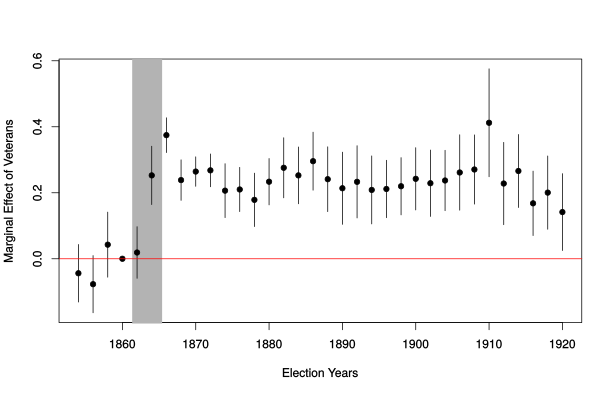

```{r setup, include = F}
require(knitr)
require(magrittr)
require(kableExtra)
require(ggplot2)
require(grid)
require(data.table)
require(UsingR)
require(lfe)

options("kableExtra.html.bsTable" = T)
```

## Plan

<style type="text/css">
  .reveal h2,h3,h4,h5,h6 {
    text-align: left;
  }
  .reveal p {
    text-align: left;
  }
  .reveal ul {
    display: block;
  }
  .reveal ol {
    display: block;
  }
  .table-hover > tbody > tr:hover { 
  background-color: #696969;
  }
</style>

### Difference in Difference

### Natural Experiments

--- 

### **Design vs. Model-based inferences**

A matter of **degree**

Statistical evidence for causality combines **observed data** with a **mathematical model** of the world

>- mathematical model describes how observed data are generated
>- model always involves assumptions
>- can almost always apply the model, even if it is wrong

## Design vs. Model-based inferences

Causal evidence varies in terms of complexity of math/assumptions: a matter of **degree**

- **Model-based** inferences about causality depend on complex statistical models with many assumptions

- **Design-based** inferences about causality use carefully controlled comparisons with simple, transparent models and assumptions

--- 

### **Design vs. Model-based inferences**

Whatever our approach...

<br>

**do the assumptions needed to use this mathematical tool reasonably fit reality?**


# Difference-in-Difference

## Connecticut 1956

In 1956, the state of Connecticut responded to high rates of automobile fatalities by imposing harsher penalties for speeding.

- How can we evaluate the effect of speeding penalties on automobile fatalities?

>- Conditioning
>- Interrupted Time Series (after vs before)
>- Difference in Difference

## Conditioning

**What would a conditioning strategy look like?**

<br>

**What confounding does this address?**

<br>

**What assumptions do we make?**

## Interrupted Time Series


**What confounding does this address?**

<br>

**What assumptions do we make?**

## Interrupted Time Series

What kinds of omitted variables does this comparison address?

>- All omitted variables that remain **constant** over time within the state.
>- Advantage: No need to know what these variables are, measure them, specify functional form, etc.

## Interrupted Time Series

**What assumptions do we make?**: none of the following

>- "history": bias related to **other** changes year-to-year changes (short-term trends)
>- "maturation":  bias / confounding due to long-term trends
>- "testing": bias /confounding related to selection into "treatment" (what kinds of things led to the policy adoption)
>- "regression": cases select into treatment due to extreme events, followed by return to the norm
>- "instrumentation": treatment induces change in measurement (non-random measurement error)

## Interrupted Time Series

A good example:

[Mummolo 2018](https://doi.org/10.1086/694393)

## Synthesis

We can combine before-and-after with conditioning: 

- What would this design look like?
- What sources of confounding would this address?
- What assumptions do we make?

## Difference-in-Difference:

- Compare $post - pre$ change in cases with "treatment" units versus "control"
    - $Treated_{post} - Treated_{pre}$ (first difference)
    - $Control_{post} - Control_{pre}$ (first difference)
    - $(Treated_{post} - Treated_{pre}) - (Control_{post} - Control_{pre})$ (Second difference)

- Estimates $ATT$: average treatment on treated


## Difference-in-Difference:

Extend the interrupted time-series:

- Compare $post - pre$ change in cases with "treatment" units versus "control"
    - $Treated_{post} - Treated_{pre}$ (first difference)
    - $Control_{post} - Control_{pre}$ (first difference)
    - $(Treated_{post} - Treated_{pre}) - (Control_{post} - Control_{pre})$ (Second difference)
    
## Difference-in-Difference:


## Difference-in-Difference:

This can reveal the unbiased causal effect on **treated**, assuming "parallel trends"
    - That is to say: "control" cases are not counterfactuals for "treated" case, but are the counterfactual *trend*

If parallel trends assumption holds, what kinds of confounding does this design eliminate?

>- Any time-invariant confounders within units
>- Any time-varying confounders that are **shared** by both treated cases and un-treated cases
>- Crucial to choose right "control" cases to have parallel trends or e.g. share as many time-varying confounders.

## Difference-in-Difference:

Implementation:

- With two "treatment" conditions, two time periods: calculate differences in means
- Use regression, with interaction term.

## Difference-in-Difference:

Example: Card and Krueger (2000)

> Do increases in the minimum wage increase unemployment in fast food?

- Examine bordering areas in New Jersey and Pennsylvania before and after increase in NJ minimum wage

## Difference-in-Difference:

Two ways to use regression:

$$Y_it = \beta_0 + \beta_1 D_i + \beta_2 T_{t} + \beta_3 D_i \times T_{t} + \epsilon_{it}$$

Where $D_i$ is an indicator for being a unit that is **ever** treated (1 yes, 0 no). $T_t$ is an indicator for the observation being **after** the treatment takes place (1 if yes, 0 if no).


$$Y_{post} - Y_{pre} = \beta_0 + \beta_1 D_i + \epsilon_i$$


## Difference-in-Difference:

How do we validate the **parallel trends** assumption?

- We cannot test fully, but we can check.

**Placebo Tests**:

- If "treatment" happens between time $t$ and $t+1$, we should not see an effect between $t-1$ and $t$!
- If design is right, there should be no effects of the treatment **prior** to the treatment taking place.
- If we "pass" placebo test, does not reject possibility that something **other than "treatment"** caused a change.
- You need multiple pre-treatment data points
- No guarantees that something else didn't change in treated/untreated cases 

## Difference-in-Difference:


## Difference-in-Difference:

If we have multiple time-periods, multiple cases, we get **generalized difference-in-differences**:

- case-specific intercepts (dummy for each case: e.g. "country fixed effects"): capture time-invariant confounders within cases
- time-specific intercepts (dummy for each period of time): capture time-varying confounders that are shared across cases

## Difference-in-Difference:

$$Y_{it} = \alpha_i + \alpha_t + \beta D_{i}T_{t}  + \epsilon_{it}$$

- $\alpha_i$ is a dummy for each unit $i$
- $\alpha_t$ is a dummy for each time period $t$
- Why does only the interaction of treatment and post-treatment remain?

## Two Way Fixed Effects

We can add...

- $\alpha_i$, a dummy for each unit $i$
- $\alpha_t$, a dummy for each time period $t$

...to any model. It removes any confounding from variables $Z$ that:

- do not vary overtime w/in cases
- vary overtime across all cases.

BUT, despite apparent similarity, TWFE $\neq$ DID

## Fixed Effects

Example:

```{r, echo = F}
df = data.frame(g = rep(letters[1:5], each = 4),
                x = 1:20,
                y = 3 + rep(1:5, each = 4) + 0:-3 + rnorm(20, sd = 0.25) )
plot(df$x, df$y, xlab = 'X', ylab = 'Y', main = "Pooled Relationship between X and Y")
```

## Fixed Effects

Example:

```{r, echo = F}
plot(df$x, df$y, xlab = 'X', ylab = 'Y', main = "Pooled Relationship between X and Y")
abline(lm(y ~ x, df))
```

## Fixed Effects

Example:

```{r}
summary(lm(y ~ x, df))$coefficients
```   


## Fixed Effects

Example:

```{r, echo = F}
plot(df$x, df$y, xlab = 'X', ylab = 'Y', main = "Pooled Relationship between X and Y\nby group", type = 'n')
text(df$x, df$y, labels = df$g)
abline(lm(y ~ x, df))
```

## Fixed Effects

In this case, the overall relationship between $X$ and $Y$ is positive. But within each unit ($a \dots e$), the relationship is negative!

Unobserved factors might make each unit have higher levels of x and higher levels of y, but as x increases within a unit (where these unobserved factors are constant), y decreases.

**fixed effects** allow us to extract this within unit relationship between $X$ and $Y$

Contrast to **pooled effects** where we compare all observations to each other, not accounting for any unit-specific effects

## Fixed Effects

**How to use fixed effects**

We add dummy variables for each unit

**What does this do?**

- Estimates a separate intercept for each unit (or group) within the data
- Residual of $X$, is now the variation in $X$ around the mean within that unit.
- Eliminates any confounding related to **unchanging** attributes of the unit

>- Why is that?

>- Doesn't account for any confounding by variables that **change** over time

## Fixed Effects

Fixed effects results:

```{r}
summary(lm(y ~ x + g, df))$coefficients
```

## Fixed Effects

```{r, echo = F}
df$x_r = lm(x ~ g, df)$residuals
df$y_r = lm(y ~ g, df)$residuals
plot(df$x_r, df$y_r, xlab = "Residual X", ylab = "Residual Y", main = "Residual Y on X \nAfter Group Fixed Effects")
abline(lm(y_r ~ x_r, df))
```

## DID: Extensions

**Staggered Treatment**: [Bacon-Goodman 2021](https://doi.org/10.1016/j.jeconom.2021.03.014)

**Multiple Treatments**: [https://arxiv.org/pdf/1803.08807.pdf](https://arxiv.org/pdf/1803.08807.pdf)

**Continuous Treatment**: [https://psantanna.com/files/Callaway_Goodman-Bacon_SantAnna_2021.pdf](https://psantanna.com/files/Callaway_Goodman-Bacon_SantAnna_2021.pdf)

---


## An Example:

What was the effect of enlistment in the US Civil War on voting for the Republican party?

$$GOP_{ie} = \alpha_i + \alpha_e + \beta Enlist_i \times PostWar_e + \epsilon_y + \epsilon_i$$

- $i$ is a county
- $e$ is a state-election (election year in a specific state)
- $y$ is a year between 1854 and 1880
- $PostWar$ indicates if election is after 1861 ($1$) or before ($0$)


## An Example:

```
dd1 = felm(gop_vs ~ postbellum:vet_alt_pct  |  #interaction of enlistment rate, post-war
                    target_fips + state_election  |  #county, state-election fixed effects
                    0 | #no Instrumental variable
                    target_fips + election_year , # cluster errors by county, election year
           merged_use) 
```


## An Example:

A placebo test/relaxed assumptions

$$GOP_{ie} = \alpha_{i} + \alpha_{e} + 
\sum_{y = 1854}^{1920} \beta_y EnlistmentRate_i * Year_y + \epsilon_i + \epsilon_y$$

## An Example:

```
year_levels = c(1860, seq(1854,1858,2), seq(1862,1920,2)) %>% as.character()
merged_panel[, year_f := factor(election_year, levels = year_levels)]

g1 = felm(gop_vs ~ 1 + year_f*vet_alt_pct | #interaction of YEAR and enlistment-rate
                  target_fips + state_election | #county and state-election FE
                  0 | #no IV
                  target_fips + election_year ,#cluster by county/ election year
                  merged_use)
```

## An Example:



## Differences-in-Differences:

Key Assumptions:

- parallel trends: treated and untreated have same changes over time except for shift in treatment.
- equivalently: no time-varying omitted variable bias; no omitted variables correlated with changes in treatment, changes in outcome

Caveats:

- careful: check parallel trends
- careful: what happens when units are treated at different times?
- careful: STANDARD ERRORS! Clustering may not save you with small $N$.


# Natural Experiments

## Natural Experiments:

Address confounding / omitted variable bias in a different way:

- exploit random or as-if random allocation of $X$ to find causal effect
- look for "naturally" occurring randomization

## Natural Experiments:

Distinguishing "natural experiment" from experiments:

- Treatment and control groups
- Random assignment (maybe)
- **"as-if" random assigment**
- **no manipulation**


## Natural Experiments:

An **observational study** where causal inference comes from the design that draws on randomization.

- contrast to difference-in-difference: not a "conditioning" approach
- depends on argument to validate "as-if" random assumption, fewer assumptions in the statistical model


## Natural Experiments:

### Regression Discontinuity

- "Treatment" occurs for cases on one side of threshold, not to cases on other side
- Near the "threshold", cases are arbitrarily assigned.
    - treatment can be for ALL cases on the "Treated" side (sharp RD) 
    - treatment can increase at the threshold ("fuzzy" RD) (e.g. Mo 2018)
   
   
## Natural Experiments

```{r, echo = F, message=F}
n = 5000
x = runif(n, -1,1)
y = 3 + 1*x + 2*(x>0) + rnorm(n)

d = data.frame(x,y, d = x>0)
ggplot(d, aes(x = x, y = y, group = d)) + 
  geom_point() + 
  geom_smooth() +
  geom_vline(xintercept = 0)
  theme_bw()

```
    
## Natural Experiments:

### Regression Discontinuity

Two approaches:

- Potential outcomes of $Y$ are approximately **linear** near the threshold; treatment shifts outcomes
    - so we (flexibly) model $Y$ on either side of the cut-off
- Potential outcomes of $Y$ are random near the cut-off
    - difference in means near the cutoff

## Natural Experiments:

### Regression Discontinuity

Decisions:

- model outcome around cutoff
    - bias/variance trade-off
    - how do you model it? linear? quadratic? cubic? quartic? local linear?
    - how do you choose the "bandwidth" around the cutoff to use?
    - typically recommend local linear, automatic choice of 'optimal bandwidth'

- difference in means at cutoff
    - how do you choose the "bandwidth" around the cutoff to use?

## Natural Experiments:

### Regression Discontinuity

Assumptions:

- assignment to treatment at the threshold is random
- AND
    - either we have correctly modeled potential outcomes of $Y$ on either side of cutoff 
    - or we have used "bandwidth" around cutoff within which treatment is as-if random assigned (difference in means)

## Natural Experiments:

### Instrumental Variables

Follows from Wald estimator for non-compliance:

- Instrumental Variables Least Squares uses variance "explained" in $X$ by  randomly induced $Z$
    - $X$ is "treatment", $Z$ is "random assignment to treatment"
    - easy to understand when $Z$ is binary
    - when $Z$ is continuous, it is more complicated (and depends on assumptions of linearity)

## Natural Experiments:

### Instrumental Variables

Decisions

- is variation induced in $X$ by $Z$ linear?
- does $Z$ actually predict change in $X$?
    - "weak instruments problem": identical to when there are very few compliers in an experiment: inference becomes very hard
    - typically do $F$ test of regression of $Y$ on $X$; $F$ statistic $> 10$.


## Natural Experiments:

### Instrumental Variables

Assumptions:

1. $Z$ is randomly assigned
2. Exclusion Restriction
    - no other causal path from $Z$ to $Y$, other than $X$
3. Monotonicity
    - increasing $Z$ uniformly increases or decreases values of $X$

## Natural Experiments:

### Choices

- Sometimes natural experiments only random conditional on some other variables (Nellis, et al.)
    - What is the correct functional form for the conditioning variables?
- Standard Errors:
    - What is the unit at which treatment is assigned?
    - Cluster/Randomization inference

## Natural Experiments:

### Limitations

- Effects are "local" or for "compliers"
    - like in non-compliance, we find subset of cases that are randomly induced into treatment/responsive
    - cases may be different

- Causal exposures may be different
    - cause applied at cutoff might be different than elsewhere
    - cause applied at random might be different (e.g. rainfall as instrument for economic growth)
    
## Natural Experiments:

### What to do:

- Show robustness to choices of analysis
- Evidence that randomization took place
    - statistical tests of implication
    - qualitative evidence: "causal process observation"