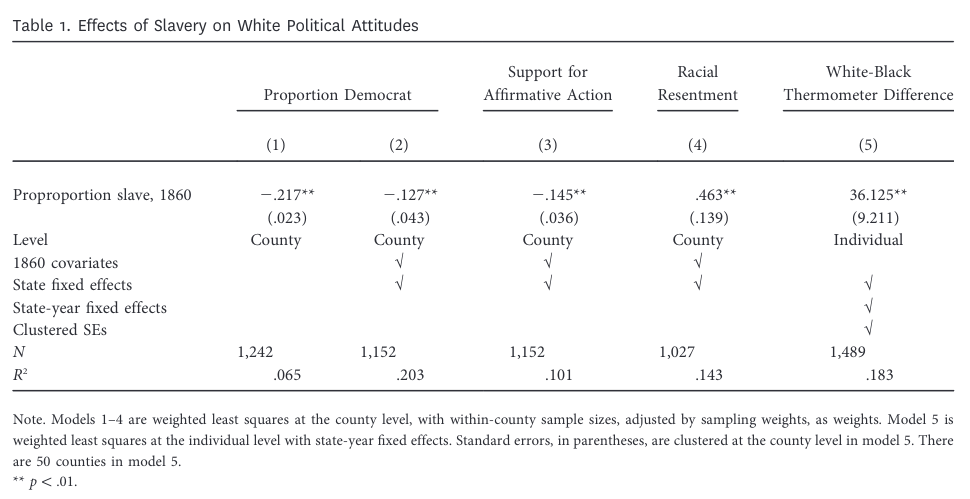

```{r setup, include = F}
require(knitr)
require(magrittr)
require(kableExtra)
require(ggplot2)
require(ggdag)
require(grid)
require(data.table)
require(UsingR)
require(fixest)
require(sandwich)
require(dplyr)
require(modelsummary)
require(interflex)

options("kableExtra.html.bsTable" = T)
```

```{r, include = F, echo = F, message = F}
riots = fread("analysisPanelBW1.csv")
riots[, ]
riots = riots[rd_INC_closenum %in% 1, 
              list(DISTRICT_ID_61, election_year,
                   INC_win = rd_INC_ivnum, any_riot = COUNT.bin,
                   muslim_prop, muslim_high,
                   ENP, ENP_high = ENP > median(ENP, na.rm = T))]

```

<style type="text/css">
  .reveal h2,h3,h4,h5,h6 {
    text-align: left;
  }
  .reveal p {
    text-align: left;
  }
  .reveal ul {
    display: block;
  }
  .reveal ol {
    display: block;
  }
  .table-hover > tbody > tr:hover { 
  background-color: #696969;
  }
</style>

## Plan for Today

### Testing Theories

- Mediators vs Moderators

### Moderators

- Interaction Effects
- Multiple Hypotheses

### Mediators

- Natural Direct/Indirect Effects
- Controlled Direct Effects
- Assumptions/Estimation?


# Testing Theoretical Implications

---

### So you've found an effect...

Let's assume we have done our due diligence and...

- with plausible assumptions
- robust choices/sensitive to violations of these assumptions

We find an effect of this treatment on our outcome of interest.

>- Reviewers (and you) want to know whether *your* theoretical interpretation is correct

---

### So you've found an effect...

To further probe **our interpretation** of this result against **alternative interpretations** we typically look at one or both of the following:

1. Does *our* interpretation vs. *rival* interpretation of main effect have different implications about **what kinds of cases** are responsive to treatment?
2. Does *our* interpretation vs. *rival* interpretation of main effect make a claim about a particular **causal mechanism** *thorough which* treatment affects outcome?


---

### So you've found an effect...

1. Does *our* interpretation vs. *rival* interpretation of main effect have different implications about **what kinds of cases** are responsive to treatment?
    - Implies that treatment effects should vary across **pre-treatment** attributes of units
    - these attributes are called **moderators**


---

### So you've found an effect...
    
2. Does *our* interpretation vs. *rival* interpretation of main effect make a claim about a particular **causal mechanism** *thorough which* treatment affects outcome?
    - Implies that treatment $D$ causes some variable $M$ which then causes $Y$.
    - These variables on path from $D$ to $Y$ are **mediators**
    - Mediators must be defined in terms of potential outcomes $M_i(D=1)$, $M_i(D=0)$.

--- 

### Example: Moderator

Did the local success of an explicitly secular political party, Indian National Congress (INC), reduce the likelihood of religious riots between Hindus and Muslims in India?

- In a religious diverse context, do avowedly secular parties act to reduce religious violence that would intensify inter-religious animosity?

---

### Example: Moderator

[Nellis et al](https://www.nowpublishers.com/article/Details/QJPS-15051) compare the incidence of riots in districts in which the INC barely won and barely lost MLA elections (w/ in 1 ppt).

They estimate the model:

$$\mathrm{Any \ Riot}_{it} = \alpha + \beta_1 \mathrm{INC \  Victory}_{it} + \epsilon_{it}$$
Here we compute $\mathrm{Any Riot}_it$ for each district between legislators taking office and the next election.


---

```{r echo = F, results='asis'}
m1 = lm(any_riot ~ INC_win, data = riots)

modelsummary(list("Any Riot" = m1),
          output = 'html', vcov = "HC0",
          gof_omit = 'DF|Deviance|AIC|BIC|Adj|Lik|F|RMSE',
          coef_rename = c('INC_win' = "INC Win", "(Intercept)" = "Intercept"),
          stars = T)
```

---

### Example: Moderator

**Why does this effect occur?** Why does the INC (a secular party) winning office **reduce** violence?


#### **Our story**

The INC portrayed itself as a secular party capable of protecting Muslims (a religious minority). Uniquely among parties, had a strong connection to Muslim voters.

- *INC **specifically** faces incentives to reduce violence when there are more Muslim voters in a district.* So effect of INC win vs loss should have **larger effects** when there are **more Muslims**.

---

### Example: Moderator

**Why does this effect occur?**

#### **A rival story**

Wilkinson (2004) argues that **all** political parties face incentives to compete over minority votes when those groups are **electorally pivotal**. So, **all parties** have incentives to stop religious riots in India when:

- There are more Muslims in a district (more Muslim voters $\to$ more electoral consequence)
- The effective number of parties in a district is higher (higher ENP $\to$ even small groups of voters can be pivotal)

This implies we should see a **smaller effect** of INC win when there are **more Muslims** and when there are is a **higher ENP**.

---

### Example: Moderator

In this example, **Muslim population** and **Effective Number of Partes** are **moderators**:

- they are "pre-treatment" attributes of districts
- Don't expect them to change due to $D$, INC win.

---

### Example Mediator

Acharya, Blackwell, and Sen (2016) examine the long-term effects of slavery in the United States.

They examine whether it affected contemporary racial attitudes among white Americans.

---

### Example Mediator

Survey data on white Americans in southern states between 1984-2011. Aggregated to county-level

Regression of average county attitudes on enslaved % in 1860.

- condition on pre-1860 attributes: total population, small farms, landholding inequality, farm value, acres of farmland, free black population, railroad access, navigable rivers, land area, ruggedness, latitude and longitude
- using "cotton suitability" as an instrument

---

### Example Mediator




---

### Example Mediator

*How* does slavery affect contemporary political attitudes?

- what is the *path*?

- Authors argue it is slavery $\to$ preservation of political/economic power $\to$ racist norms/institutions $\to$ contemporary attitudes

- But it could also be that there are OTHER mechanisms: slavery $\to$ greater contemporary African American population $\to$ contemporary perceived "racial threat" $\to$ conteporary attitudes

---

### Example Mediator

In this case, 19th century **racist norms** and 20th century black population are **on the path** from slave population to racist attitudes. Expressed in terms of **potential outcomes**.

(Board)

- Theory one suggests that $RacistNorms(Slavery = High) > RacistNorms(Slavery = Low)$; $Attitudes(RacistNorms = High) > Attitudes(RacistNorms = Low)$
- Theory two suggests that $BlackPop(Slavery = High) > BlackPop(Slavery = Low)$; $Attitudes(BlackPop = High) > Attitudes(BlackPop = Low)$


---

### Testing

#### **Moderators**

We examine stories about moderators using either: split sample or **interaction effects**

#### **Mediators**

We examine mediation using tools that estimate specific **causal estimands**

- controlled direct effects
- natural direct/indirect effects


# Interaction Effects
   
---

### Interaction Effects

Interactions in regression permit slopes/intercept for one variable to differ across values of another variable.


- Is the effect of treatment $D$ different across other attributes $M$? (heterogeneous treatment effects, **moderator**)
- Do confounders combine to affect treatment/outcome? (e.g., gender and age affect hours worked and earnings)
- Differences-in-Differences


---

### Interaction Effects

We have simple model:

$Y_i = \beta_0 + \beta_1 D_i + \beta_2 X_i$

If we want to permit interaction between $D$ and $X$, add coefficient for variable that is product of $D$ and $X$

$Y_i = \beta_0 + \overbrace{\beta_1 D_i + \beta_2 X_i}^{\text{Main Terms}} + \underbrace{\beta_3D_i\cdot X_i}_{\text{Interaction}}$


**Always include main terms *alongside* the interaction term** (otherwise assumes "effect of $D$ is 0 when $X$ is 0")

---

### Example: **Moderation**

Did the local success of an explicitly secular political party, Indian National Congress (INC), reduce the likelihood of religious riots between Hindus and Muslims in India?

Does the effect of INC victory differ between places with high/low ENP?

- What should the equation be, if we include an interaction with High ENP?
- What should the equation be, if we include an interaction with High Muslim population?


---

### Example: **Moderation**

$$\displaylines{\mathrm{Any \ Riot}_{it} = \beta_0 + \beta_1 \mathrm{INC \  Win}_{it} + \beta_2 \text{High ENP}_{it} +\\\beta_3 \text{INC  Win}_{it}\cdot \text{High ENP}_{it}}$$
$$\displaylines{\mathrm{Any \ Riot}_{it} = \beta_0 + \beta_1 \mathrm{INC \  Win}_{it} + \beta_2 \text{MuslimHigh}_{it} + \\ \beta_3 \text{INC  Win}_{it}\cdot \text{MuslimHigh}_{it}}$$

Where $MuslimHigh$ and $HighENP$ are $1$ if above median, $0$ if below.

---

### Example: **Moderation**

This is a **Binary by Binary** interaction:

- INC win/lose is **binary**
- High/Low ENP is **binary**
- High/Low Muslim is **binary**

Let's write out the design matrix...

---

### Interaction Effects

$\displaylines{\mathrm{Any \ Riot}_{it} = \beta_0 + \beta_1 \mathrm{INC \  Win}_{it} + \beta_2 \text{High ENP}_{it} +\\\beta_3 \text{INC  Win}_{it}\cdot \text{High ENP}_{it}}$


Different intercepts (means) for each group:

|        | INC Lose | INC Win |
|--------|------|--------|
| ENP Low | ? | ? |
| ENP High | ? | ? |

What combinations of **coefficients** give us the **mean probability of a riot** for each cell in this table?


---

### Interaction Effects

Different intercepts (means) for each group:

|        | INC Lose | INC Win |
|--------|------|--------|
| ENP Low | $\beta_0$ | $\beta_0 + \beta_1$ |
| ENP High | $\beta_0 + \beta_2$ | $\beta_0 + \beta_1 + \beta_2 + \beta_3$ |

Let's interpret what **each coefficient means**

$\displaylines{\mathrm{Any \ Riot}_{it} = \beta_0 + \beta_1 \mathrm{INC \  Win}_{it} + \beta_2 \text{High ENP}_{it} +\\\beta_3 \text{INC  Win}_{it}\cdot \text{High ENP}_{it}}$

---

### Interaction Effects

$\beta_0$: Riot probability when INC loses in low ENP district

$\beta_1$: Difference in Pr(Riot) when INC win (vs loses) in low ENP district

$\beta_2$: Difference in Pr(Riot) when INC loses in high (vs low) ENP district

$\beta_3$: Difference in change in Pr(Riot) (INC win vs lose) in High vs Low ENP district

>- $\beta_3$ seem familiar?

---

### Interaction Effects

Easy to do in `R`:

```{r}
m2 = lm(any_riot ~ INC_win*ENP_high, 
        data = riots)
m3 = lm(any_riot ~ INC_win + muslim_high + INC_win:muslim_high, 
        data = riots)
```

`*` expands out the 'main' effects and interaction effects

`:` just multiplies two variables together, no 'main' effects
   
---

```{r eval = F}
modelsummary(list("Any Riot" = m2),
          output = 'html',
          vcov = "HC1",
          stars = T,
          gof_omit = 'DF|Deviance|AIC|BIC|Adj|Lik|F|RMSE',
          coef_rename = c( "(Intercept)" = "Intercept", 'INC_win' = "INC Win", 'ENP_highTRUE' = "High ENP", "INC_win:ENP_highTRUE" = "INC Win x High ENP", "muslim_high" = "High Muslim", "INC_win:muslim_high" = "INC Win x High Muslim"))
```


---

```{r echo = F, results='asis'}
modelsummary(list("Any Riot" = m2),
          output = 'html',
          vcov = "HC1",
          stars = T,
          gof_omit = 'DF|Deviance|AIC|BIC|Adj|Lik|F|RMSE',
          coef_rename = c( "(Intercept)" = "Intercept", 'INC_win' = "INC Win", 'ENP_highTRUE' = "High ENP", "INC_win:ENP_highTRUE" = "INC Win x High ENP", "muslim_high" = "High Muslim", "INC_win:muslim_high" = "INC Win x High Muslim"))
```

---

### Interaction Effects | Binary

$\displaylines{\mathrm{Any \ Riot}_{it} = \beta_0 + \beta_1 \mathrm{INC \  Win}_{it} + \beta_2 \text{High ENP}_{it} +\\\beta_3 \text{INC  Win}_{it}\cdot \text{High ENP}_{it}}$

If we use hypothesis test of $\beta_3$, can we tell whether the **effect of INC Win in High ENP districts** is different from $0$?

If we use hypothesis test of $\beta_1$, can we tell whether the **effect of INC Win in Low ENP districts** is different from $0$?

---

### Interaction Effects | Binary

If moderator is **binary** interaction term lets us test whether there is a significant difference in treatment effects for the two sub-groups.

If you want to test whether the effect in each group is different from $0$, you have to look at "main effect" of treatment (you can then reverse code the moderator, e.g. interact with "Low ENP")


---

### Interaction Effects | DiD

Different intercepts (means) for each group:

|        | Untreated | Treated |
|--------|------|--------|
| Pre | `Intercept` | `Intercept + Treated` |
| Post | `Intercept + Post` | `Intercept + Treated +` <br/> `Post + Treated:Post` |

`lm(Y ~ Treated*Post, data = data)`

---

### Interaction Effects | DiD

If we have many treated, many untreated units $i$, across multiple time periods $t$, it is common to do this:

```{r eval=F, echo = T}
lm(Y ~ Treated*Post + dummy_i + dummy_t, data = data)
fixest::feols(Y ~ Treated*Post | dummy_i + dummy_t, data = data)
```

If we include a dummy for each unit $i$ and a dummy for each time period $t$... Which of these four coefficients will we be able to actually estimate? (think about linear independence)

`Intercept + Treated_i + Post_t + Treated_i:Post_t`


---

### Interaction Effects 

When $D$ and moderator $M$ are **both binary**, interaction effects are very straightforward.

- you can add three (or more)-way interactions. Must include all combinations of multiplications. Interpretation of coefficients is less easy, but you can think through design matrix.


---

#### **Continuous by Binary variable**

Rather than fitting different intercepts for groups:

- Slope of $D$ depends on binary indicator ($M$)
- effect of binary treatment ($D$) depends on value of continuous variable $M$
- $\hat{\beta_1}$ for $D$ will be slope of $D$ when $M = 0$
- $\hat{\beta_2}$ for $M$ will be mean of $M = 1$ when $D = 0$

**Assumptions** 

- We assume the change in effect of $D$ is linear (trivially true if $M$ is binary)
- Both levels of binary variable present across all levels of continuous variable (common support)


---

### Interaction Effects | Continuous x Binary

```{r}
m4 = lm(any_riot ~ INC_win*ENP, 
        data = riots)
```

---

```{r echo = F, results='asis'}
modelsummary(list(m4),
          output = 'html',
          vcov = "HC1",
          stars = T,
          gof_omit = 'DF|Deviance|AIC|BIC|Adj|Lik|F|RMSE',
          coef_rename = c( "(Intercept)" = "Intercept", 'INC_win' = "INC Win", 'ENP' = "ENP", "INC_win:ENP" = "INC Win x ENP", "muslim_high" = "High Muslim", "INC_win:muslim_high" = "INC Win x High Muslim"))
```
    
Interpretation of coefficients? 

---

### Interaction Effects | Continuous x Binary

How can we make this more interpretable?

- Center ENP at its mean

---

```{r echo = F, results='asis'}
riots_c = copy(riots)
riots_c[, ENP := ENP - mean(ENP,na.rm = T)]
m5 = lm(any_riot ~ INC_win*ENP, 
        data = riots_c)

modelsummary(list("Original" = m4, "Mean Centered" = m5),
          output = 'html',
          vcov = "HC1",
          stars = T,
          gof_omit = 'DF|Deviance|AIC|BIC|Adj|Lik|F|RMSE',
          coef_rename = c( "(Intercept)" = "Intercept", 'INC_win' = "INC Win", 'ENP' = "ENP", "INC_win:ENP" = "INC Win x ENP", "muslim_high" = "High Muslim", "INC_win:muslim_high" = "INC Win x High Muslim"))
```
    
---

### Interaction Effects | Continuous x Binary

In this context, we are more interested in **marginal effects**:

- What is the effect of INC Win when ENP is at (some value)? 
- Is this different from 0? 
- Is this different from effect fo INC win when ENP at (lower/higher value)?

We also want to be careful assuming that the effect of INC Win changes **linearly** with ENP?

---

### Interaction Effects

Best to use [`interflex`](https://yiqingxu.org/packages/interflex/articles/continuous.html) package in `R`. Based on [Hainmueller et al 2018](https://jmummolo.scholar.princeton.edu/sites/g/files/toruqf3341/files/hainmueller_mummolo_xu_2019.pdf).

- tools to check common support
- tools to check for non-linear interactions
- easily plots marginal effects

---

Check common support

```{r, echo = F, message=F, warning=F}

a = interflex(estimator = "raw",Y = "any_riot", D = "INC_win", X = "ENP", 
          data = riots, na.rm = T,
          weights = NULL, Ylabel = "Pr(Riot)", 
          Dlabel = "INC Win", Xlabel="ENP", 
          main = "Raw Plot", cex.main = 1.2, ncols=2, base= 0)
a
```

---

"Binning" Estimator 

```{r, echo = F, message=F, warning=F}

b = interflex(estimator = "binning",Y = "any_riot", D = "INC_win", X = "ENP", 
          data = riots, na.rm = T,
          weights = NULL, Ylabel = "Pr(Riot)", 
          Dlabel = "INC Win", Xlabel="ENP", 
          main = "Binning Plot", cex.main = 1.2, ncols=1, base = 0)

b$figure
```

---

"Binning" Estimator 

```{r, echo = T, eval = F, message=F, warning=F}

b = interflex(estimator = "binning",
              Y = "any_riot", D = "INC_win", X = "ENP", FE = NULL,
              data = riots, na.rm = T,
              weights = NULL, Ylabel = "Pr(Riot)", 
              Dlabel = "INC Win", Xlabel="ENP", 
              main = "Binning Plot", base = 0)


b$figure
```


---

"Kernel" Estimator 

```{r echo =F, include=F, message=F, warning=F}
c = interflex(estimator = "kernel",Y = "any_riot", D = "INC_win", X = "ENP", 
          data = riots, na.rm = T,
          weights = NULL, Ylabel = "Pr(Riot)", 
          Dlabel = "INC Win", Xlabel="ENP", 
          main = "Binning Plot", cex.main = 1.2, ncols=1, base = 0)

```

```{r, echo = F, eval = T,  message=F, warning=F}

c$figure
```

---

### Interaction Effects | Continuous x Continuous

- Slope of $D$ depends on value of $M$
- Slope of $M$ depends on value of $D$
- $\hat{\beta_1}$ for $D$ will be slope of $D$ when $M = 0$
- $\hat{\beta_2}$ for $M$ will be slope of $M$ when $D = 0$
- $\hat{\beta_3}$: how much slope of $D$ changes with change in $M$

---

### Interaction Effects | Continuous x Continuous

**Assumptions** 

- We assume the change is linear 
- all levels of one variable present across all levels of other variable (common support)
- This is much harder to achieve!
- Must get marginal effects

---

### Activity (part 1)

Download Riots data:

```{r}
riots = read.csv("https://www.dropbox.com/scl/fi/f5h9iz8qtvqdwv1frgqnv/l13_riots.csv?rlkey=155uky6xqvg7ro4vcopwddoic&dl=1")
```

1. Use `lm` to regress `any_riot` on **binary x binary** interaction of `INC_win` by `muslim_high`. 
2. Generate a table using `modelsummary`. 
3. Interpret main effect of `INC_win` and interaction.
4. Use `interflex` "binning" estimator to look at **binary x continuous** interaction of `INC_win` by `muslim_prop`.
5. Interpret the marginal effects plot. (Is marginal effect of `INC_win` linear in `muslim_prop`? When is effect significantly different from $0$?)


---

### Activity (part 2)?

```{r}
suffrage = read.csv("https://www.dropbox.com/scl/fi/jr6hza8yodevb0ptrhty2/l13_suff_interaction.csv?rlkey=sdtsiak5rkbs3gspdwq1zhz83&dl=1")
```

Y is `diff_suff`
D is `vet_pct`
X is `c_company_kia`
FE is `state`
weights are `elig_1865`

1. Generate "raw" `interflex` plot (you will have to leave out `weights`)
2. Generate "binning" `interflex` plot

---

```{r, echo = F, message=F}
d = interflex(estimator = "raw",
              Y = "diff_suff", D = "vet_pct", X = "c_company_kia", FE = "state",
              data = suffrage, na.rm = T,
              weights = NULL, Ylabel = "Chg. in Suff. Support", 
              Dlabel = "Enlist Rate", Xlabel="Company KIA", 
              main = "Raw Plot")
d

```

---

```{r, echo = F, message=F}
e = interflex(estimator = "binning",
              Y = "diff_suff", D = "vet_pct", X = "c_company_kia", FE = "state",
              data = suffrage, na.rm = T,
              weights = 'elig_1865', Ylabel = "Suff. Support", 
              Dlabel = "Enlist Rate", Xlabel="Company KIA", 
              main = "Binning Plot")
e$figure

```

---

### Interactions:

- For **binary**-**binary** interactions, interpretation and estimation is straightforward.
- For any **continuous** interactions, estimation is tricky and we must calculate marginal effects. 
    - Use `interflex` package to handle this
    - Check for common support
    - Get tests of linearity, non-linear interactions, SEs, plots

--- 

### Example: Moderator

We found that:

- effect of INC win does not vary with ENP.
- effect of INC win is higher in places with more Muslims.

Overall, this rejects the interpretation that suppression of riots is due to a logic where all parties face competition pressures to stop anti-minority violence.

Instead, suggests there is link between INC and support drawn from Muslim voters.

# Risks of Moderators

---

### Risks of tests for moderators:

If we don't proceed from theoretical arguments and look at heterogeneous effects (interactions) by many different attributes...


[This comic](https://xkcd.com/882/)


>- We can run into $p$ hacking.

---

### Multiple Hypotheses

There methods to account for looking at multiple hypothesis tests:

- Bonferroni correction (adjusts for Family Wise Error Rate): we update $p$ values so that $\alpha$ is the probability of making at least one type I error (falsely reject the null of differential subgroup effect) among all tests. (Conservative)
- Benjamini Hochberg (adjusts for FDR): update $p$ values so that $\alpha$ is proportion of false rejections of the null over all rejections of the null (less stringent)

These and other corrections available in `p.adjust` function. 


---

### Moderators are not "identified"

If we find there is a difference between sub-groups, we cannot (typically) say that it is THIS attribute that causes a difference.

- it could be that sub-group membership is confounded
- e.g. proportion Muslim in a district might be affected by something else that actually determines the effect of INC Win.


# Mediation

---

### Example Mediator

*How* does slavery affect contemporary political attitudes?

- what is the *path*?

- Authors argue it is slavery $\to$ preservation of political/economic power $\to$ racist norms/institutions $\to$ contemporary attitudes

- But it could also be that there are OTHER mechanisms: slavery $\to$ greater contemporary African American population $\to$ contemporary perceived "racial threat" $\to$ conteporary attitudes

---

```{r, echo = F}
labels = c('black_pop' = "21st c. Black\nPop (M)", 
                  'slave_pop' = 'Pct Slave (D)',
                  'attitudes' = "Racism\n21st c.\n(Y)",
                  'property' = 'Property ($)\n 21st c. (Z)',
                  'wealth_1860' = 'Wealth 1860\n(X)',
                  'u' = 'U')
dagify(
       black_pop ~ slave_pop,
       black_pop ~ wealth_1860,
       slave_pop ~ wealth_1860,
       u ~ wealth_1860,
       attitudes ~ u,
       attitudes ~ black_pop,
       attitudes ~ slave_pop,
       property ~ wealth_1860,
       property ~ slave_pop,
       attitudes ~ property,
       coords = time_ordered_coords(
                  list(
                    c('wealth_1860', 'slave_pop'),
                    c('u', 'black_pop', 'property'),
                    "attitudes"
                  )
       )
       ) %>%
  tidy_dagitty() %>%
  mutate(label = labels[name]) %>%
  ggplot(aes(x = x, y = y, xend = xend, yend = yend)) +
geom_dag_edges() +
geom_dag_text(aes(label = label), colour = 'black') +
theme_dag()

```

---

### Mediators

We may be interested in three different situations:

1. What is the effect on $Y$ of a change in the mediator $M$ induced by $D$?
    - Very similar to $CACE$.
    - What is effect of change in 21st century black population induced by 1860 slave population on 21st century racial attitudes?
    


---

### Mediators

We may be interested in three different situations:

2. What is the effect on $Y$ induced by $D$, when $M$ is at the level "naturally" induced by $D$. 
    - What is effect of 1860 slave population on 21st century racial attitudes when 21st century black population is at the level induced by 1860 slave population?

---

### Mediators

3. What is the effect of $D$ on $Y$, holding the mediator $M$ fixed at some value $m$.
    - What is effect of 1860 slave population on 21st century racial attitudes when 21st century black population fixed at some specific level?


---

### Mediators | Estimands

1. Natural Indirect Effect: Effect of $D$ on $Y$ through $M$
2. Natural Direct Effect: Effect of $D$ on $Y$ *not* through $M$
3. Controlled Direct Effect: Effect of $D$ on $Y$ holding $M$ constant.

Natural Direct and Indirect Effects can sum up to the **total effect** of $D$.

- They "decompose" the overall effect of $D$ and correspond to paths on the DAG
- Align with understanding "how much of effect is through this path?"

---

### Estimands:

**natural indirect effect**

$$\delta_i(d) = Y_i(d, M_i(1)) - Y_i(d, M_i(0))$$
What is effect of changing $M$ (going from $M(D=0)$ to $M(D=1)$) but not changing $D$?

What is effect of changing **21st c. black population** (as if changing slave population), without changing slave population?

- more intense version of fundamental problem of causal inference.
- equivalent to trying to see what would happen if compliers did not comply. Logically impossible.


---

### Estimands:

**natural direct effect**

$$\zeta_i(d) = Y_i(1, M_i(d)) - Y_i(0, M_i(d))$$
What is effect of changing $D$ (going from $(D=0)$ to $(D=1)$) but not changing $M$ (from what is induced by $d$?

What is effect of changing **slave population**, without changing **21st c. black population** population induced by the actual slave population?

- more intense version of fundamental problem of causal inference.
- equivalent to trying to see what would happen if compliers did not comply. Logically impossible.

---

### Estimands:

**controlled direct effect**

$$\lambda_i(d) = Y_i(1, m) - Y_i(0, m)$$

What is effect of changing $D$ (going from $(D=0)$ to $(D=1)$) but holding  $M$ at value $m$

What is effect of changing **slave population**, holding **21st c. black population** population constant at some value?

If $M$ fully mediates $D$, then $CDE$ will be $0$ for all values of $m$. (If not, then there is another path other than $D \to M \to Y$)


---

### Assumptions

**Natural Direct Effect** and **Natural Indirect Effect** assume:

- $D$ is **conditionally independent** of potential outcomes of $Y$ and $M$, given pre-treatment variables $X$. (no selection into treatment based on effect of $D$ on $Y$ or effects on mediator $M$)
- $M$ is **conditionally independent** of potential outcomes of $Y$ given $D$ and $X$.

this is **sequential ignorability**


---

### Assumptions

**Natural Direct Effect** and **Natural Indirect Effect** assume:

- Slave population in 1860 ($D$) is independent of potential outcomes of 21st c. racial attitudes ($Y$)  and black population ($M$) conditional on $X$.
- Black population in 21st c. is independent of potential outcomes of racial attitudes $Y$, conditional on $X$ and $D$.

**Sequential ignorability**

---


```{r, echo = F}
labels = c('black_pop' = "21st c. Black\nPop (M)", 
                  'slave_pop' = 'Pct Slave\n(D)',
                  'attitudes' = "Racism\n21st c.\n(Y)",
                  'property' = 'Property ($)\n 21st c. (Z)',
                  'wealth_1860' = 'Wealth 1860\n(X)',
                  'u' = 'U')
dagify(
       black_pop ~ slave_pop,
       black_pop ~ wealth_1860,
       slave_pop ~ wealth_1860,
       u ~ wealth_1860,
       attitudes ~ u,
       attitudes ~ black_pop,
       attitudes ~ slave_pop,
       property ~ wealth_1860,
       property ~ slave_pop,
       black_pop ~ property,
       attitudes ~ property,
       coords = time_ordered_coords(
                  list(
                    c('wealth_1860', 'slave_pop'),
                    c('u', 'black_pop', 'property'),
                    "attitudes"
                  )
       )
       ) %>%
  tidy_dagitty() %>%
  mutate(label = labels[name]) %>%
  ggplot(aes(x = x, y = y, xend = xend, yend = yend)) +
geom_dag_edges() +
geom_dag_text(aes(label = label), colour = 'black') +
theme_dag()

```

---

### Problems

1. It could be that $D \to M$ is confounded by **other variables** unrelated to $Y$, not in $X$.
2. By including $M$ in our model, we have collider bias: if there are other factors that cause $M$ and cause $Y$ (possibly **caused** by $D$ --- another path)

If, e.g., Slave Population $\to$ Property values $\to$ Attitudes. And Property Value $\to$ Black Population (M), $M$ is confounded.

Basically, if there **other ways** treatment can affect outcome, and those other paths possibly affect mediator $M$, there will be bias. This is almost alway possible.


---

### Assumptions

**Controlled Direct Effects** assume:

- $D$ is **conditionally independent** of potential outcomes of $Y$ and $M$, given pre-treatment variables $X$. (no selection into treatment based on effect of $D$ on $Y$ or effects on mediator $M$)
- $M$ is **conditionally independent** of potential outcomes of $Y$ given $D$, $X$, $Z$.

this is **sequential ignorability** version 2:

$Z$ is a vector of post-treatment confounders. (e.g., property values). We want to "block" the other paths by which $D$ might affect $Y$.

---

### Assumptions

**Controlled Direct Effects** assume:


- Slave population in 1860 ($D$) is independent of potential outcomes of 21st c. racial attitudes ($Y$)  and black population ($M$) conditional on $X$.
- Black population in 21st c. is independent of potential outcomes of racial attitudes $Y$, conditional on $X$ and $D$ and $Z$.


---

### Using These Tools

1. NDE/NIE are estimated using `mediation` package. The assumptions for these are very hard to meet, EVEN IN RANDOMIZED EXPERIMENTS
2. CDE can be estimated using `DirectEffects` package, [vignette here](https://cran.r-project.org/web/packages/DirectEffects/vignettes/DirectEffects.html)

---

### Mediation

Overall, this is a very contested area methodologically.

One one hand you have [Acharya et al 2016](https://scholar.harvard.edu/sites/scholar.harvard.edu/files/msen/files/direct-effects.pdf) advocating for methods to get at mediating paths.

On the other hand you have [Bullock and Green 2010](https://www2.psych.ubc.ca/~schaller/528Readings/BullockGreenHa2010.pdf) who basically suggest that we can't do it at all.


