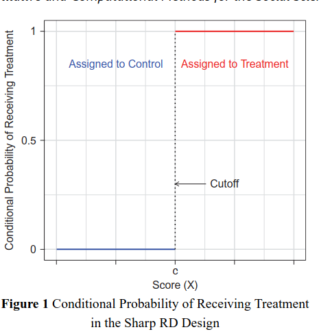
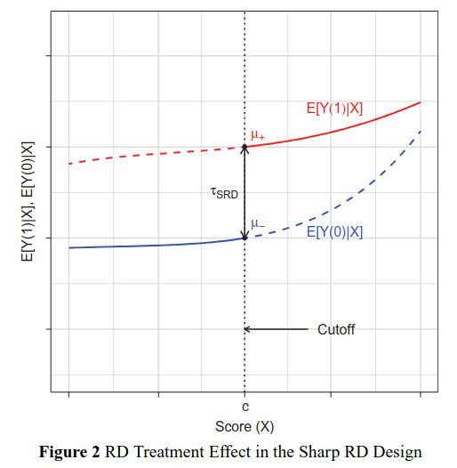
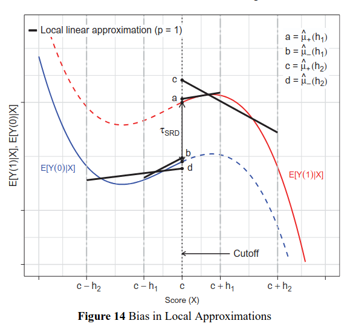
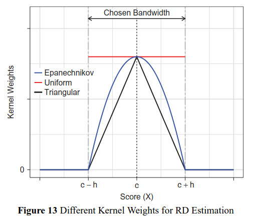

```{r setup, include = F}
require(knitr)
require(magrittr)
require(kableExtra)
require(ggplot2)
require(grid)
require(data.table)
require(UsingR)
require(lfe)

options("kableExtra.html.bsTable" = T)
```


<style type="text/css">
  .reveal h2,h3,h4,h5,h6 {
    text-align: left;
  }
  .reveal p {
    text-align: left;
  }
  .reveal ul {
    display: block;
  }
  .reveal ol {
    display: block;
  }
  .table-hover > tbody > tr:hover { 
  background-color: #696969;
  }
</style>


## Outline

### Natural Experiments

- Motivation/Definition
- Challenges
- IV
- RDD
- Qualitative Evidence
- Balance Tests
- Papers


# Natural Experiments

---

### What do we mean by natural experiment?

An **observational study** where causal inference comes from the design that draws on randomization of treatment.

- no manipulation of treatment by researcher
- random or "as-if" random assignment takes place in the "real world"


**experiment**: because it has **randomization**

**natural**: because it occurs without researcher intervention in real-world

---

### Why?

1. solution to confounding

2. no complex estimands (hopefully!), simple and transparent statistical models
  
  - fewer worries about common support, interpolation/extrapolation


## Compare and contrast

> Piccardi et al use simple $t$ tests (in a regression context) to compare differences in means

> "The power of multiple regression analysis is that it allows us to do in non-experimental environments what natural scientists are able to do in a controlled laboratory setting: keep other factors fixed" (Wooldridge 2009: 77)

## Design vs. Model-based inferences

A matter of **degree**

Statistical evidence for causality combines **observed data** and a **mathematical model** of the world.

>- mathematical model makes inferences about reality
>- model always involves assumptions about how observed data are generated
>- can almost always apply the model, even if it is wrong

## Design vs. Model-based inferences

Causal evidence varies in terms of complexity of math/restrictiveness of assumptions: a matter of **degree**

- **Model-based** inferences about causality involve many choices in complex statistical models with many difficult-to-assess assumptions

- **Design-based** inferences about causality use carefully controlled comparisons with simple models and transparent assumptions

---

### Challenges

1. Finding Natural Experiments
    
- where is there actually randomness? is it known random process (lottery) or "as-if" random?
- relevance of intervention; relevance of randomly assigned group
- random vs as-if random: known random process (lottery), something that is "as-if" random... (in what way)
  
---

### Challenges

2. Arguing for Randomness

How do we know this is random? 

- qualitative evidence: how was treatment assigned? If a lottery, what was the process? Were the rules followed? If "as-if" random, how did treatment occur?
- balance tests: if treatment is random, should be independent of pre-treatment attributes

--- 

### Challenges

3. How simple is the design?

- In some cases, very simple random process $\to$ simple statistical model (like experiments)
- sometimes, we claim randomness, conditional on other factors. $\to$ complicated models, harder to understand


---

### Varieties:

1. "Standard natural experiments": treatment $D$ is randomized for some units

2. Instrumental Variables: some instrument $Z$ is randomized and affects treatment $D$

3. Regression Discontinuity: treatment assignment of $D$  takes place at cutoff $c$, random close to $c$

# Instrumental Variables

---

### Instrumental Variables

What is it? Extends logic of $CACE$ to 

- continuous treatments $D$ 
- continuous "assignment-to-treatment" $Z$
- possibility of including controls ($Z$ is random, conditional on $X$

How?

- 2SLS, IVLS (generalizations of least squares)
- "first stage" is effect of $Z$ on $D$
- "second stage" is effect of $\widehat{D}$ on $Y$
- "reduced form" is effect of $Z$ on $Y$

---

### Instrumental Variables

**Assumptions**:

- instrument $Z$ is independent of potential outcomes of $Y$
- $Z$ only affects $Y$ through $D$ (exclusion restriction)
- monotonicity: $Z$ can only increase (decrease) $D$ (equivalent to no defiers)
- $Z$ must actually affect $D$ (there must be SOME compliers)

---

### Instrumental Variables

**Issues**:

- What is a "complier" when we have continuous $Z$ and $D$? (orthogonal projection of $D$ onto $Z$) ($\widehat{D}$ from regressing $D$ on $Z$)
- Least Squares problems still apply:
  - assume linearity $\to$ interpolation/extrapolation issues
  - which values of $D$ are contributing to estimated effect?
  
---

### IV Issues 

Recent work by [Lal et al (2024)](https://yiqingxu.org/papers/english/2021_iv/LLXZ.pdf) finds two major issues:

1. Weak Instruments a problem:

- "first stage" (effect of $Z$ on $D$, assignment on taking treatment) is weak
- CACE remains biased in larger samples (longer for consistency to kick in)
- large standard errors
- normal approximation of sampling distribution is wrong

---

### IV Issues 

1. Weak Instruments a problem: What to do? 

- rule of thumb: $F$ statistic for $Z$ on $D$ should be $> 10$. 

Lal et al show we must: 

- Correctly test for strength of $Z \to D$ (Effective F) 
- Use significance tests that adjust $t$ statistics: bootstrap or $tF$ procedure
- Use weak-instrument procedures (AR test)

all in `ivDiag` package.


---

### IV Issues 

2. Exclusion Restriction Violations

If exclusion restriction is violated, weak instruments $\to$ amplified bias


- Zero First Stage: test effect of $Z$ on $Y$ for "never takers"/"always takers" (cases that don't change $D$ because of $Z$). Should find no effect. 


# RDD

--- 

### Regression Discontinuity

Classic example: 

What is the effect of electing a criminal vs. non-criminal politician on provision of government handouts?

- places that elect criminals vs not likely different in many ways.
- what if we compare places in which criminal candidate bare won or lost against non-criminal politician?


--- 

### Regression Discontinuity

Classic example: 

When criminal either won or came in second...

- there is a continuous variable (**forcing variable**) $X$: $\text{margin of victory} = voteshare_{crim} - voteshare_{noncrim}$ 
- when margin of victory reaches 0 (a cutoff, $c$), $D$ goes from 0 to 1

---



---

### Regression Discontinuity

**Sharp RD**: Move from all untreated to all treated at the cutoff

$\tau_{SRD} = E[Y_i(1) - Y_i(0) | X_i = c]$

**Fuzzy RD**: Some units shift from untreated to treated at cutoff $c$

- turns into instrumental variables problem.

---

### Regression Discontinuity

Key assumption:

**continuity at cutoff**: 

- CEFs of $E[Y_i(1) | X_i =]$, $E[Y_i(0) | X_i =]$ are continuous and smooth across forcing variable (e.g., vote share)
- functions can have non-zero slope at the cutoff, but must be continuous/smooth


---



>- How do we get the CEF? FPCI

---

### Regression Discontinuity

Only need to estimate $CEF$ at the cutoff, $c$...

- estimate the slope of $E[Y(0) | X_i = c]$ using data where $X < 0$, $D=0$
- estimate the slope of $E[Y(1) | X_i = c]$ using data where $X > 1$, $D=1$

How?

- want the best fit AT the cutoff; don't want to estimate CEF for all values $X < 0$
- **local** polynomial regression:
  - fit CEF $Y = f(X)$ as **polynomials** of $X$ for $X<c$ and $X>c$); get difference in $Y$ at $c$.
  - estimate this putting more weight on data near $c$ (**local**)

---

### Regression Discontinuity

Choices to make: 

- polynomials of $X$: 0, 1, 2, 3...?
- kernel: how to assign weights to cases?
- bandwidth: how far can data be from $c$ to get non-zero weight?

---

### Regression Discontinuity

Choosing polynomial order

- typically 1, sometimes 2. 
- local LINEAR model is good approximation

---



---

### Regression Discontinuity

Choosing kernel (not super consequential)

- Triangular: default, preferred
- Epanechikov
- Uniform

--- 



---

### Regression Discontinuity

Choosing bandwidth (most consequential)

- choice of bandwidth affects bias and variance of the estimate
- choose bandwidth to minimize MSE of estimate (MSE a function of bias and variance)
- essentially check different bandwidths to see which has lower MSE

---

### Regression Discontinuity

Standard Errors (consequential)

- selection of bandwidth $\to$ optimal effect estimates
- selection of bandwidth $\to$ incorrect standard errors b/c bias remains
- "normal" standard errors are incorrect
- robust bias corrected: estimate bias, account for variance of effect estimate and bias estimate


---


### Regression Discontinuity

Check continuity

- examine effect of $D$ on pre-treatment covariates, using RD

Check sorting/manipulation:

- density tests: is there clumping of cases on one or the other side of the cutoff (b/c it is advantageous to manipulate $X$ to change $D$) 
- "donut tests": leave out cases right at the cutoff

# Example Paper: Nellis et al

---

### What is the research design:

- What is the instrument? 
- What is in the regression model for 2SLS? Why?
- What do the assumptions mean in this context? Do they make sense?
- Is there any reason to be worried about weak instruments?

---

### What is the research design:

- How is this related to regression discontinuity?

# Assessing Random Assignment

---

### Balance Tests

Logic: if $D$ (or $Z$) is random, then independent of other causes of $Y$. Should not observed differences in pre-treatment variables across $D$/$Z$.

- regression of $X$ on $D/Z$; Komolgorov-Smirnov tests (differences in distribution) 
- null hypothesis tests: expect to reject the null with frequency of $\alpha$ among all tests.
- equivalence tests are better: reject null of differences greater than $\epsilon$ 
- how big of a difference? 1/10th, 1/20th standard deviation. 
- report balance on STANDARDIZED variarables (mean 0, sd 1)

---

Nellis et al appendix:

- Let's go through these tests... what do they do? Why?


---

### Balance Tests

But which covariates should you examine?

Variables plausibly linked to:

- stories about confounding (so somehow causes of $Y$)
- processes that might determine treatment (even in the "natural experiment")

This requires theoretical knowledge and **qualitative contextual** knowledge about your cases

---

### Qualitative Evidence:

Dunning highlights importance of **causal process observation** of treatment assignment.

- How is treatment actually assigned/received?


---

### Qualitative Evidence:

Key questions to ask are:

1.) which actors/processes are involved to assigning / receiving treatment?

- humans have incentives/motivation to allocate resources in specific ways
- some natural experiments appeal to "nature" as random. But... natural processes still follow specific processes; humans adapt to/respond to "natural" conditions. (e.g. rough terrain, crop suitability)

---

### Qualitative Evidence:

For actors:

- *information*: Do units / actors controlling treatment know which cases are getting exposed to treatment?
- *incentives*: Do units / actors have incentives to self-select into or other control allocation of treatment?
- *capacities*: Do units / actors have the capacity to self-select or allocate treatment to particular units?

---

Paper Dialogue:

- What is the natural experiment in Ferwerda and Miller?
- How do they justify random assignment?
- What are Kocher and Monteiro's critiques? How do they align with the causal process observations laid out by Dunning?

---

### What is random?

Things that seem arbitrary/beyond human control not necessarily random: really make the case for HOW the random assignment process would work (if it is 'as-if' random)

- rainfall, geological formations not in human control. But people /institutions select into these conditions
- geographic/natural features often bad instruments because they affect lots of things
- geographic discontinuities are similar: lots of things change in different jurisdictions
- sometimes these issues fixed when combined with DiDs