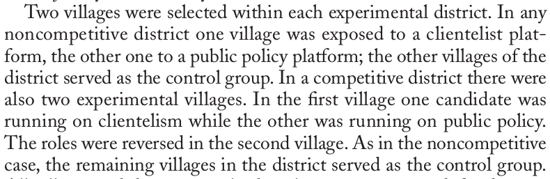

```{r setup, include=FALSE}
knitr::opts_chunk$set(echo = TRUE)
require(knitr)
require(magrittr)
require(ri)
```

<style type="text/css">
  .reveal h2,h3,h4,h5,h6 {
    text-align: left;
  }
  .reveal p {
    text-align: left;
  }
  .reveal ul {
    display: block;
  }
  .reveal ol {
    display: block;
  }
</style>


# Potential Outcomes Model and Sampling Variability


## Plan for Today

- Recap
- Review ACE (and unbiasedness)
- Sampling variability of ACE
- Three ways to estimate

# Recap

## Key ideas from last week

* Reviewed **random variables** and their expectations
* Potential Outcomes Model (Neyman Causal Model)
* Random assignment (in expectation) allows us to estimate unobserved potential outcomes

### BUT...

>- ... random assignment **does not guarantee** that any **particular** randomization gives us an exact estimate of unobserved potential outcomes

>- Need to account for **sampling variability**

## Sampling variability

In any given randomization, **treatment mean** and **control mean** are likely off from the true mean...

We want to know:

1. how much are they off?
2. turn that into a hypothesis test

## Key idea

### Sampling Distribution of the Mean

>- What is it?

>- We'll do an example

# Example

## Wantchekon (2003)

### Do clientelistc appeals work better than policy-based appeals?

## Wantchekon (2003)

March 2001 presidential elections in Benin



## Wantchekon (2003)


## Imagine we know *potential outcomes*

| $Village_i$ | $Y_i^1$ | $Y_i^0$ |
|---------|---------|---------|
| 1       | 9       | 7       | 
| 2       | 8       | 8       | 
| 3       | 7       | 5       | 
| 4       | 5       | 7       | 
| 5       | 8       | 7       | 

## What are the unit treatment effects? ($\tau_i$)

## What are the unit treatment effects? ($\tau_i$)

| $Village_i$ | $Y_i^1$ | $Y_i^0$ | $\tau_i$ |
|---------|---------|---------|----------|
| 1       | 9       | 7       | 2        |
| 2       | 8       | 8       | 0        |
| 3       | 7       | 5       | 2        |
| 4       | 5       | 7       | -2       |
| 5       | 8       | 7       | 1        |

## What is the Average Causal Effect?

## What is the Average Causal Effect?

```{r}

tau_i = c(2,0,2,-2,1)

mean(tau_i)

```

## Imagine we run this experiment 

### We set 2 villages in treatment (clientelist appeal)

### We set 3 villages in control (no special appeal)

### What are all possible random assignments (in treatment)?

---

### All possible treatment groups

```{r, echo=F}

randomizations = combn(5,2,simplify = T) %>% t
randomizations %>% kable

```

## For each randomization, calculate the $\widehat{ACE}$

| $Village_i$ | $Y_i^1$ | $Y_i^0$ | $\tau_i$ |
|---------|---------|---------|----------|
| 1       | 9       | 7       | 2        |
| 2       | 8       | 8       | 0        |
| 3       | 7       | 5       | 2        |
| 4       | 5       | 7       | -2       |
| 5       | 8       | 7       | 1        |

## Across the all randomizations...

### What is the mean $\widehat{ACE}$?


## Let's check our work:

```{r}
p_o_table = data.frame(village_i = 1:5,
                       y_i_1 = c(9,8,7,5,8),
                       y_i_0 = c(7,8,5,7,7)
                      )
p_o_table$tau_i = p_o_table$y_i_1 - p_o_table$y_i_0

#ACE
mean(p_o_table$tau_i)
```


## Let's check our work:

```{r}
randomizations = combn(5,2,simplify = T) %>% t

treatment_groups = apply(randomizations, 1, 
                         function(x) 
                           mean(p_o_table[p_o_table$village_i %in% x, 'y_i_1'])
                        )

control_groups = apply(randomizations, 1, 
                         function(x) 
                           mean(p_o_table[!(p_o_table$village_i %in% x), 'y_i_0'])
                        )

treatment_groups

control_groups
```

## Let's check our work:

```{r}

#Average Causal Effects (hat)
treatment_groups - control_groups

#Expected value of the ACE (hat)
mean(treatment_groups - control_groups)
```

## Let's check our work:

```{r, echo = F}

hist(treatment_groups - control_groups,
     xlab = "ACE",
     main = "Sampling Distribution of ACE-hat",
     breaks = 20)

```

## Summary:

#### Sample Difference in Means in **unbiased**

- mean of the **sampling distribution** of **sample** $\widehat{ACE}$ is same as **population** $ACE$
- **but** none of the samples have exact population $ACE$. 

#### Histogram is the **exact sampling distribution** of the $\widehat{ACE}$ in this experiment

- tells us how likely it is we observe sample $\widehat{ACE}$ by chance (using this randomization scheme)

#### We never observe this histogram

>- we need a way to **estimate** the sampling distribution of $\widehat{ACE}$.

# Estimating the variance of the sample \widehat{ACE}

## Three approaches

1) Analytic/Asymptotic approach

2) Bootstrap approach

3) Randomization inference

# Analytic Approach

## Analytic Approach

### First: we want to get variance of $widehat{ACE}$

- $widehat{ACE}$ is a **difference**
- Need rules for calculating variance of **difference** between random variables

$$Var(X - Y) = Var(X) + Var(Y) - 2 \cdot Cov(X,Y)$$

## Analytic Approach

### Variance of $\widehat{ACE}$

- $m$ units assigned to treatment; $N - m = n$ units assigned to control
- $Y^T = \frac{1}{m}\sum\limits_{i=1}^{m}Y_i^1$
- $Y^C = \frac{1}{n}\sum\limits_{i=m+1}^{N}Y_i^0$

What is $Var(Y^T - Y^C)$?

>- $Var(Y^T) + Var(Y^C) - 2 Cov(Y^T, Y^C)$

## Analytic Approach

### Variances of Treatment/Control Group

assume i.i.d. draws from the study group (is this correct?)

$$Var(Y^T) = \frac{Var(Y_i^1)}{m}$$

Variance of **sampling distribution** of the **treatment-group mean** is variance of potential outcomes under treatment divided by the treatment group size

## Analytic Approach

Variance of potential outcomes under treatment:

$$Var(Y_i^1) = \frac{1}{N}\sum\limits_{i=1}^{N}(Y_i^1 - \overline{Y^1})^2$$

### This is a *parameter*, often denoted $\sigma^2$

$$Var(Y^T) = \frac{\sigma^2}{m}$$

## Analytic Approach

Since we don't know $\sigma^2$, we need to **estimate** it from our **sample**

Just like sample mean, sample variance is an unbiased estimator of population variance:

- if we divide by $m - 1$, not $m$

$$\widehat{Var(Y^1_i)} = \widehat{\sigma^2} = \frac{1}{m-1}\sum\limits_{i=1}^{m}(Y_i^1 - Y^T)^2$$


## Analytic Approach: Digression

Why is sample variance biased if we divide by $m$?

- the mean minimizes the sum of squared residuals

- If the sample mean is different from the population mean, then the sum of squared residuals from the sample mean will be less than what it is for the population mean.

- Sample variance is sum of squared residuals / m.

- Sample variance is always less than population variance unless sample mean equals population mean

## Analytic Approach: Digression

```{r echo = F, include = T}
k = 10000
out = data.frame(x_bar = rep(NA, k), x_sd = rep(NA, k), diff_sd = rep(NA, k))

for (i in 1:k){
  draw = rnorm(100)
  x_bar = mean(draw)
  x_sd = (mean((draw - x_bar)^2))
  true_sd = (mean((draw - 0)^2))
  out[i,] = c(x_bar, x_sd, (x_sd - true_sd))
}

plot(out$x_bar, out$diff_sd, xlab = "Sample Mean - Population Mean", ylab = "Sample Variance - True Variance", main = "Variance using sample mean - Variance using population mean")
```

## Analytic Approach

Using this approach we can estimate $Var(Y^T)$ and $Var(Y^C)$. We still need $Cov(Y^T,Y^C)$ to get variance of sampling distribution of sample $\widehat{ACE}$

$$Cov(Y^T,Y^C) = -\frac{1}{N(N-1)}\sum\limits_{i=1}^{N}(Y_i^1 - \overline{Y^1})(Y_i^0 - \overline{Y^0})$$

### Can we estimate this? What is the problem here?

## Analytic Approach

We can't estimate the covariance because we can't see both potential outcomes for each case!

### What do we do?

We can ignore the covariance safely, because

1. We've ignored sampling without replacement from finite population
2. This will either exactly offset or MORE THAN offset any reduction in the $Var(ACE)$ due to ignoring unestimable $Cov(Y^T,Y^C)$
3. i.e., variances we obtain with $\widehat{Var}(\widehat{ACE})} = \widehat{Var}(Y^T) + \widehat{Var}(Y^C)$ are going to be exactly correct or TOO LARGE (conservative)

## Analytic Approach

So far we've been trying to estimate the **variance** of the $\widehat{ACE}$ But variance is not directly practical: units are squared. The **standard error** or the **standard deviation of the sampling distribution** of the $\widehat{ACE}$ is more helpful. It is the square-root of the **variance**.

To turn variances into **hypothesis tests** we must also know what the **shape** of the sampling distribution is. We typically assume it is **asymptotically normal**

## Analytic Approach

### Normal approximation:

Per the CLT: the sampling distributions of sums of random variables (and by extension, their mean) approach the normal curve as the sample size $\rightarrow\infty$.

We then use area under the normal (usually $t$: why?) curve to estimate chance of observing a sample mean by chance, given some **null hypothesis**.

Approximation can perform well, but depends on sample size and underlying distribution. 

## Analytic Approach

If the **population** looks like this:

```{r, echo = F}
x = rnorm(30)

hist(x)
```

## Analytic Approach

The sampling distibution for $n = 5$ is:

```{r, echo = F}
k = 10000
s_x = sample(x, k * 5, replace = T) %>% matrix(ncol = 5)
m = rowMeans(s_x)

x_m = mean(x)
sd_m = (x - mean(x))^2 %>% mean %>% sqrt
hist(m, xlab = "Sample Mean (n = 5)", main= "Sampling Distribution of Mean", freq = F)
lines(seq(min(m), max(m), 0.01), dnorm(seq(min(m), max(m),0.01), mean = x_m, sd = sd_m/sqrt(5)))
```

## Analytic Approach

If the **population** looks like this:

```{r, echo = F}
x = rbinom(1000, size = 2, prob = 0.05)

hist(x)
```

## Analytic Approach

The sampling distibution for $n = 5$ is:

```{r, echo = F}
k = 10000
s_x = sample(x, k * 5, replace = T) %>% matrix(ncol = 5)
m = rowMeans(s_x)

x_m = mean(x)
sd_m = (x - mean(x))^2 %>% mean %>% sqrt
hist(m, xlab = "Sample Mean (n = 5)", main= "Sampling Distribution of Mean", freq = F)
lines(seq(min(m), max(m), 0.01), dnorm(seq(min(m), max(m),0.01), mean = x_m, sd = sd_m/sqrt(5)))
```


## Analytic Approach

The sampling distibution for $n = 25$ is:

```{r, echo = F}
k = 10000
s_x = sample(x, k * 5, replace = T) %>% matrix(ncol = 25)
m = rowMeans(s_x)
n = 25

x_m = mean(x)
sd_m = (x - mean(x))^2 %>% mean %>% sqrt
hist(m, xlab = "Sample Mean (n = 30)", main= "Sampling Distribution of Mean", freq = F)
lines(seq(min(m), max(m), 0.01), dnorm(seq(min(m), max(m),0.01), mean = x_m, sd = sd_m/sqrt(25)))
```


## Analytic Approach

The sampling distibution for $n = 100$ is:

```{r, echo = F}
k = 10000
s_x = sample(x, k * 5, replace = T) %>% matrix(ncol = 100)
m = rowMeans(s_x)
n = 100

x_m = mean(x)
sd_m = (x - mean(x))^2 %>% mean %>% sqrt
hist(m, xlab = "Sample Mean (n = 100)", main= "Sampling Distribution of Mean", freq = F)
lines(seq(min(m), max(m), 0.01), dnorm(seq(min(m), max(m),0.01), mean = x_m, sd = sd_m/sqrt(100)))
```

## Analytic Approach

Does normality hold in our example?

```{r, echo = F}
hist(treatment_groups - control_groups,
     xlab = "ACE",
     main = "Sampling Distribution of ACE hat",
     breaks = 20)

```

## Analytic Approach

### Hypothesis Tests

1. We run an experiment on our 5 villages, and observe $\widehat{ACE} = 0.5$
2. The hypothesis test investigates: what is probability of observing a value this large if the true $ACE = 0$ 
3. Null hypothesis $H_0$ is $ACE = 0$ while alternative hypotheses are $ACE > 0$ or $ACE < 0$ or $ACE \neq 0$.

## Analytic Approach

### Hypothesis Tests

- We need to estimate the standard error of ACE: $\widehat{SE}(\widehat{ACE})$
- Divide $\widehat{ACE}$ by $\widehat{SE}$.
- Compare test-statistic against $t$ distribution, and reject/fail to reject null

Time permitting, we can do an example...

## Analytic Approach

### Limitions

- $t$-tests assume either normality in potential outcomes, or asymptotic normality of sample means. This may be incorrect with small $n$ or complex designs

Alternatives:

**bootstrap**

**randomization inference**

# The Bootstrap

## Bootstrapping 

Rather than assume the sampling distribution takes on a particular shape with a certain variance, we can **simulate** the sampling process.

Assuming we know what the sampling process was (e.g. clustering), we can use our sample to simulate what the sampling distribution might look like.

**boostrapping**: take the empirical sample as a new population and then simulate $k$ samples at random with replacement from this population to simulation sampling distribution of (e.g.) the mean.

## Bootstrapping

Let's use the **real** Wantcheckon data

```{r, echo = F}
y = c(0.81,0.75, 
      0.90, 0.82, 
      0.94, 0.74, 
      0.81, 0.58,
      0.91, 0.86,
      0.86,0.64,
      0.87,0.72,
      0.65, 0.84)

Z = rep(1:0, 8)

wantchekon = data.frame(clientelist = Z,vote_pct = y)

kable(wantchekon)
```

## Bootstrapping

Normal Approximation

```{r}
var_ace = var(wantchekon$vote_pct[wantchekon$clientelist == 1])/8 +
  var(wantchekon$vote_pct[wantchekon$clientelist == 0])/8

se = sqrt(var_ace)
y_t = mean(wantchekon$vote_pct[wantchekon$clientelist == 1])
y_c = mean(wantchekon$vote_pct[wantchekon$clientelist == 0])

t = (y_t - y_c) / se

#Ha: ACE > 0
#Satterthwaite df
pt(t, df = 13.9, lower.tail = F)
```

## Bootstrapping

```{r}
#number of iterations
k = 10000

#store bootstrapped results here
bs_ace = matrix(NA, ncol = 1, nrow = k)

for (i in 1:k) {
  #Sample treatment population
  t_b = sample(wantchekon$vote_pct[wantchekon$clientelist == 1], replace = T)
  #Sample from control population
  c_b = sample(wantchekon$vote_pct[wantchekon$clientelist == 0], replace = T)
  
  bs_ace[i,1] = mean(t_b) - mean(c_b)
}

```

## Bootstrapping

```{r, echo = F}

hist(bs_ace, xlab = "Bootstrapped ACE hat", main = "Bootstrapped Sampling Distribution\nof ACE hat")

```

## Bootstrapping


(1) Take SD of boostrapped distribution as standard error of sampling distribution

```{r}
sd(bs_ace)

se

t_bs = (y_t - y_c) / sd(bs_ace)

#Ha: ACE > 0
#Satterthwaite df
pt(t_bs, df = 13.9, lower.tail = F)
```

## Bootstrapping

(2) Take 2.5th and 97.5th quantiles of bootstrap distribution to get CI

```{r}
quantile(bs_ace, probs = c(0.025, 0.975))
```

## Bootstrapping

Bootstrap (in this case) gives a very similar answer to analytic approach. This is because the assumptions for analytic formula are correct (i.i.d. sampling) and i.i.d. sampling in bootstrap algorithm.

- in other contexts with more complex sampling, complex estimator, analytic variance may not be available. Bootstrap can help

- We will see this again later in the course.

# Randomization Inference

## Randomization Inference

Similar to bootstrap (in some ways):

- randomization inference does not assume any asymptotic distribution
- can be applied to many different estimators (not just, e.g., the mean)

Different from bootstrap (in other ways):

- Do not resample with replacement from the data
- Instead, consider all other possible randomizations

## Randomization Inference

### A different null

Normally we consider a null where the **average** effect is $0$ (some units could have positive or negative effects).

$$\frac{1}{N}\sum\limits_{i=1}^{N} \tau_i = ACE = 0$$
Randomization inference tests the **sharp null hypothesis**

$$\tau_i = 0 \ \ \ \forall \ \ \ (i\ \in N)$$
that **every** unit treatment effect is $0$.

## Randomization Inference

### Advantages:

- No assumptions about distributions (no assumption of normality, no dependence on asymptotic convergence)
- directly flows from potential outcomes model
- any test statistic (median, ranks, whatever)

### Disadvantages

- only tests **sharp null** which may be less interesting (ask about a caveat here)
- Confidence intervals only for **constant effects**
- $p$ values limited by number of permutations (too few, and they are coarse, too many, they are approximate)

## Randomization Inference

### In practice:

- Null hypothesis of **sharp null** lets us complete the potential outcomes table based on the observed data
- Why?

>- Sharp null implies that $Y_i^1 = Y_i^0$ for all units $i$.

## Randomization Inference

```{r, echo = F}

ri_table = data.frame(i = 1:16, `Y_i_0` = wantchekon$vote_pct, `Y_i_1` = wantchekon$vote_pct)

kable(ri_table)

```

## Randomization Inference

Once we have this table of potential outcomes, we:

1. Identify all possible permutations of randomizations (or sample from them, if this number is large)
2. Calculate the difference in means (or other statistic of our choice) for these different randomizations that could have happened.
3. Compare our observed statistic against this **null distribution** (distribution of possible outcomes that could have occurred by chance assuming the sharp null hypothesis is true)
4. Calculate $p$ value based on fraction of outcomes in null distribution more extreme than observed outcome.

## Randomization Inference

```{r, echo = F, warning=F}
y = wantchekon$vote_pct
Z = wantchekon$clientelist
ate = estate(y, Z)
perms = genperms(Z)
Ys = genouts(y, Z, ate = 0)
distout = gendist(Ys, perms)
out = dispdist(distout, ate)
```

## Randomziation Inference

In `R`:

```{r}
#install.packages('ri')
require(ri)
```

