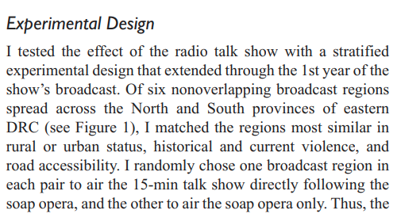
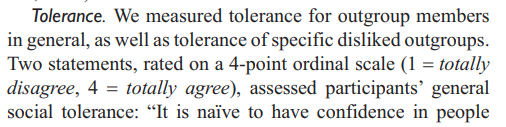

```{r setup, include=FALSE}
knitr::opts_chunk$set(echo = TRUE)
require(knitr)
require(magrittr)
require(ri)
require(kableExtra)
require(data.table)
```

<style type="text/css">
  .reveal h2,h3,h4,h5,h6 {
    text-align: left;
  }
  .reveal p {
    text-align: left;
  }
  .reveal ul {
    display: block;
  }
  .reveal ol {
    display: block;
  }
</style>


# Potential Outcomes Model and Sampling Variability


## Plan for Today

- Review $ACE$ (and unbiasedness of $\widehat{ACE}$)
- Sampling variability of $\widehat{ACE}$
- Two ways to estimate variance of $\widehat{ACE}$
    - asymptotic
    - randomization inference

# Review

## Key ideas from last week

* Reviewed **random variables** and their expectations
* Potential Outcomes Model (Neyman Causal Model)
* Random assignment allows us to estimate unobserved potential outcomes (given assumptions)

### BUT...

>- ... random assignment **does not guarantee** that any **particular** randomization gives us an exact estimate of unobserved potential outcomes

>- Need to account for **sampling variability**

## Sampling variability

In any given randomization, **treatment mean** and **control mean** are likely $\neq$  the true means of $Y(1)$ and $Y(0)$...

We want to know:

1. By how much are they sample means likely to deviate from parameter?
2. Given $\widehat{ACE}$, how confident can we be that $ACE \neq 0$

## Key idea

### Sampling Distribution of the Mean

>- What is it?

>- We'll do an example

## Bonus idea

### Unbiasedness of $\widehat{ACE}$


**parameter**: unknown attribute of random variable (e.g., the mean)

**estimator**: rule/procedure for **estimating** an unknown parameter given observed data

**bias**: estimator if **biased** if, on average, the estimator yields a value different from the parameter

So $\widehat{ACE}$ is unbiased if:

$$E(\widehat{ACE}) - ACE = 0$$

# Example

## Paluck (2010)

Following evidence of effects of soap opera in Rwanda (2009):


## Paluck (2010)

Variation on Rwandan study, in Eastern DRC.



## Paluck (2010)


## Paluck (2010)



## Paluck (2010)

>  "I would not like that group to belong to my community association"; (1 = totally disagree; 4 = totally agree)

| $Region_i$ | $Y_i(1)$ | $Y_i(0)$ |
|---------|---------|---------|
| 1       | 3       | 2       | 
| 2       | 4       | 4       | 
| 3       | 4       | 2       | 
| 4       | 2       | 3       | 
| 5       | 2       | 4       | 
| 6       | 4       | 1       | 

## What are the unit treatment effects? ($\tau_i$)

| $Region_i$ | $Y_i(1)$ | $Y_i(0)$ |
|---------|---------|---------|
| 1       | 3       | 2       | 
| 2       | 4       | 4       | 
| 3       | 4       | 2       | 
| 4       | 2       | 3       | 
| 5       | 2       | 4       | 
| 6       | 4       | 1       | 

## What is the Average Causal Effect ($ACE$)?

| $Region_i$ | $Y_i(1)$ | $Y_i(0)$ |
|---------|---------|---------|
| 1       | 3       | 2       | 
| 2       | 4       | 4       | 
| 3       | 4       | 2       | 
| 4       | 2       | 3       | 
| 5       | 2       | 4       | 
| 6       | 4       | 1       | 

## Imagine we run this experiment 

- We set 3 regions in treatment (soap opera + talk show)

- We set 3 regions in control (soap opera only)

- How many possible random assignments are there?

- What are all possible random assignments (to treatment and control)?
    - on paper/in `R`

## All possible treatment groups

---

### All possible treatment groups

```{r, echo=F}
require(ri) #combn is a function in this package
require(magrittr) # %>% is from this package
require(kableExtra) #scroll_box is from this package
  
randomizations = combn(6,3,simplify = T) %>% t
randomizations %>% kable %>% scroll_box(height = "500px" )

```

---

For each randomization, calculate the $\widehat{ACE}$


| $Region_i$ | $Y_i(1)$ | $Y_i(0)$ |
|---------|---------|---------|
| 1       | 3       | 2       | 
| 2       | 4       | 4       | 
| 3       | 4       | 2       | 
| 4       | 2       | 3       | 
| 5       | 2       | 4       | 
| 6       | 4       | 1       | 

---

### Across all randomizations...

- What is the mean $\widehat{ACE}$?

- How does it compare to the $ACE$?

- Are there any $\widehat{ACE} = ACE$

##

---

Let's check our work:

```{r}
require(data.table) #data.table function

p_o_table = data.table(region_i = 1:6,
                       y_i_1 = c(3,4,4,2,2,4),
                       y_i_0 = c(2,4,2,3,4,1)
                      )
p_o_table$tau_i = p_o_table$y_i_1 - p_o_table$y_i_0
p_o_table[, tau_i := y_i_1 - y_i_0]

#ACE
ace = mean(p_o_table$tau_i)
ace
```

---

Let's check our work:

```{r}
require(ri) #combn is a function in this package
require(magrittr) # %>% is from this package

randomizations = combn(6,3,simplify = T) %>% t

t_means = apply(randomizations, 1, 
                function(x) 
                  mean(p_o_table[region_i %in% x, y_i_1])
                )

c_means = apply(randomizations, 1, 
                function(x) 
                  mean(p_o_table[!(region_i %in% x), y_i_0])
                )
```

---

Let's check our work:

``` {r}

t_means

c_means


```

---

Let's check our work:

```{r}
#Average Causal Effects (hat)
ace_hats = t_means - c_means

#Expected value of the ACE (hat)
e_ace_hat = mean(ace_hats)
e_ace_hat

#ACE
ace
```


---

Let's check our work:

```{r, echo = F}

hist(t_means,
     xlab = "Y(1) | Z = 1",
     main = "Sampling Distribution of Treated Group Mean",
     breaks = 20)
abline(v = p_o_table$y_i_1 %>% mean, col = 'red')

```

---

Let's check our work:

```{r, echo = F}

hist(c_means,
     xlab = "Y(0) | Z = 0",
     main = "Sampling Distribution of Control Group Mean",
     breaks = 20)
abline(v = p_o_table$y_i_0 %>% mean, col = 'red')

```

---

Let's check our work:

```{r, echo = F}

hist(ace_hats,
     xlab = "ACE-hat",
     main = "Sampling Distribution of ACE-hat",
     breaks = 20)
abline(v = ace, col = 'red')

```

--- 

### Summary:

1. Sample Difference in Means in **unbiased**

    - mean of the **sampling distribution** of **sample** $\widehat{ACE}$ is same as **population** $ACE$
    - yet **none** of the samples estimate population $ACE$ exactly.

2. Histogram is the **exact sampling distribution** of the $\widehat{ACE}$ in this experiment

    - shows us how likely it is we observe sample $\widehat{ACE}$ by chance (using this randomization scheme)

--- 

### Summary:

This sampling distribution could tell us 

- how likely we are to observe $\widehat{ACE}$ by chance
- variability in estimate $\widehat{ACE}$ 
- also the true $ACE$

But we never observe this histogram

- we need a way to **estimate** the sampling distribution of $\widehat{ACE}$.


# Variance of $\widehat{ACE}$

## Two approaches

1) Analytic/Asymptotic approach

2) Randomization inference

3) <strike>Bootstrap</strike>

## Analytic Approach

**First**: we want to get variance of $\widehat{ACE}$

- $\widehat{ACE}$ is a **difference** of random variables. Why?
- Need rules for calculating variance of **difference** between random variables

$$Var[X - Y] = Var[X] + Var[Y] - 2 \cdot Cov[X,Y]$$

--- 

### Analytic Approach

- **study group** of size $N$ ($N$ units are assigned)
- $m$ units assigned to T; $N - m = n$ units assigned to C
- $Y^T = \frac{1}{m}\sum\limits_{i=1}^{m}[Y_i(1) | Z_i = 1]$
- $Y^C = \frac{1}{n}\sum\limits_{i=m+1}^{N}[Y_i(0) | Z_i= 0]$
- $\widehat{ACE} = Y^T - Y^C$

What is $Var[Y^T - Y^C] = Var[\widehat{ACE}]$?

>- $Var[Y^T - Y^C] = Var[Y^T] + Var[Y^C] - 2 Cov[Y^T, Y^C]$

--- 

### Analytic Approach

**Variances of Treatment/Control Group Means**

if we assume **independent and identically distributed** draws from the **study group** (is this correct?)

$$Var[Y^T] = \frac{Var[Y_i(1)]}{m}$$

Variance of **sampling distribution** of the **treatment-group mean** is variance of  potential outcomes under treatment for **all cases** divided by the treatment group size

--- 

### Analytic Approach

Variance of potential outcomes under treatment:

$$Var[Y_i(1)] = \frac{1}{N}\sum\limits_{i=1}^{N} \left( Y_i(1) - \frac{\sum\limits_{i=1}^{N} Y_i(1)}{N} \right) ^2$$

This is a *parameter*, often denoted $\sigma^2$

$$Var[Y^T] = \frac{\sigma^2}{m}$$

--- 

### Analytic Approach

We don't know $\sigma^2$, we need to **estimate** it from our **sample**.

Like sample mean, sample variance is an unbiased estimator of population variance:

- **if we divide by $m - 1$ not $m$**

$$\widehat{Var[Y_i(1)]} = \widehat{\sigma^2} = \frac{1}{\color{red}{m-1}}\sum\limits_{i=1}^{m}[Y_i(1) | Z_i = 1] - Y^T)^2$$

---

###  Digression

Why is sample variance biased if we divide by $m$ (instead of $m-1$)?

- mean of data minimizes the sum of squared errors

- If the sample mean $\hat\mu$ $\neq$ population mean $\mu$, then $\left[ \sum\limits_{i = 1}^{m} [x_i - \hat\mu]^2 \right] < \left[ \sum\limits_{i = 1}^{m} [x_i - \mu]^2 \right]$

- **Uncorrected** sample variance $\widehat{\sigma^2}$ is $\frac{1}{m} \sum\limits_{i = 1}^{m} [x_i - \hat\mu]^2$.

- Then, $\widehat{\sigma^2} < \sigma^2$ unless sample mean equals population mean

---

### Digression

```{r echo = F, include = T}
k = 10000
out = data.frame(x_bar = rep(NA, k), x_sd = rep(NA, k), diff_sd = rep(NA, k))

for (i in 1:k){
  draw = rnorm(100)
  x_bar = mean(draw)
  x_sd = (mean((draw - x_bar)^2))
  true_sd = (mean((draw - 0)^2))
  out[i,] = c(x_bar, x_sd, (x_sd - true_sd))
}

plot(out$x_bar, out$diff_sd, xlab = "Sample Mean - Population Mean", ylab = "Sample Variance - True Variance", main = "Variance using sample mean - Variance using population mean")
abline(h = 0, v = 0, col = 'red')
```


---

### Analytic Approach

Using this approach:

$$\widehat{Var[Y_i(1)]} = \widehat{\sigma^2} = \frac{1}{m-1}\sum\limits_{i=1}^{m}[Y_i(1) | Z_i = 1] - Y^T)^2$$

$$\widehat{Var[Y^T]} = \frac{\widehat{\sigma^2}}{m}$$

 we can **estimate** $Var(Y^T)$ and $Var(Y^C)$.
 
 What else do we need to estimate $Var[\widehat{ACE}]$?
 
---

### Analytic Approach

We still need $Cov(Y^T,Y^C)$ to get variance of $\widehat{ACE}$, because 

$Var[\widehat{ACE}] = Var[Y^T] + Var[Y^C] - 2 Cov[Y^T, Y^C]$

<br>

<small>
$$Cov(Y^T,Y^C) = -\frac{1}{N(N-1)}\sum\limits_{i=1}^{N} \left( Y_i(1) - \frac{\sum\limits_{i=1}^{N} Y_i(1)}{N} \right) \cdot \left(Y_i(0) - \frac{\sum\limits_{i=1}^{N} Y_i(0)}{N} \right)$$
</small>

>- **Can we estimate this?**

---

### Analytic Approach

Can't estimate the covariance because we don't see both potential outcomes for each case!

>- What can we do?

---

### Analytic Approach

We can ignore the covariance (**deflates variance**) safely, because

1. Estimator $\widehat{Var[Y^T]}$ ignores sampling **without replacement** from **finite** population (**inflates variance**)
2. Which either **exactly** or **more than** offsets reduction in the $\widehat{Var}(\widehat{ACE})$ due to ignoring $Cov(Y^T,Y^C)$

Variances we obtain with $\widehat{Var}[\widehat{ACE}]$ are going to be:

- **exactly correct** (if $\tau_i$ is the same for all $i$; effect is same for all cases)
- **TOO LARGE**/conservative in all other cases.

--- 

### Analytic Approach

We've been trying to estimate the **variance** of the $\widehat{ACE}$.

Variance is not usually what we want

- units are squared. 
- The **standard error** (**standard deviation of the sampling distribution**) of  $\widehat{ACE}$ is more helpful. It is the square-root of the **variance**.
- Usually, though, we want to do a **hypothesis test**

# Hypothesis Testing

--- 

### Normal approximation:

Per the **Central Limit Theorem**: the **sampling distributions** of **sums of random variables** (and by extension, their means) **approach** the normal distribution as the $N \rightarrow\infty$.

Using this fact; estimated sample mean and variance of the sample mean:

- Use the area under the normal (usually $t$: why?) curve to get compute chance of observing sample mean by chance, given a **null hypothesis**.

This approximation performs well, but depends on **sample size** and **population distribution**. 

--- 

### Normal approximation:

If the **population** looks like this:

```{r, echo = F}
x = rnorm(30)

hist(x)
```

--- 

### Normal approximation:

Predict the shape of sampling distribution of sample mean for $(n= 5$)


```{r, echo = F}
hist(x)
```

--- 

### Normal approximation:

The shape of sampling distribution of sample mean for $(n= 5$)

```{r, echo = F}
k = 10000
s_x = sample(x, k * 5, replace = T) %>% matrix(ncol = 5)
m = rowMeans(s_x)

x_m = mean(x)
sd_m = (x - mean(x))^2 %>% mean %>% sqrt
hist(m, xlab = "Sample Mean (n = 5)", main= "Sampling Distribution of Mean", freq = F)
lines(seq(min(m), max(m), 0.01), dnorm(seq(min(m), max(m),0.01), mean = x_m, sd = sd_m/sqrt(5)))
```


--- 

### Normal approximation:

If the **population** looks like this:

```{r, echo = F}
x = rbinom(1000, size = 2, prob = 0.05)

hist(x)
```


--- 

### Normal approximation:

Predict the shape of sampling distribution of sample mean for $(n= 5$)


```{r, echo = F}
hist(x)
```


--- 

### Normal approximation:

The shape of sampling distribution of sample mean for $(n= 5$)

```{r, echo = F}
k = 10000
s_x = sample(x, k * 5, replace = T) %>% matrix(ncol = 5)
m = rowMeans(s_x)

x_m = mean(x)
sd_m = (x - mean(x))^2 %>% mean %>% sqrt
hist(m, xlab = "Sample Mean (n = 5)", main= "Sampling Distribution of Mean", freq = F)
lines(seq(min(m), max(m), 0.01), dnorm(seq(min(m), max(m),0.01), mean = x_m, sd = sd_m/sqrt(5)))
```

--- 

### Normal approximation:

The sampling distibution of sample mean for $n = 25$ is:

```{r, echo = F}
k = 10000
s_x = sample(x, k * 5, replace = T) %>% matrix(ncol = 25)
m = rowMeans(s_x)
n = 25

x_m = mean(x)
sd_m = (x - mean(x))^2 %>% mean %>% sqrt
hist(m, xlab = "Sample Mean (n = 30)", main= "Sampling Distribution of Mean", freq = F)
lines(seq(min(m), max(m), 0.01), dnorm(seq(min(m), max(m),0.01), mean = x_m, sd = sd_m/sqrt(25)))
```

---

### Normal approximation:

The sampling distribution of sample mean for $(n= 100$) is

```{r, echo = F}
k = 10000
s_x = sample(x, k * 5, replace = T) %>% matrix(ncol = 100)
m = rowMeans(s_x)
n = 100

x_m = mean(x)
sd_m = (x - mean(x))^2 %>% mean %>% sqrt
hist(m, xlab = "Sample Mean (n = 100)", main= "Sampling Distribution of Mean", freq = F)
lines(seq(min(m), max(m), 0.01), dnorm(seq(min(m), max(m),0.01), mean = x_m, sd = sd_m/sqrt(100)))
```

---

### Normal approximation:

Does normality hold in our experiment?

```{r, echo = F}
hist(ace_hats,
     xlab = "ACE",
     main = "Sampling Distribution of ACE hat",
     breaks = 20)

```

---

### Normal approximation:

Does normality hold in our experiment?

```{r, echo = F}
hist(t_means,
     xlab = "Y^T",
     main = "Sampling Distribution of Y^T",
     breaks = 20)

```


---

### Normal approximation:

Does normality hold in our experiment?

```{r, echo = F}
hist(t_means,
     xlab = "Y^C",
     main = "Sampling Distribution of Y^C",
     breaks = 20)
```

---

### Hypothesis Tests

We run an experiment on our 6 regions, and observe $\widehat{ACE} = 0.667$

The hypothesis test investigates: what is probability of observing a value this large or larger if the true $ACE = 0$ 

- **Null hypothesis** $H_0$ is $ACE = 0$ 
- **alternative hypotheses** are $ACE > 0$ or $ACE < 0$ or $ACE \neq 0$.

---

### Hypothesis Tests

- We need to estimate the standard error of ACE: $\widehat{SE}(\widehat{ACE})$
- Divide $\widehat{ACE}$ by $\widehat{SE}$ (get $t$ statistic).
- Compare test-statistic against $t$ distribution, and reject/fail to reject null (given choice of $\alpha$: the significance level)


--- 

### Limitations of Analytical Hypothesis Tests

- $t$-tests assume **normality** in potential outcomes
- or assume **asymptotic** normality of sample mean sampling distribution. This may be incorrect with small $N$ or complex designs. (What about in our example?)

If distributional assumptions are wrong, hypothesis test will not be correct

- need to investigate plausibility of assumption: 
    - is $N$ large? 
    - Are values of $Y(1) | Z=1$ and $Y(0) | Z =0$ approximately normal?

--- 

### Limitations of Analytical Hypothesis Tests

Alternatives:

<strike>**bootstrap**</strike>

**randomization inference**

# Randomization Inference

--- 

### Randomization Inference

Unlike analytical approach:

- randomization inference **does not assume** any asymptotic distribution
- can be applied to many different estimators (not just, e.g., the mean)

--- 

### Randomization Inference

Tests a **different null** hypothesis

Usually null hypothesis is that the **average** effect is $0$ (some units could have positive or negative effects).

$$\frac{1}{N}\sum\limits_{i=1}^{N} \tau_i = ACE = 0$$
Randomization inference tests the **sharp null hypothesis**

$$\tau_i = 0 \ \ \ \forall \ \ \ (i\ \in N)$$
that **every** unit treatment effect is $0$.

--- 

### Randomization Inference

Advantages:

- No assumptions about distributions (no assumption of normality, no asymptotic convergence)
- as we will see, directly flows from potential outcomes model
- any test statistic (median, ranks, whatever)

Disadvantages

- only tests **sharp null** which may be less interesting (ask about a caveat here)
- Confidence intervals only for **constant effects**
- $p$ values limited by number of permutations (too few, and they are coarse, too many, they are approximate)

--- 

### Randomization Inference

In practice:

- Null hypothesis of **sharp null** lets us complete the potential outcomes table based on the observed data
- Why?

>- Sharp null implies that $Y_i^1 = Y_i^0$ for all units $i$.

--- 

### Randomization Inference

We run Paluck's experiment and see this:

| $Region_i$ | $Y_i(1)$ | $Y_i(0)$ |
|---------|---------|---------|
| 1       | 3       | ?       | 
| 2       | 4       | ?       | 
| 3       | ?       | 2       | 
| 4       | 2       | ?       | 
| 5       | ?       | 4       | 
| 6       | ?       | 1       | 

--- 

### Randomization Inference

Under the **sharp null**, this would be true:

| $Region_i$ | $Y_i(1)$ | $Y_i(0)$ |
|---------|---------|---------|
| 1       | 3       | $\color{red}{3}$      | 
| 2       | 4       | $\color{red}{4}$        | 
| 3       | $\color{red}{2}$        | 2       | 
| 4       | 2       | $\color{red}{2}$       | 
| 5       | $\color{red}{4}$         | 4       | 
| 6       | $\color{red}{1}$        | 1       | 

  --- 

### Randomization Inference

Once we have this table of potential outcomes **under the sharp null**, we:

1. Identify all possible permutations of randomizations (or sample from them, if this number is large)
2. Calculate the difference in means (or other statistic) for these different randomizations.
3. Compare our **observed statistic** against this **null distribution** (distribution of **possible outcomes** that could have occurred by chance assuming the sharp null hypothesis is true)
4. Calculate $p$ value based on fraction of outcomes in null distribution more extreme than observed outcome.

## Randomization Inference

``` {r, echo = F, warning=F,message =F}
ts = randomizations[2,]
y = p_o_table[, ifelse(region_i %in% ts, y_i_1, y_i_0)]
Z = p_o_table[, region_i %in% ts]
ate = estate(y, Z)
perms = genperms(Z)
Ys = genouts(y, Z, ate = 0)
distout = gendist(Ys, perms)
out = dispdist(distout, ate)
```

## Randomziation Inference

If $\widehat{ACE}=$ `r ate`, then $p(ACE != 0)$ is `r out$two.tailed.p.value`.

In `R`:

```{r}
#install.packages('ri')
require(ri)
```

