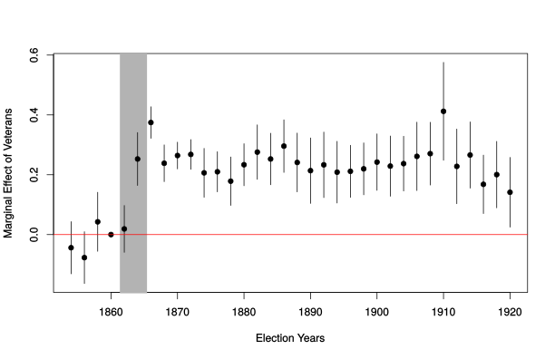

```{r setup, include = F}
require(knitr)
require(magrittr)
require(kableExtra)
require(ggplot2)
require(grid)
require(data.table)
require(UsingR)
require(lfe)

options("kableExtra.html.bsTable" = T)
```

# Design Based Inference

<style type="text/css">
  .reveal h2,h3,h4,h5,h6 {
    text-align: left;
  }
  .reveal p {
    text-align: left;
  }
  .reveal ul {
    display: block;
  }
  .reveal ol {
    display: block;
  }
  .table-hover > tbody > tr:hover { 
  background-color: #696969;
  }
</style>


## Design-Based Inference

- Contrast to conditioning
- Difference-in-Differences
- Natural Experiments

# Design vs Conditioning

--- 

### **Design vs. Model-based inferences**

A matter of **degree**

Statistical evidence for causality combines **observed data** with a **mathematical model** of the world

>- mathematical model describes how observed data are generated
>- model always involves assumptions
>- can almost always apply the model, even if it is wrong

## Design vs. Model-based inferences

Causal evidence varies in terms of complexity of math/assumptions: a matter of **degree**

- **Model-based** inferences about causality depend on complex statistical models with many assumptions

- **Design-based** inferences about causality use carefully controlled comparisons with simple, transparent models and assumptions

--- 

### **Design vs. Model-based inferences**

Whatever our approach...

<br>

**do the assumptions needed to use this mathematical tool reasonably fit reality?**

--- 

### Conditioning vs. Design

When we **condition**, we block specific backdoor paths that generate **confounding** by comparing cases that are **similar on observable trait**:

- we must assume that treatment is **conditionally independent** on these traits, that there is **positivity**, and that there is **no measurement error**.
- we did **exact matching** last week, but most conditioning strategies involve **additional modelling assumptions** to be tractable

--- 

### Conditioning vs. Design

In the absence of an experiment, we might choose more careful research **designs**, instead of relying on conditioning.

- comparing the same unit over time
- differences-in-differences
- "natural" experiments:
    - sources of "randomness" in the world
    - arbitrary thresholds

Here, the **structure of the comparison** motivates an argument for independence of cause and potential outcomes. Rather than block specific confounding variables, we eliminate confounding due to a **class** of confounding variables.

# Difference-in-Difference

## Media Effects on Political Attitudes

Social and political theorists have frequently argued that media---by shaping perceptions of events in the world, exposing people to narrative frames---affects beliefs and behaviors.

>- What might be some obstacles to evaluating the **causal** effect of media exposure?
>- Why might **experiments** be a poor strategy?
>- Why might **conditioning** not work very well?

---

### Media Effects

Foos and Bischoff examine the effect of changing exposure to *The Sun* on anti-EU attitudes and voting in the UK.

- *The Sun* is a tabloid with long-standing anti-EU coverage and editorial slant
- In 1989, ~100 fans of Liverpool FC died in stampede at a match; *The Sun* blamed the victims for the tragedy
- Boycott of the *The Sun* by fans and teams in the Liverpool area.

---

### Conditioning?

We could ignore this shift, and simply compare attitudes about the EU in areas (or among people) with greater vs less readership of *The Sun*:

- What might be some reasons to doubt the effectiveness of this approach?

---

### Interrupted Time Series

We could instead, compare attitudes toward the EU in Liverpool **before and after** the boycott:

- What might some advantages of this be?

>- Block **all** confounding variables that remain **constant** over time within Liverpool 
>- Advantage: No need to know what these variables are, measure them, specify a model, etc.

---

### Interrupted Time Series

In interrupted time series, we plug in the **observed outcome before treatment** for the **counterfactual outcome where treatment did not happen**: where $t=1$ indicates post-treatment, $t=0$ indicates before treatment.

$$\tau_i = [Y_{i,t=1}(1) | D_i = 1] - \color{red}{[Y_{i,t=1}(0)|D_i = 1]}$$

Plugging in:

$$\widehat{\tau_i} = [Y_{i,t=1}(1) | D_i = 1] - [Y_{i,t=0}(0) | D_i = 1]$$

What can go wrong here?

---

### Interrupted Time Series

In order for interrupted time series to work, we must assume:

$$[Y_{i,t=0}(0) | D_i = 1] = \color{red}{[Y_{i,t=1}(0)|D_i = 1]}$$ 

That in the absence of the treatment, outcomes of $Y$ would not have changed from before to after treatment.

>- Why might this be incorrect in general? In the context of the Liverpool *Sun* boycott?

---

### Interrupted Time Series

**Assumptions mean:** none of the following

>- "history": bias related to **other** changes year-to-year changes (short-term trends)
>- "maturation":  bias / confounding due to long-term trends
>- "testing": bias /confounding related to selection into "treatment" (what kinds of things led to the policy adoption)
>- "regression": cases select into treatment due to extreme events, followed by return to the norm
>- "instrumentation": treatment induces change in measurement (non-random measurement error)

---

### Interrupted Time Series

A good example:

[Mummolo 2018](https://doi.org/10.1086/694393)

---

### Difference-in-Differences:

Difference-in-differences compares changes in the **treated** cases against changes in **untreated** cases.

Again, we want to know:

$$\begin{split}E[\tau_i | D_i = 1] = {}  \frac{1}{n}\sum\limits^{n}_{i=1} & [Y_{i,t=1}(1) | D_i = 1] - \\ & \color{red}{[Y_{i,t=1}(0)|D_i = 1]}\end{split}$$

>- Is this the **average causal effect**?

---

### Difference-in-Differences:

Interrupted Time Series forced us to assume **no other changes** in outcomes over time, but it is almost always true that:

$\color{red}{Y_{i,t=1}(0) | D_i = 1]} - [Y_{i,t=0}(0)|D_i = 1] \neq 0$

That is to say, *counterfactually*, **in the absence of treatment $D$**, potential outcomes $Y_i(0)$ are **changing over time**.Observed pre-treatment outcomes not a good substitute for post-treatment counterfactual outcomes.

>- Do we have a way to estimate what these **counterfactual trends absent treatment** might be?

---

### Difference-in-Differences:

We don't know: $\color{red}{Y_{i,t=1}(0) | D_i = 1]} - [Y_{i,t=0}(0)|D_i = 1]$

But we **do know**: $Y_{i,t=1}(0) | D_i = 0] - [Y_{i,t=0}(0)|D_i = 0]$

<br>

In our example: we **don't know** how EU skepticism might have trended in Liverpool absent the boycott. But we **do know** how  EU skepticism in *the rest of the UK* trended absent the boycott.

---

### Difference-in-Differences:

If we assume:

$$\{\overbrace{\color{red}{Y_{i,t=1}(0) | D_i = 1]} - [Y_{i,t=0}(0)|D_i = 1]}^{\text{Treated counterfactual trend}}\} = \\ \{\underbrace{Y_{i,t=1}(0) | D_i = 0] - [Y_{i,t=0}(0)|D_i = 0]}_{\text{Untreated observed trend}}\}$$


Then we can plug-in the $observed$ **untreated group** trend for the $\color{red}{counterfactual}$ **treated group** trend.

---

### Difference-in-Differences:

This is the **parallel trends assumption**. It is equivalent to saying there are no time-varying confounding variables that *differ* between treated and untreated.


If it is true, we can do some simple algebra and find that

$[\tau_i | D_i = 1] = [Y_{i,t=1}(1) | D_i = 1] - \color{red}{[Y_{i,t=1}(0)|D_i = 1]}$

<br>

$\begin{equation}\begin{split}[\tau_i | D_i = 1] = {} & \{\overbrace{[Y_{i,t=1}(1) | D_i = 1] - [Y_{i,t=0}(0) | D_i = 1]}^{\text{Treated observed trend}}\} - \\ &        \{\underbrace{\color{red}{Y_{i,t=1}(0) | D_i = 1]} - [Y_{i,t=0}(0)|D_i = 1]}_{\text{Treated counterfactual trend}}\}\end{split}\end{equation}$

---

$\begin{equation}\begin{split}[\widehat{\tau_i} | D_i = 1] = {} & \{\overbrace{[Y_{i,t=1}(1) | D_i = 1] - [Y_{i,t=0}(0) | D_i = 1]}^{\text{Treated observed trend}}\} - \\ & \{\underbrace{Y_{i,t=1}(0) | D_i = 0] - [Y_{i,t=0}(0)|D_i = 0]}_{\text{Untreated observed trend}}\}\end{split}\end{equation}$

And this gives us the name:

- $Treated_{post} - Treated_{pre}$ (first difference)
- $Untreated_{post} - Untreated_{pre}$ (first difference)
- $(Treated_{post} - Treated_{pre}) - \\ (Untreated_{post} - Untreated_{pre})$ 

>- Difference in differences


---


---


---

### Difference-in-differences:

This shows that the Boycott of the *Sun* reduced Euro Skepticism in Liverpool

- Under the **parallel trends assumption** (untreated cases have the same *trends* as treated cases *in the absence of treatment*)
- This is an unbiased estimate of the **Average Treatment on Treated** ($ATT$):

  - the effect of treatment on the **treated** cases
  - it is TOTALLY fine if the effect of treatment on untreated cases would be different

---

### Difference-in-differences:

If parallel trends assumption holds, what kinds of confounding does this design eliminate?

- Any time-invariant confounders within units
- Any time-varying confounders that are **shared** by both treated cases and un-treated cases
>- Crucial to choose right "control" cases to have parallel trends or e.g. share as many time-varying confounders.

What are examples of confounders held constant in *Sun* Boycott difference in difference?

---

### Difference-in-differences:

**Estimation**:

- Classical scenario: with two "treatment" conditions, two time periods: calculate differences-in-differences in means
- We can use regression, dummy for ever-treated, dummy for post-treatment, interaction of the two

---

### Difference-in-differences:

How do we validate the **parallel trends** assumption?

- We cannot directly test it, but we can try to see if it is plausible

**Placebo Tests**:

- If "treatment" happens between time $t$ and $t+1$, we should not see an effect between $t-1$ and $t$!
- If design is right, there should be no effects of the treatment **prior** to the treatment taking place.
- If we "pass" placebo test, does not reject possibility that something **other than "treatment"** caused a change.
- You need multiple pre-treatment data points

---


---

### Difference-in-differences: Extensions

**Staggered Treatment**: [Bacon-Goodman 2021](https://doi.org/10.1016/j.jeconom.2021.03.014)

**Multiple Treatments**: [https://arxiv.org/pdf/1803.08807.pdf](https://arxiv.org/pdf/1803.08807.pdf)

**Continuous Treatment**: [https://psantanna.com/files/Callaway_Goodman-Bacon_SantAnna_2021.pdf](https://psantanna.com/files/Callaway_Goodman-Bacon_SantAnna_2021.pdf)


As we get away from simple DiD, assumptions and potential problems multiply, solutions get more complicated...

---


---

### An Example:

What was the effect of enlistment in the US Civil War on voting for the Republican party?

$GOP_{ie} = \alpha_i + \alpha_e + \beta Enlist_i \times PostWar_e + \epsilon_y + \epsilon_i$

- $i$ is a county
- $e$ is a state-election (election year in a specific state)
- $y$ is a year between 1854 and 1880
- $PostWar$ indicates if election is after 1861 $(1)$ or before $(0)$

---

### An Example:



---

### An Example:


---

### Difference-in-differences:

**Assumptions:**

- parallel trends: treated and untreated have same changes over time except for shift in treatment.
- equivalently: no time-varying omitted variable bias; no omitted variables correlated with changes in treatment, changes in outcome

**Caveats:**

- 'check' parallel trends
- careful: what happens when units are treated at different times? different amounts?
- careful: STANDARD ERRORS! Clustering may not save you with small $N$.


# Natural Experiments

---

### Natural Experiments:

Address confounding in a different way:

- exploit random or as-if random allocation of $X$ to find causal effect
- look for "naturally" occurring randomization

---

### Natural Experiments:

Distinguishing "natural experiment" from experiments:

- Treatment and control groups
- Random assignment (maybe)
- **"as-if" random assigment**
- **we don't do the manipulation**

---

### Natural Experiments:

An **observational study** where causal inference comes from the design that draws on randomization.

- contrast to difference-in-differences
- depends on argument to validate "as-if" random assumption $\to$ fewer assumptions in the statistical model

---

### Regression Discontinuity

- "Treatment" occurs for cases on one side of threshold, not to cases on other side
- "Near" the hreshold, cases are effectively arbitrarily assigned.
    - treatment can be for ALL cases on the "Treated" side (sharp RD) 
    - treatment can increase at the threshold ("fuzzy" RD) (e.g. Mo 2018)
   

---

```{r echo = F, message=F, warning=F, include = T}
require(data.table)
require(ggplot2)
require(magrittr)
elections = fread('./closeElectionBalanceData.csv') %>% 
          .[, list(id = DISTRICT_ID_61, year, rd_INC_mov)]
panel = fread('./analysisPanelBW1.csv') %>%
          .[, list(id = DISTRICT_ID_61, year = election_year, riot = COUNT > 0)]
setkey(elections, id, year)
setkey(panel, id, year)

use = elections[panel]
use[, wt := 1/.N, by = id]
use[, inc_win := rd_INC_mov > 0]
use[, mov := round(rd_INC_mov, 1)]
use = use[!is.na(mov) & !is.na(riot), list(n = sum(wt), riot = weighted.mean(riot, wt, na.rm = T)), by = list(mov, inc_win)]
ggplot(use[mov %between% c(-10,10)], aes(x = mov, y = riot, size = n, weight = n, color = inc_win)) + 
  geom_point(alpha = 0.3) + 
  geom_smooth(method = 'lm') + 
  geom_vline(xintercept = 0) +
  theme_bw() +
  xlab("INC Margin of Victory") + 
  ylab("Pr(Riot)")

```

---

```{r echo = F, message=F, warning=F, include = T}
ggplot(use[mov %between% c(-10,10)], aes(x = mov, y = riot, size = n, weight = n, color = inc_win)) + 
  geom_point(alpha = 0.3) + 
  geom_smooth(span = 0.3) + 
  geom_vline(xintercept = 0) +
  theme_bw() +
  xlab("INC Margin of Victory") + 
  ylab("Pr(Riot)")
```
   
---

```{r, echo = F, message=F}
n = 5000
x = runif(n, -1,1)
y = 3 + 1*x + 2*(x>0) + rnorm(n)

d = data.frame(x,y, d = x>0)
ggplot(d, aes(x = x, y = y, group = d)) + 
  geom_point() + 
  geom_smooth() +
  geom_vline(xintercept = 0)
  theme_bw()

```
    
---

### Regression Discontinuity

Two approaches:

- Potential outcomes of $Y$ are approximately **linear** near the threshold; treatment shifts outcomes
    - so we (flexibly) model $Y$ on either side of the cut-off
- Potential outcomes of $Y$ are random near the cut-off
    - difference in means near the cutoff

---

### Regression Discontinuity

Decisions:

- model outcome around cutoff
    - bias/variance trade-off
    - how do you model it? linear? quadratic? cubic? quartic? local linear?
    - how do you choose the "bandwidth" around the cutoff to use?
    - typically recommend local linear, automatic choice of 'optimal bandwidth'

- difference in means at cutoff
    - how do you choose the "bandwidth" around the cutoff to use?

---

### Regression Discontinuity

Assumptions:

- assignment to treatment at the threshold is random
- AND
    - either we have correctly modeled potential outcomes of $Y$ on either side of cutoff 
    - or we have used "bandwidth" around cutoff within which treatment is as-if random assigned (difference in means)

---

### Instrumental Variables

Follows from Wald estimator for non-compliance:

- Instrumental Variables Least Squares uses variance "explained" in $D$ by  randomly induced $Z$
    - $D$ is "treatment", $Z$ is "random assignment to treatment"
    - easy to understand when $Z$ is binary
    - when $Z$ is continuous, it is more complicated (and depends on assumptions of linearity)

---

### Instrumental Variables

Decisions

- is variation induced in $D$ by $Z$ linear?
- does $Z$ actually predict change in $D$?
    - "weak instruments problem": identical to when there are very few compliers in an experiment: inference becomes very hard
    - typically do $F$ test of regression of $Y$ on $X$; $F$ statistic $> 50$.

---

### Instrumental Variables

Assumptions:

1. $Z$ is randomly assigned
2. Exclusion Restriction
    - no other causal path from $Z$ to $Y$, other than $X$
3. Monotonicity
    - increasing $Z$ uniformly increases or decreases values of $X$

---

### Natural Experiments: Choices

- Sometimes natural experiments only random conditional on some other variables (Nellis, et al.)
    - What is the correct functional form for the conditioning variables?
- Standard Errors:
    - What is the unit at which treatment is assigned?
    - Cluster/Randomization inference

### Natural Experiments: Limitations

- Effects are "local" or for "compliers"
- Effects for sub-group with randomization
    - like in non-compliance, we find subset of cases that are randomly induced into treatment/responsive
    - cases may be different from population of interest

- Causal exposures may be different
    - cause applied at cutoff might be different than elsewhere
    - cause applied at random might be different (e.g. rainfall as instrument for economic growth)
    
---

### Natural Experiments: What to do

- Evidence that randomization took place
    - statistical tests of implication
    - qualitative evidence: "causal process observation"
- Show robustness to choices of analysis
