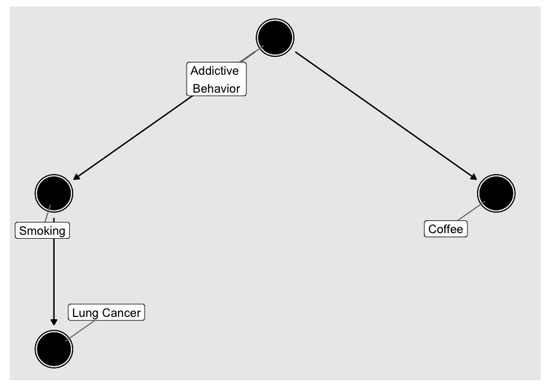
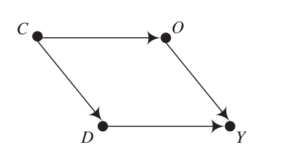
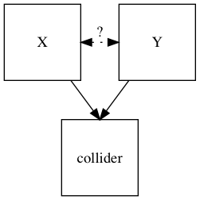

```{r setup, include = F}
require(knitr)
require(magrittr)
require(kableExtra)
require(ggplot2)
require(grid)
require(data.table)
require(UsingR)

options("kableExtra.html.bsTable" = T)

acs_data = fread("acs_lawmed.csv")
acs_data[, FEMALE := SEX]
acs_data[, MARST_f := as.factor(MARST)]
#acs_data = acs_data[sample(1:nrow(acs_data), size = 10000)]
acs_data[, MALE := abs(FEMALE - 1)]
acs_data[, sex := as.factor(ifelse(FEMALE == 1, 'Female', 'Male'))]
```

<style type="text/css">
  .reveal h2,h3,h4,h5,h6 {
    text-align: left;
  }
  .reveal p {
    text-align: left;
  }
  .reveal ul {
    display: block;
  }
  .reveal ol {
    display: block;
  }
  .table-hover > tbody > tr:hover { 
  background-color: #696969;
  }
</style>

## Plan for Today

### Review

1. Questions on PS 4

### Least Squares and Causality

1. Review Least Squares
    - algorithm
    - statistical inference
2. A causal model for regression
3. Omitted Variable Bias
4. Conditioning
5. Regression and Conditioning

# Questions

## Questions on Problem Set 4

## Questions on Least Squares and Statistical Inference

# Least Squares Review

## Least Squares: Algorithm

- Least Squares can model the mean of a variable $Y$ as a linear function of some other variable (bivariate) or mean of a variable $Y$ as a linear function of several other variables (multivariate)
- The fitted values of $Y$ are chosen to have the smallest distance to the true values of $Y$, and so the residuals are orthogonal to the variables in $X$.
- To do this, we just need to have $n > p$ and matrix $X$ must be invertable


## Least Squares: Statistical Inference

We can also, making assumptions, use regression to estimate, with uncertainty the true value of slope coefficient.

- If the model $Y = \beta X + \epsilon$ where the slopes in $\beta$ are constant and additive for all cases is correct
- If the $\epsilon_i$ are independent and indentically distributed, with mean 0
- If $\epsilon_i$ is **independent** of $X_i$: $X \mathrel{\unicode{x2AEB}} \epsilon$

Then, $\hat{\beta}$ is **unbiased** and has a known sampling distribution that we can estimate from the data.


## Least Squares

Nothing so far on how regression relates to **causality**

To understand link to causality

- Need to imagine a **causal model** for regression (to parallel the Neyman Causal Model)
- What are sources of bias?
- Connection between regression and conditioning

# A Causal Model for Least Squares

## Response Schedule

In the context of **experiments**, we imagined that each observation has potential outcomes corresponding to their behavior under different treatments

- To find the average causal effect of treatment without bias, we had to assume that only treatment status affects the outcome and that treatment is assigned in a manner unrelated to potential outcomes

## Response Schedule

In regression, where levels of treatment might be continuous, we generalize this idea to the "response schedule":

- some equation that reflects potential outcomes across different values of the "treatment"

$$Y^X_i = \alpha + \beta X + \epsilon_i$$
Here $Y_i^X$ is the potential outcome for $i$ for a value of $X$. 

- this response schedule says that $Y_i$ changes same amount for all unit changes in $X$.
- We only ever observe one $Y_i^X$ for the value of $X$ that is given, others are counterfactual.


## Response Schedule

If we don't know parameters $\alpha, \beta$, what do we need to assume to obtain an estimate $\widehat{\beta}$ that we can give a **causal** interpretation? (Unit change in $X$ **causes** $\widehat{\beta}$ change in $Y$)

**We must assume**

- $Y_i$ actually produced according to the response schedule (equation is correctly specified; e.g., linear and additive)
- $X_i$ is chosen at random, so independent of $\epsilon_i$:  $X_i \mathrel{\unicode{x2AEB}} \epsilon_i$. Sometimes we say $X$ is **exogenous**


## How does this go wrong?

If the true process generating the data is:

$$Y_i = \beta_0 + \beta_1 X_i + \beta_2 Z_i + \epsilon_i$$

with $(X_i,W_i) \mathrel{\unicode{x2AEB}} \epsilon_i$, $E(\epsilon_i) = 0$, $Var(\epsilon_i) = \sigma^2$

What happens when we regress $Y_i$ on a constant and $X_i$ and exclude $Z_i$?

---

Because this is a bivariate regression ($Y = \widehat{\beta_0} + \widehat{\beta_1} X_i + e_i$)

$$\small\begin{eqnarray} 
\widehat{\beta_1} &=& \frac{Cov(X_i, Y_i)}{Var(X_i)}    \\
&=& \frac{Cov(X_i, \beta_0 + \beta_1 X_i + \beta_2 Z_i + \epsilon_i)}{Var(X_i)} \\
&=& \frac{Cov(X_i, \beta_1 X_i)}{Var(X_i)} + \frac{Cov(X_i,\beta_2 Z_i)}{Var(X_i)} + \frac{Cov(X_i,\epsilon_i)}{Var(X_i)}   \\
&=& \beta_1\frac{Var(X_i)}{Var(X_i)} + \beta_2\frac{Cov(X_i, Z_i)}{Var(X_i)} \\
&=& \beta_1 + \beta_2\frac{Cov(X_i, Z_i)}{Var(X_i)}
\end{eqnarray}$$

So, $E(\widehat{\beta_1}) \neq \beta_1$, it is **biased**

## Omitted Variable Bias

### This bias is **omitted variable bias**

## Omitted Variable Bias

If the truth is:  $Y_i = \beta_0 + \beta_1 X_i + \beta_2 Z_i + \epsilon_i$

And $\widehat{\beta_1} = \beta_1 + \beta_2\frac{Cov(X_i, Z_i)}{Var(X_i)}$

What is the direction of the bias when:

1. $\beta_2$ is positive; $\frac{Cov(X_i, Z_i)}{Var(X_i)} < 0$

2. $\beta_2$ is negative; $\frac{Cov(X_i, Z_i)}{Var(X_i)} < 0$

2. $\beta_2$ is positive; $\frac{Cov(X_i, Z_i)}{Var(X_i)} > 0$

2. $\beta_2$ is $0$; $\frac{Cov(X_i, Z_i)}{Var(X_i)} > 0$

## Omitted Variable Bias

This is only source of bias if two things are true:

1. $\beta_2 \neq 0$: omitted variable $Z$ has (or is correlated with something that has) an effect on $Y$ 

2. $\frac{Cov(X_i, Z_i)}{Var(X_i)} \neq 0$: omitted variable $Z$ is correlated with $X$.  

This is why we don't need to include EVERYTHING that might affect $Y$ in our regression equation.


# Conditioning

## OVB: visually



## OVB: visually



## Conditioning

**conditioning** is when we examine the effect of $X_i$ on $Y_i$ within subsets/strata of the data defined by the values of $Z_i$, **blocking** backdoor (non causal) paths from $X$ to $Y$.

## Conditioning

We may be tempted to condition on as many variables as possible, but this can lead to trouble!

**colliders**: variable that is causally influenced by two or more variables. The causal variables influencing the collider are themselves not necessarily associated.

- conditioning on the collider can INDUCE associations between variables that were not associated.

## Conditioning



## Conditioning

Consider Graduate School Admissions:

```{r,echo = F}
n = 250
test = rnorm(n)
motivation = rnorm(n)
score = test + motivation
admit = ifelse(score > quantile(score, probs = c(0.85)), "Yes", "No")

plot_data = data.table(test, motivation, Admit =  admit)
ggplot(plot_data, aes(x = test, y = motivation, color = Admit)) + 
  geom_point() + 
  xlab("Test Score") + 
  ylab("Motivation") + theme_bw()

```

## Conditioning

If both **motivation** and **test scores** cause admission (but are independent of each other), conditioning on admission (stratifying by admission) can lead us to see negative association between the two.

When does this arise?

- Can happen in a variety of circumstances, but is VERY COMMON for variables that are "post-treatment" (let's draw this)
- See Morgan and Winship, Chapter 4

## Conditioning

- Do not condition on "post-treatment" variables
- Condition on variables that affect "treatment" assignment 

## Conditioning: Example

Imagine we have a binary treatment $X_i$ and we want to know its average effect on $Y_i$.

But we lack random assignment; $Z_i$ affects $Y_i$ and is associated with $X_i$.

What do we do? Condition

----

Example (1)

|  | $Y_i^1$ | $Y_i^0$ | $X_i$ | $Z_i$ | $Y_i$ | $\tau_i$ |
|-----------|---------|---------|-------|-------|-------|----------|
| treated | 20 | 10 | 1 | 1 | 20 | 10 |
| treated | 20 | 10 | 1 | 1 | 20 | 10 |
| treated | 15 | 5 | 1 | 0 | 15 | 10 |
| untreated | 20 | 10 | 0 | 1 | 10 | 10 |
| untreated | 15 | 5 | 0 | 0 | 5 | 10 |
| untreated | 15 | 5 | 0 | 0 | 5 | 10 |

----

```{r}
ace = mean(c(10,10,10,10,10,10))
ace_hat = mean(c(20,20,15)) - mean(c(10,5,5))
ace
ace_hat
```

Why isn't $\widehat{ACE} = ACE$?

---

In this case,  **conditioning** would be to find the effect of $X_i$ on $Y_i$ within subsets of the data defined by the values of $Z_i$. Rather than taking the difference:

$\bar{Y^1} - \bar{Y^0} =  (\bar{Y} | X = 1) - (\bar{Y}| X = 0)$

We calculate:

$(\bar{Y^1} - \bar{Y^0} | Z = z)$ for each value of $z$ in the data.

---

Example (1): Let's "condition" on $Z$

|  | $Y_i^1$ | $Y_i^0$ | $X_i$ | $Z_i$ | $Y_i$ | $\tau_i$ |
|-----------|---------|---------|-------|-------|-------|----------|
| treated | 20 | 10 | 1 | 1 | 20 | 10 |
| treated | 20 | 10 | 1 | 1 | 20 | 10 |
| untreated | 20 | 10 | 0 | 1 | 10 | 10 |
| treated | 15 | 5 | 1 | 0 | 15 | 10 |
| untreated | 15 | 5 | 0 | 0 | 5 | 10 |
| untreated | 15 | 5 | 0 | 0 | 5 | 10 |

---

```{r}
ace_z0 = mean(c(15)) - mean(c(5,5))
ace_z1 = mean(c(20,20)) - mean(c(10))
mean(c(ace_z0, ace_z1))
```

Why does "conditioning" recover the true ACE in this case?

---

Example (2)

|  | $Y_i^1$ | $Y_i^0$ | $X_i$ | $Z_i$ | $Y_i$ | $\tau_i$ |
|-----------|---------|---------|-------|-------|-------|----------|
| treated | 20 | 10 | 1 | 1 | 20 | 10 |
| treated | 20 | 10 | 1 | 1 | 20 | 10 |
| treated | 15 | 5 | 1 | 0 | 15 | 10 |
| untreated | 18 | 10 | 0 | 1 | 10 | 8 |
| untreated | 15 | 5 | 0 | 0 | 5 | 10 |
| untreated | 15 | 5 | 0 | 0 | 5 | 10 |

---

```{r}
ace = mean(c(10,10,10,10,10,8))
ace
ace_hat = mean(c(20,20,15)) - mean(c(10,5,5))
ace_hat
```

Why isn't $\widehat{ACE} = ACE$?

---

Example (2): Let's "condition" on $Z$

|  | $Y_i^1$ | $Y_i^0$ | $X_i$ | $Z_i$ | $Y_i$ | $\tau_i$ |
|-----------|---------|---------|-------|-------|-------|----------|
| treated | 20 | 10 | 1 | 1 | 20 | 10 |
| treated | 20 | 10 | 1 | 1 | 20 | 10 |
| untreated | 18 | 10 | 0 | 1 | 10 | 8 |
| treated | 15 | 5 | 1 | 0 | 15 | 10 |
| untreated | 15 | 5 | 0 | 0 | 5 | 10 |
| untreated | 15 | 5 | 0 | 0 | 5 | 10 |

---

```{r}
ace_z0 = mean(c(15)) - mean(c(5,5))
ace_z1 = mean(c(20,20)) - mean(c(10))
mean(c(ace_z0, ace_z1))
```

>- Has conditioning uncovered the true ATE?

>- Why not?

>- Effect of treatment is correlated with treatment status


## Conditioning: Example

This can also be expressed in terms of our regression model:

$Y_i = \alpha + \tau \cdot X_i + \beta \cdot Z_i + \epsilon_i$

In this case, because $X_i$ is binary, we can decompose $\epsilon_i$ into:

$\epsilon_i = \nu_i^0 + X_i \cdot (\nu_i^1 - \nu_i^0)$

Where:

$\nu_i^0 = Y_i^0 - \bar{Y^0}$ (the residual for $i$ from the mean $Y$ without treatment)

$\nu_i^1 = Y_i^1 - \bar{Y^1}$ (the residual for $i$ from the mean $Y$ with treatment)


---

Example (2): "conditioning" on $X$

|  | $Y_i^1$ | $Y_i^0$ | $D_i$ | $X_i$ | $Y_i$ | $\tau_i$ |$\epsilon_i$|
|-----------|---------|---------|-------|-------|-------|----------|---|
| treated | 20 | 10 | 1 | 1 | 20 | 10 |2.83|
| treated | 20 | 10 | 1 | 1 | 20 | 10 |2.83|
| untreated | 18 | 10 | 0 | 1 | 10 | 10 |2.5|
| treated | 15 | 5 | 1 | 0 | 15 | 10 |-2.17|
| untreated | 15 | 5 | 0 | 0 | 5 | 10 |-2.5|
| untreated | 15 | 5 | 0 | 0 | 5 | 10 |-2.5|

>- $\epsilon_i$ is not independent of $X_i$, after conditioning on values of $Z_i$. It is larger when $X_i = 1$.

# Conditioning With Regression

## Conditioning with Regression

- There are multiple ways to condition (matching, inverse probability weighting, regression)
- Regression has certain advantages
    - good linear approximation
    - (sometimes) fairly easy to understand
    - used a lot
- But conditioning with regression can lead us into trouble

##  Potential Pitfalls

### (1) Omitted Variable Bias

- Excluding some variable $Z$ that should be in the model
- Induces bias if $Z$ is causally related to both $X$ and $Y$
- How do we know whether there is some missing $Z$ we need to include?
- We need to make a big assumption that we've included all relevant confounding variables: **conditional independence assumption** or **ignorability**

##  Potential Pitfalls

Even if we included all variables, we could have problems due to simplifications of our model:

- we typically assume the model is linear and additive. 
- but the world might be non-linear and interactive (effect of $X$ on $Y$ depends on $Z$)
- our decisions about how to specify the math of regression equation can lead to bias

##  Potential Pitfalls

### (2) Interpolation Bias: 

- By forcing relationship between $Z$ (and for generality $Z_1 \ldots Z_k$) and $X$ to be linear and additive, conditioning on $Z$ may not fully remove association between $Z$ and $X$, $Z$ and $Y$. 
- This unmodeled relationship will become part of $\epsilon$, and will not be independent of $X$.
- We don't look at strata defined by sharing exactly the same attributes, we approximate linearly. If linear approximation is wrong, we have bias.

## Example: Interpolation

Let's return to the same example we used above: do hours increase earnings? We can use the same American Community Survey data on incomes in law and medicine.

## Example: Interpolation

We can examine lawyers and doctors in the American Community Survey.

- Does working more hours increase earnings?
- It is likely that age is associated with hours worked and to earnings
- Omitting age could lead to OVB

## Example: Interpolation

```{r, echo = F}
plot_data = acs_data[, list(UHRSWORK = mean(UHRSWORK)), by = AGE]
ggplot(plot_data, aes(x = AGE, y = UHRSWORK)) + geom_point() + theme_bw() + 
  xlab("Age") + ylab("Mean Hours Worked")
```

## Example: Interpolation

```{r, echo = F}
plot_data = acs_data[, list(INCEARN = mean(INCEARN)), by = AGE]
ggplot(plot_data, aes(x = AGE, y = INCEARN)) + geom_point() + theme_bw() + 
  xlab("Age") + ylab("Mean Annual Income ($)")
```

## Example: Interpolation

To condition on age, we can regress income on hours worked and age:

```{r}
lm_hours_age = lm(INCEARN ~ UHRSWORK + AGE, acs_data)
summary(lm_hours_age)$coefficients
```

## After Conditioning...


```{r, echo = F}

acs_data[, UHRSWORK_star := lm(UHRSWORK ~ AGE, .SD)$residuals]
acs_data[, UHRSWORK_star2 := lm(UHRSWORK ~ as.factor(AGE), .SD)$residuals]
acs_data[, INCEARN_star := lm(INCEARN ~ UHRSWORK + AGE, .SD)$residuals]
acs_data[, INCEARN_star2 := lm(INCEARN ~ UHRSWORK + as.factor(AGE), .SD)$residuals]

plot_data = acs_data[, list(UHRSWORK = mean(UHRSWORK_star)), by = AGE]
ggplot(plot_data, aes(x = AGE, y = UHRSWORK)) + geom_point() + theme_bw() + 
  xlab("Age") + ylab("Mean Residual Hours Worked") + geom_hline(yintercept = 0, color = 'red')
```

## After Conditioning...

```{r}
plot_data = acs_data[, list(INCEARN_star = mean(INCEARN_star)), by = AGE]

ggplot(plot_data, aes(x = AGE, y = INCEARN_star)) + geom_point() + theme_bw() + 
  xlab("Age") + ylab("Mean Residual Annual Income ($)") + geom_hline(yintercept = 0, color = 'red')
```

## Interpolation Bias

Age is still related to hours worked and income, just non-linearly

- this will induce omitted variable bias (but its form will be non-linear)

## Interpolation Bias

Errors not independent of Hours Worked

```{r}
ggplot(acs_data, aes(x = UHRSWORK_star, y = INCEARN_star)) + geom_smooth() + theme_bw() + 
  xlab("Residual Hours Worked") + ylab("Mean Residual Annual Income ($)") + geom_hline(yintercept = 0, color = 'red')
```

## Interpolation Bias

What can we do?: We can model relationship between $Z$ and $X,Y$ more flexibly.

In the extreme we can **saturate** the model in terms of $Z$: fit a dummy variable for each unique value of $Z$. 

- if $Z$ contains multiple variables, then  a dummy for each unique set of a values
- If we do this, then regression does conditioning that stratifies exactly on $Z$, as we did in exercise
- Regression returns a **weighted** average of effects of $X$ across all strata defined by $Z$. 
- This average is weighted by **variance** (more weight placed on strata with greater residual variance in $X$)

*n.b.*: also be careful about interpolation assumptions about $X$. We are treating every one unit increase in $X$ has having the same effect (may not be reasonable)


## Interpolation Bias

```{r}
lm_hour_age_sat = lm(INCEARN ~ UHRSWORK + as.factor(AGE), acs_data)
summary(lm_hour_age_sat)$coefficients

#Linear Results:
summary(lm_hours_age)$coefficients
```

## Interpolation Bias

```{r}
ggplot(acs_data, aes(x = UHRSWORK_star2, y = INCEARN_star2)) + geom_smooth() + theme_bw() + 
  xlab("Residual Hours Worked") + ylab("Mean Residual Annual Income ($)") + geom_hline(yintercept = 0, color = 'red')
```

## Interpolation Bias

Another way of thinking about interpolation bias:

The point of conditioning is to compare different levels of "Treatment" for cases that are same on other attributes (so potential outcomes should be the same)

But when we condition using a regression and assume linearity, additivity, we compare cases against what they are estimated to be (which may depend on data-points that are very dissimilar)

## Potential Pitfalls

### (3) Extrapolation Bias: 

- By forcing relationship between $Z$ (and for generality $Z_1 \ldots Z_k$) and $X$ to take some functional form (usually linear)...
- If cases with different levels of treatment are also different in terms of $Z$ (such that, e.g. there is no variation in treatment within strata), then causal inferences will depend on **extrapolation**
- This extrapolation is often heavily influenced by our mathematical assumptions rather than the underlying data/truth. (King and Zeng)
- Another name for this problem is a **lack of common support**... we don't have otherwise similar cases across different kinds of treatment.

## Extrapolation Bias

```{r, echo = F}
n = 250
z = rnorm(n)
x = rbinom(n, 1 , prob = ifelse(z > 0, 1, 0))

y = 1 + z * 0.25 + x * 1 + x*(z^2)*0.5 + rnorm(n, sd = 0.5)

plot_data = data.table(z,x = as.factor(x),y)
ggplot(plot_data, aes(x = z, y = y, color = x, group = x)) + geom_point() + 
  geom_smooth(method = 'lm', se = F, fullrange = T) + theme_bw()
```

## Summary
Conditioning using regression can obtain an unbiased estimate for the effect of some cause when:

1) $X$ (putative cause) is independent of $\epsilon$ (the error term) once we have conditioned on the variable(s) $Z$ (and we don't condition on colliders/post-treatment variables)

2) The causal effect of $X$ does not vary across different values of $Z$. (Even if this is true, regression will compute a kind of weighted average of the different causal effects)

3) We do not force $Z$ to have a linear relationship with $X$ and $Y$ (permit a flexible relationship)