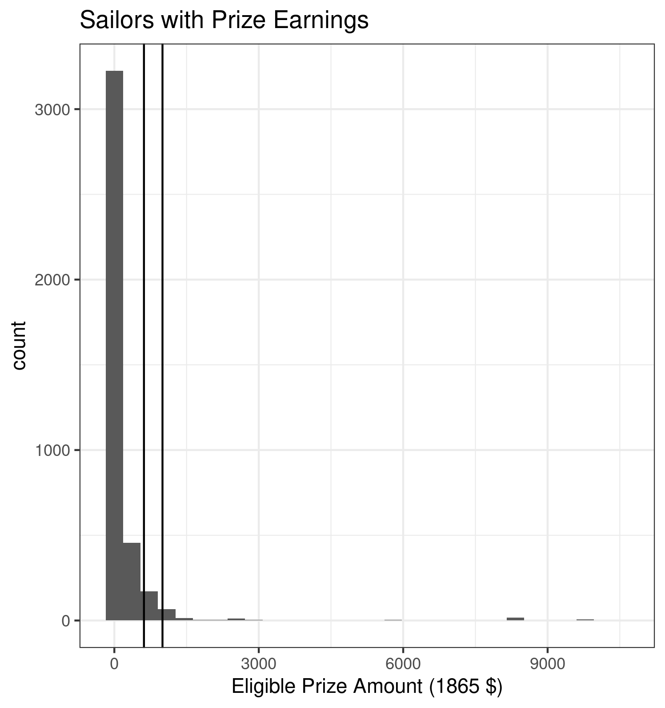
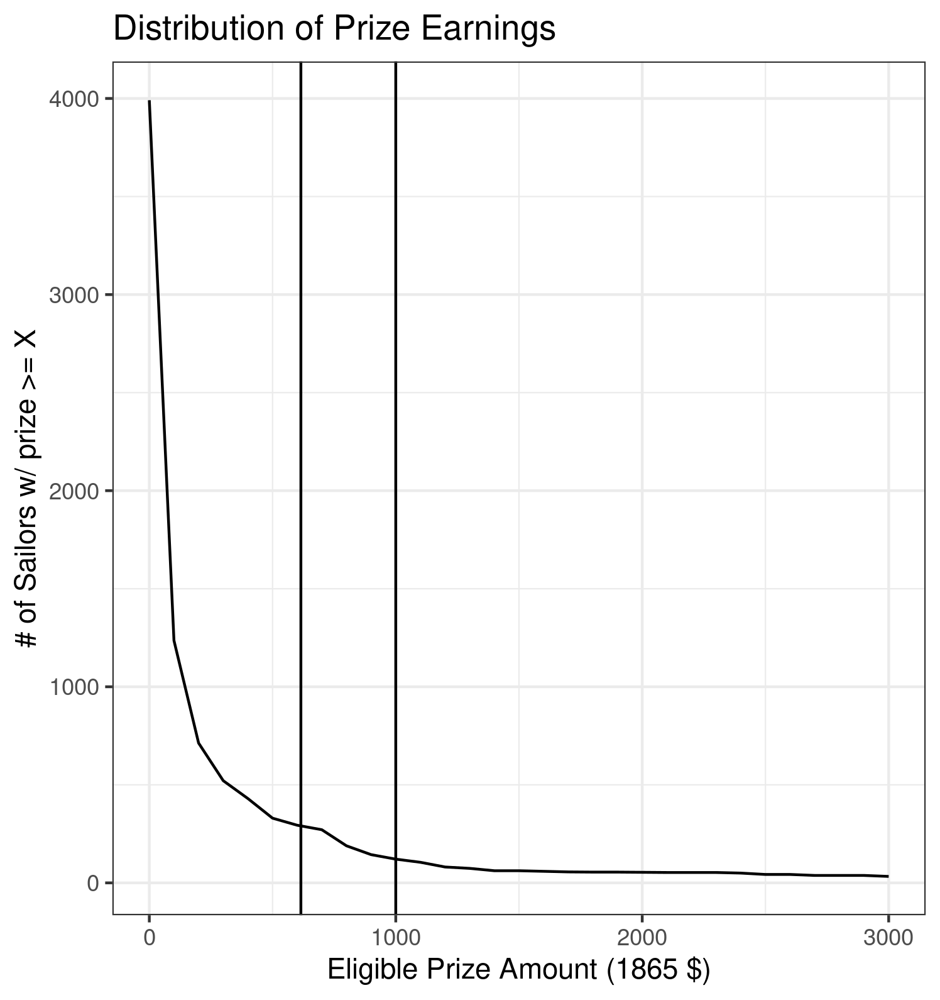
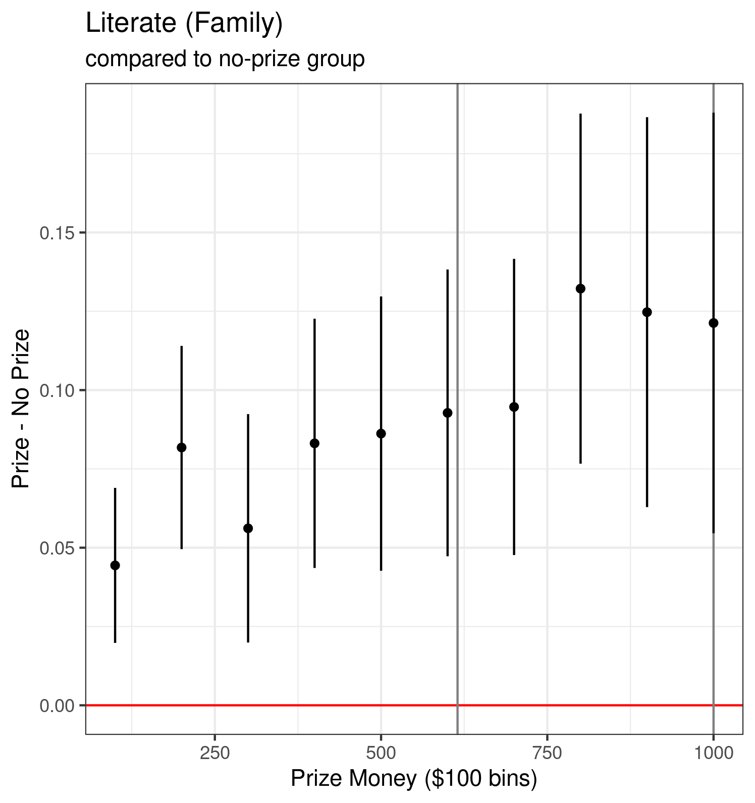
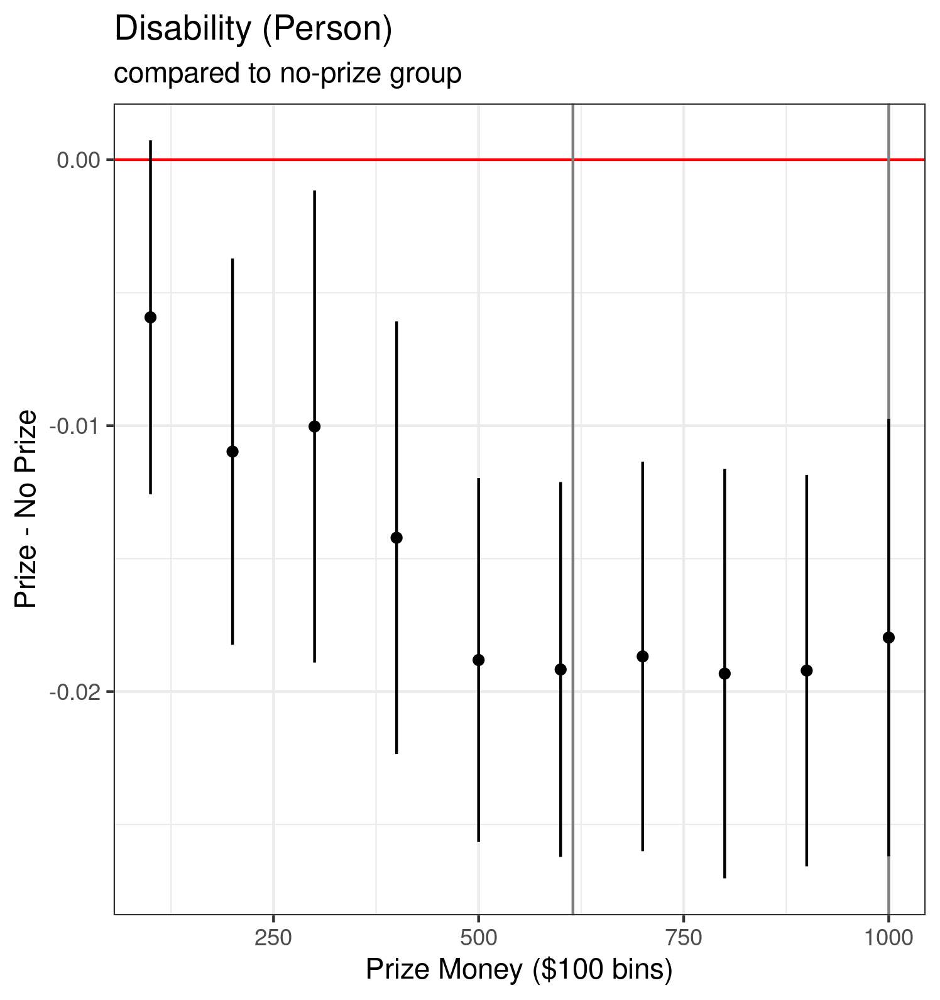
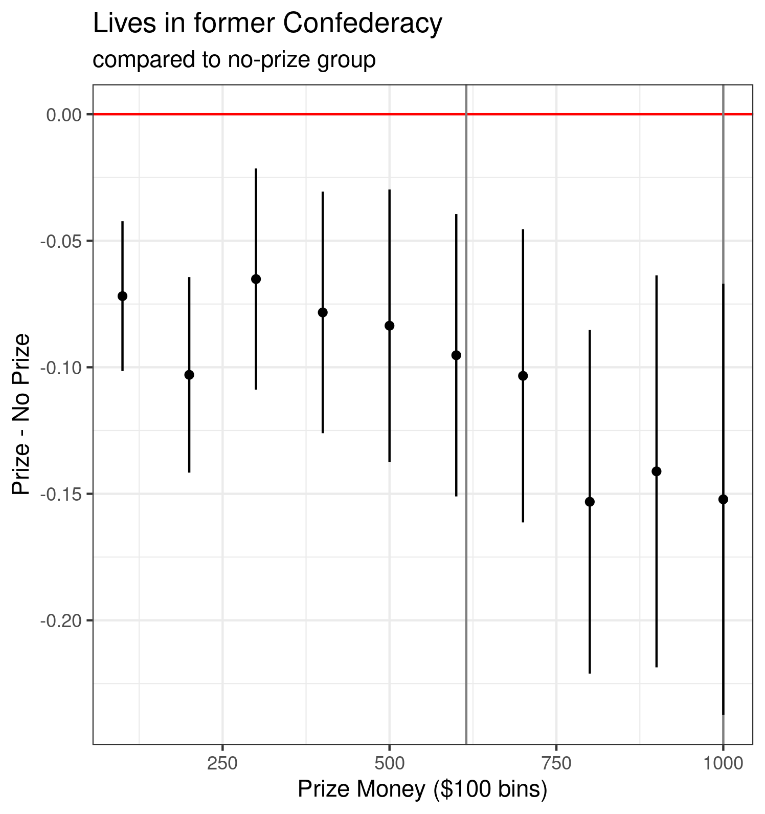
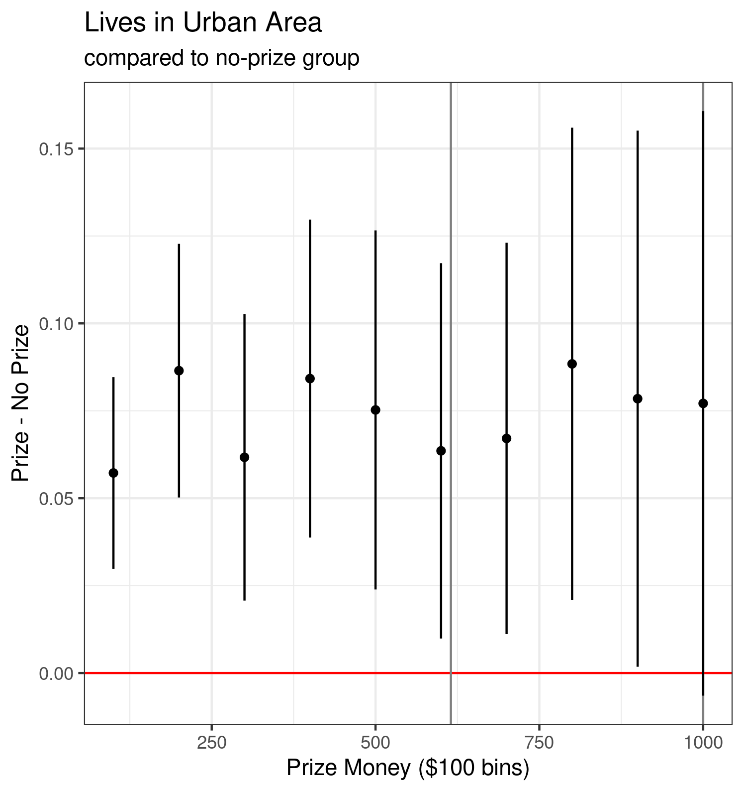
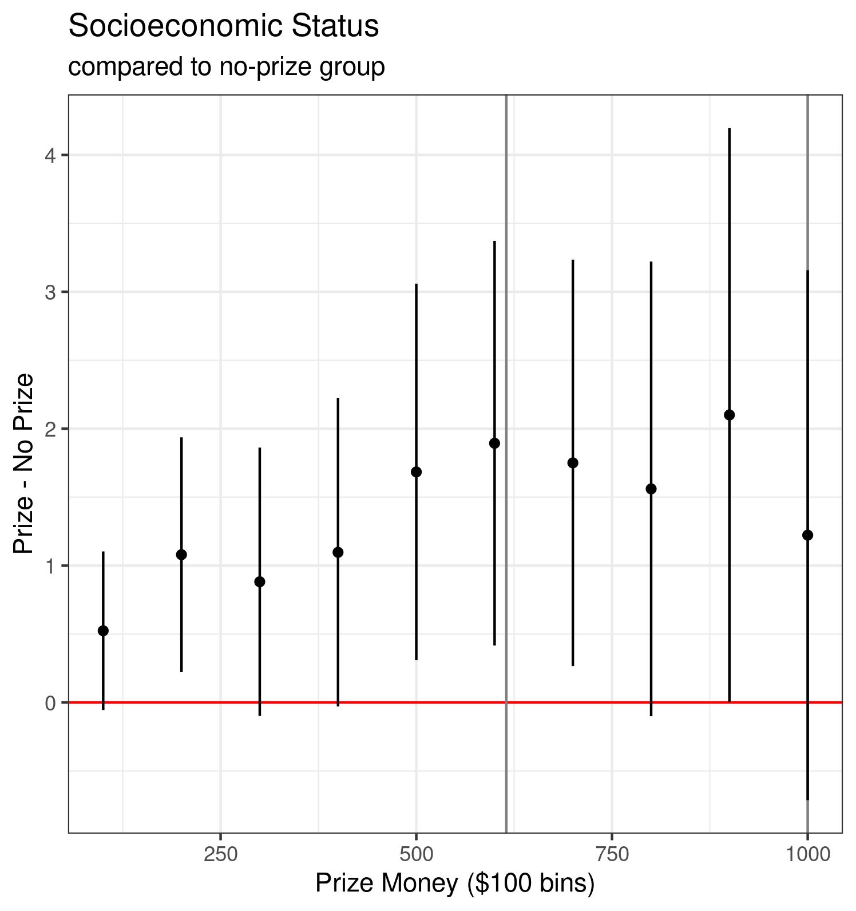
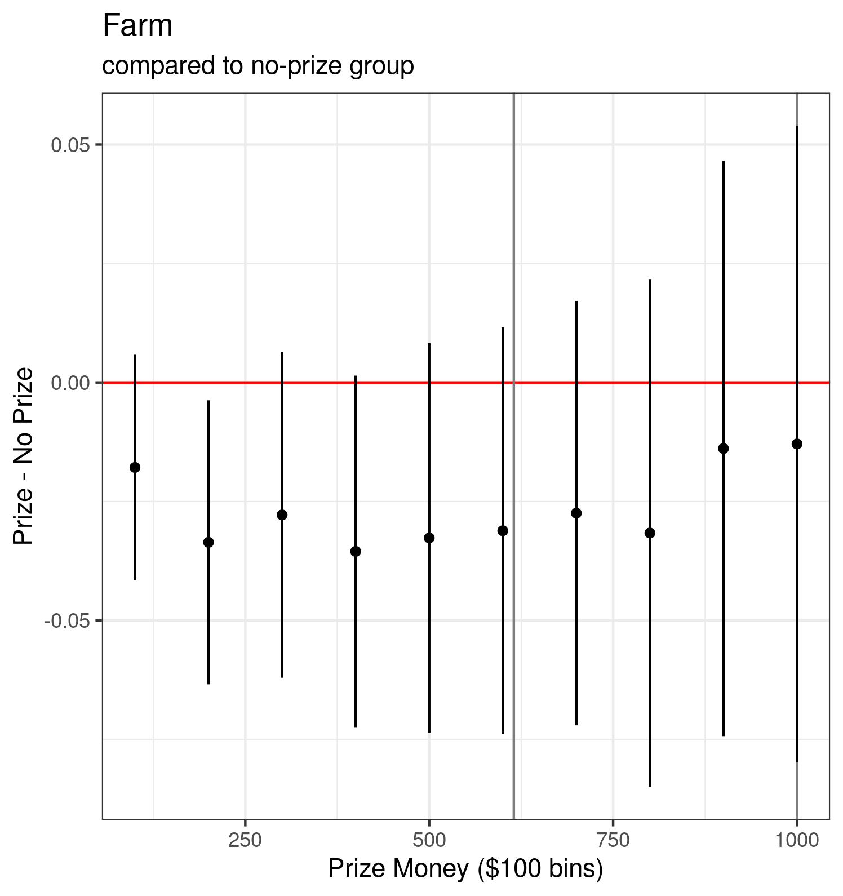
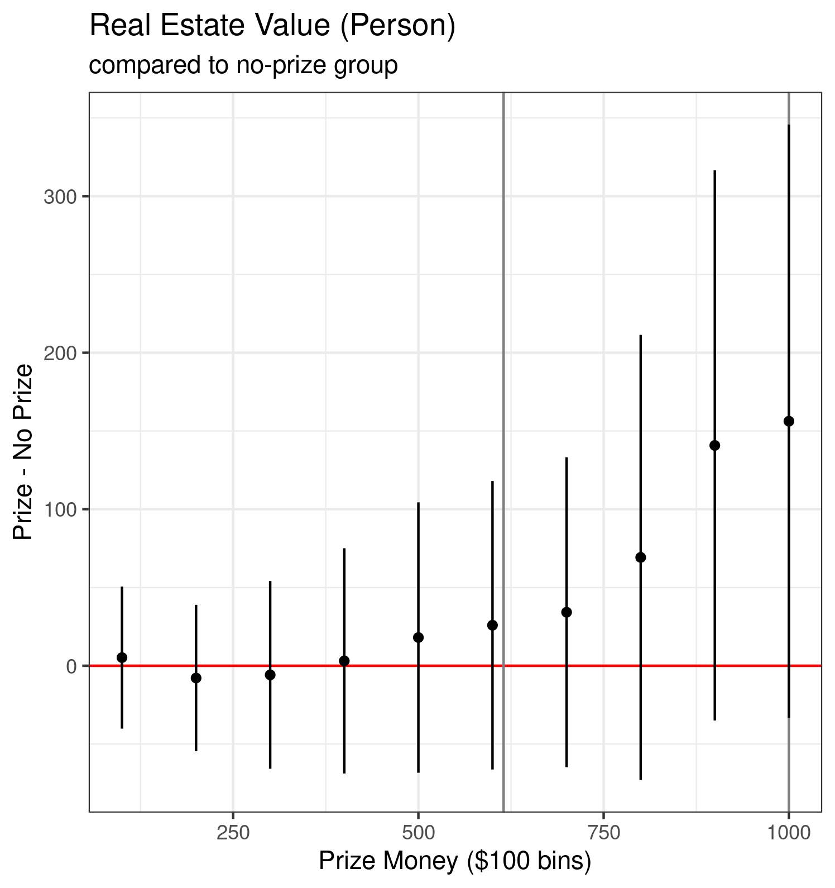
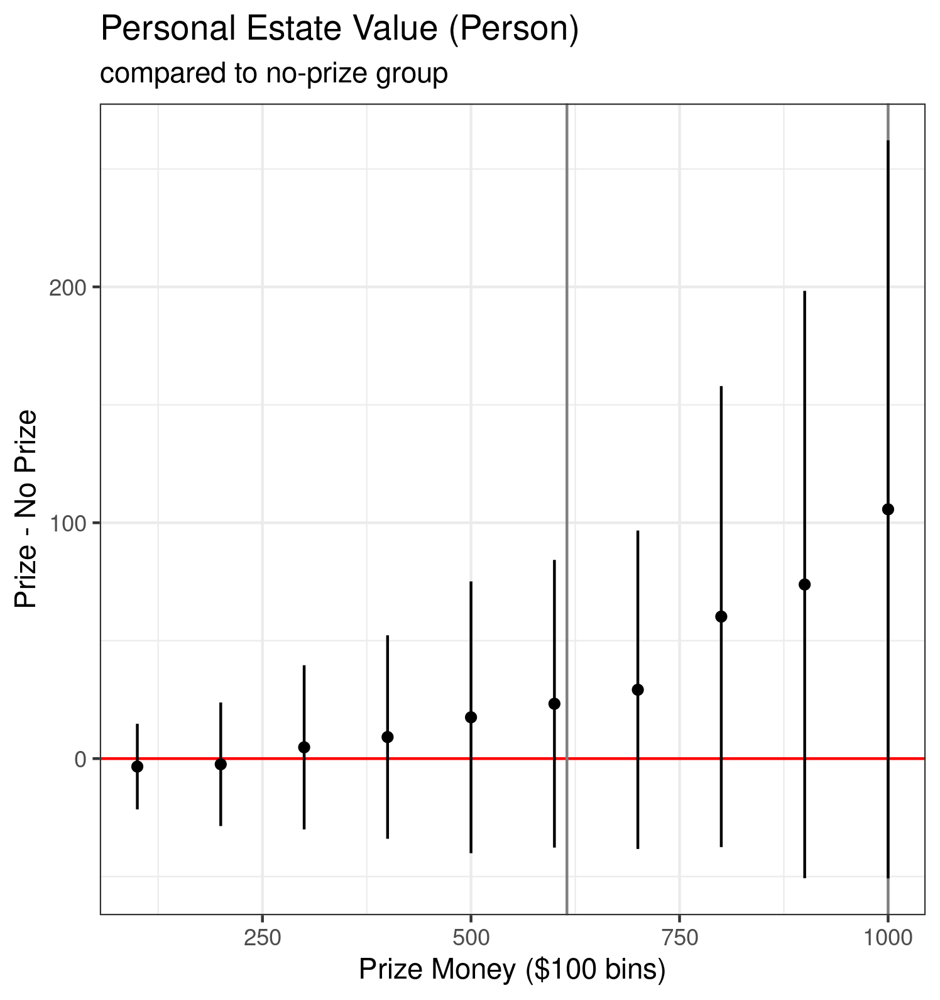

```{r setup, include = F}
require(knitr)
require(magrittr)
```

## Motivation


<style type="text/css">
  .reveal h2,h3,h4,h5,h6 {
    text-align: left;
  }
  .reveal p {
    text-align: left;
  }
  .reveal ul {
    display: block;
  }
  .reveal ol {
    display: block;
  }
  .table-hover > tbody > tr:hover { 
  background-color: #696969;
  }
</style>


---

### Counterfactual Reparations

Reparations or major land reforms never materialized:

- For vast majority of freed people, no 40 acres and a mule

What might have been the effects of such policies during Reconstruction?

>- land reforms effective (Miller 2011, 2020), but hard politically

---

### Cash transfers

- "easier" politically, than land redistribution
- subject of substantial research in economics in variety of contexts
- parallels contemporary debates about what reparations might look like 

What if Federal government provided cash to African Americans after Emancipation?

- what kinds of effects would this have had *for individuals* and *families*?


## Union Navy Prizes of War

---

### Union Navy Prize Money

- Union Navy was integrated, by law and by necessity 
  - Black sailors on hundreds of ships
  - discrimination in ranks, hazing, postings

- Prize money for captured blockade runners
  - "Prizes" condemned in court, then auctioned
  - Proceeds split between federal gov't, officers and crew of ship
  - Prizes range between 200 and > 500K in 2020 dollars

---

### Union Navy Prize Money

- Transfers of cash from Federal Gov't to Black sailors (after filing claim)
- Given service on similar ships, in same areas, at same time, winning prize is "as-if" random

We can examine the effects of cash transfers to Black sailors and their families

## Data

---

### Sailors

- African-American Sailors Project (Joseph Reidy) of Howard University
  - identified black sailors from ship muster rolls
  - first/last name, age, birth place, enlist place/date, ships served on, dates of service
- Available from National Park Service

---

### Prizes and Ships

Prizes

- audit reports list prizes awarded to which ships and amount, and date of capture
- can estimate prize allocations
- National Archives holds actual records of prize eligibility

Ships

- Official Records of the Union and Confederate Navies
  - dates/locations of ship service
  - ship type, tonnage, crew, guns
- Dictionary of American Naval Fighting Ships
  - crew, ship dimensions, speed, armaments

---

### Outcomes

Currently...

1870 and 1880 Censuses (From IPUMS)

- automated linking to sailors (and also their families)
- property (real and personal), literacy, children schooling, disability, sickness, residence in south, residence in urban areas, economic status

## Preliminary Results

How common were large prizes?

Benchmark: 1000 in 1865 is ~223000 in relative wealth

Benchmark: expected price of 40 acres and mule in 1870 is $615

---





---



--- 

Higher literacy



--- 

Lower rates of disability




---

Less likely to live in former confederacy




---

More likely to live in urban areas





---

Higher Socio-Economic Status





--- 

Less likely to live on a farm




---

Higher Real Estate Values





---

Higher Personal Estate Values




## Next Steps

Improving measurement with other records sources:

- Actual prize eligibility: treasury records
- more careful matching (Navy Service Records/Pensions)
- more outcomes:
  - property/tax records; voter rolls; office-holding?
  - inter-generational effects


