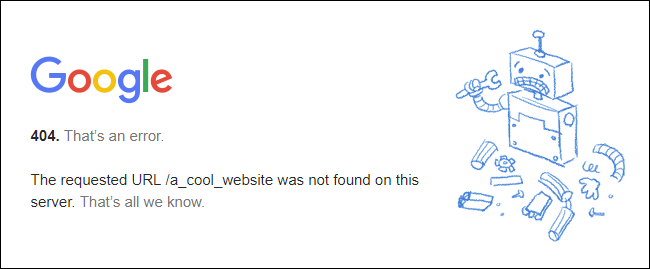

```{r setup, include=FALSE}
knitr::opts_chunk$set(echo = TRUE)
```


# Outline

<style type="text/css">
  .reveal h2,h3,h4,h5,h6 {
    text-align: left;
  }
  .reveal p {
    text-align: left;
  }
  .reveal ul {
    display: block;
  }
  .reveal ol {
    display: block;
  }
</style>


---

### Motivation

Skills needed for accessing data help:

1. Make a project **feasible** by access to necessary data
2. Make a project **feasible** by reducing time/cost of data collection
3. **Multiply** the return on your labor (work smarter, not harder)

Even with limited financial support, PhD/MA students can produce more high-quality, unique research.

- More time doing thinking, reading, writing
- More innovative projects, with finite resources

--- 

### Goals

- Brief exposure to some common tools
- Some hands on experience, but not a detailed "how to"
- Use these tools in your projects to truly learn

Do:

- Ask questions today about possible applications
- Reach out to get further guidance

---

### Plan

- Some examples
- Introduction to web requests (http)
- Web scraping (+ exercise)
- APIs (+ exercise)
- PDFs/OCR to get text/tables (+ exercise)
- Cleaning/Data Management (brief)


# Examples

---

### Examples

African American Sailors in the Civil War

- effects of wealth transfers ('counterfactual' reparations)
- [https://www.nps.gov/civilwar/search-sailors.htm](https://www.nps.gov/civilwar/search-sailors.htm)
- Automate the navigation and saving of this data

---

### Examples

**Download online database**: full count 1860 US Census [Fold3.com](Fold3.com)

- Subscription genealogy site. 
- Access to census **images** is behind a paywall.
- But page metadata (including all personal data transcribed) is exposed behind the scenes
- Data is hidden in background requests (explain)

---

### Examples

**Searching a database**: Historical newspaper archives for lynching discourse

Automate searches and saving of results.

- First pass: submitted search queries to find which newspapers mentioned lynching on which dates
- Second pass: which newspapers are NOT talking about lynching? Download an index of what newspapers were available on each date.

---

### Examples

What if you have natively digital data?:

- Facebook users (Mueller and Schwarz), Twitter networks, Google Trends, Canvas (sure!)
- Google Vision, GPT, etc.
- These services have an API: an interface for requesting/receiving data. Usually there is an explicit guide.


# Web Requests

## Requests

Mostly, we access resources on the internet using HTTP.

As internet **users**, the programs/apps we use send **[requests](https://en.wikipedia.org/wiki/Hypertext_Transfer_Protocol#Request_methods){target="_blank"}** of various types to a **server** (a computer somewhere else).

The **server** then sends us a **response** that indicates the **status** of our request (did it go OK?) and any data.

---



[status codes](https://en.wikipedia.org/wiki/List_of_HTTP_status_codes)

---

### Statuses

- **200** means OK
- Some indicate a problem (**404**)
- Other indicate that you have been blocked/do not have access


[status codes](https://en.wikipedia.org/wiki/List_of_HTTP_status_codes)

---

### Requests

In my experience, we largely only need to use:

- **GET** requests
- **POST** requests

Right click in your browser, select "Inspect", choose "Network" tab (may need to enable "Developer Menu" on Safari > Settings)

---

### GET

1. Access some static content (you are scraping data on some specific html page)
2. Search/query database: usually uses a GET request with several search parameters

[http://chroniclingamerica.loc.gov/search/titles/results/?state=Alabama&page=2](http://chroniclingamerica.loc.gov/search/titles/results/?state=Alabama&page=2)


---

### POST

Request includes a 'form' that is submitted:

* Submits some data (could be login information, post on message board, or search query)
* You must find the form (usually hidden) and insert the correct values

[example](https://www.newspapers.com/signon.php){target="_blank"}

---

### Headers

**Requests** also have **headers** which contains information about where the request comes from and "cookies". (Used for tracking permission to content... and just tracking). 

- **SOMETIMES IMPORTANT** if content is behind a login, or there are efforts to block bots.

Click on a request, examine the "Headers" tab...


---

### Responses

When we submit requests, the format of the **response** may vary:

**HTML**: a text markup language that is converted to a visual page in a browser.
 
- tags: `<tag>stuff</tag>`
- css: `<tag id="style1" class="style2">stuff</tag>`
- attributes: `<tag attribute="something">stuff</tag>`


---

### Responses

**JSON**: a structured data object:
    - contains dictionaries (in "`{}`") of "keys" (labels), a ":", and values (things that are labeled), separated by commas.
    - lists of values (in "`[]`"), separated by commas.
    - `{'Key1':'Value', 'Key2': ['Value1','Value2']}`
    


---


---

### Responses

**Other responses** are possible:

- Sometimes a request generates a pdf, csv, etc.

---

### Using Web Requests

What you do...

1. Accessing Data:
    - "scraping" or using "API" to automate collection of data you found online
2. Extracting Data
    - using API tool to get/generate data out of some original file (e.g. image to text)
3. Extending Data
    - using API tool to add something new to data (geocode, classification, etc)

# Scraping

## Web Scraping

"Scraping" refers to using some programming tools to **automate** the process of 

- generating **requests** for data hosted on a website/service
- extracting the data we need from **responses**
- Usually a situation where the data is primarily formatted for visual display (HTML)

---

### Scraping

Procedure:

1. Find the data you want online
2. Open developer tools in browser
3. Click in browser to start request(s) that generate data
4. What requests return the data? $\to$ replicate the request
5. How is request formatted? $\to$ structure new request
6. What is the response? $\to$ code to parse/extract data

---

### Scraping in R


For sending requests:
[httr2](https://httr2.r-lib.org/)

For parsing HTML
[rvest](https://rvest.tidyverse.org/articles/rvest.html)


---

### Exercise 1

Let's go here: [https://en.wikipedia.org/w/index.php?title=Category:Ships_of_the_Union_Navy](https://en.wikipedia.org/w/index.php?title=Category:Ships_of_the_Union_Navy)


---

### Exercise 2

Let's go here: [http://www.dalbydata.com/user.php?action=civwarsearch](http://www.dalbydata.com/user.php?action=civwarsearch)

--- 

### Commmon Problems with Scraping

- Permissions/Headers: you may need to be logged in, or to have correct "cookies" or "referer" to access data using R instead of browser
- Captchas
- Too many requests $\to$ blocked IP.

# APIs

## Using APIs

Where as "scraping" refers to pulling data from webpage that you'd visit with your browser...

An API (application programming interface) uses HTTP requests to directly access structured data (typically in JSON format).

[See here](https://www.postman.com/what-is-an-api/)

---

### Using APIs

APIs may be useful to:

- Access the data you want directly
- Use a tool to extract new data (e.g., Google Vision for text or image classification, OpenAI GPT, etc.)
- Use a tool that extends your data (e.g., add latitude/longitude)

Lots of APIs for various purposes. Next session will cover using APIs for LLMs like GPT

---

### Using APIs

Two situations:

1. **Public API**: well-documented API designed with you as a user in mind

- requires API Key (pay per use) 
- well-documented guide to API parameters

2. **"Hidden" API**: many sites use APIs internally, not designed for us to use.

- No documentation
- Harder to find

---

### Using APIs

Procedure:

1. Find the API
2. Sign up and get a key (if you need one)
3. Find a guide to the API
4. Format and submit a request
5. Process the response

---

### Using APIs

Let's say we want to get latitude and longitude for a list of addresses.

We could look them up in Google Maps one by one, but this would take a long time.

We could instead use [OpenStreetMap API](https://nominatim.org/release-docs/latest/api/Search/)

---

### Exercise 3

The Nominatim API from OSM is **public**

Let's turn to our R Notebook.


---

### Example of Hidden API 

[https://www.fold3.com/publication/120/us-navy-survivors-certificates-1861-1910/](https://www.fold3.com/publication/120/us-navy-survivors-certificates-1861-1910/)

Open Network tool; start clicking through, look for Requests, filtering by "XHR"; check "Request", "Response"

---

### Common Issues with APIs

- Errors: usually because you have formatted request in correctly.
- Rate limits: APIs restrict requests per time period.
- "Hidden APIs" usually have security features to deter us. May limit how much data you can extract at a time.


# Extracting Data from Files

## Extracting Data

A common situation is:

We have images or PDFs with text data or tables that we want to digitize.

- reports from governments/agencies
- archival records
- books/volumes of historical data

---

### Extracting Data

Which tool to use:

- Is the data "natively" digital (not a scan/image)? If NO $\to$ OCR and computer vision
- Is the data you want a TABLE? If yes $\to$ `tabulapdf` in `R` or `camelot` in Python
- Is the data you want just text? If yes $\to$ pdftools

---

### Extracting Data

If your data is in a natively digital PDF... you can get text and tables.

- `pdftools` package in `R` can read pdf text [how to](https://library.virginia.edu/data/articles/reading-pdf-files-into-r-for-text-mining)
- `tabulapdf` package in `R` can extract tables [guide](https://cran.r-project.org/web/packages/tabulapdf/vignettes/tabulapdf.html)

PDF table extraction is finnicky, sometimes installation trouble. Consensus that `camelot` in Python is "best".

---

### Extracting Data

PDF table extraction often requires some code to "clean" up the table:

- e.g., long cell entries spread across multiple rows needs to be collapsed

---

### Extracting Data

If your data is in a scanned image, you can get text and tables, but it will be harder.

We need to use some combination of OCR (optical character recognition) and layout parsing.

- `tesseract`: open source OCR engine with R package. (Alternatively, Google Vision API)
- [LayourParser](https://layout-parser.github.io/) can detect formatting in images, but is hard to install and train the model.
- GPT works really well with text tables; bizarrely it has trouble with tables of numbers.

---

### Example

Indiana **People's Guides** list partisanship of 30,000 people in 1874


Let's see how to get the text...

# Additional Resources

## Cleaning Data

Common to need to process the data you extract further:

- Extract strings (regular expressions)
- Matching/Fuzzy Matching
- Linking Records

---

### Working with: Regular Expressions

If you need to pull out specific segments of text (e.g. Names? Addresses?)...

- In R use `stringr` package: [reference guide here](https://cran.r-project.org/web/packages/stringr/vignettes/regular-expressions.html)


---

### Working with: Messy Data

**Fuzzy Matching**

- if names/place names have spelling variants or typos
- can use string similarity metrics (e.g.  Jaro-Winkler scores)
- `stringdist` package in `R` makes this easy and fast
- easier than checking by hand to correct errors

---
  
### Working with: Record Linkage

If data contain records of people/organizations to be linked:

1. Deterministic rules [(APSR civil war)](https://static.cambridge.org/content/id/urn:cambridge.org:id:article:S0003055419000170/resource/name/S0003055419000170sup001.pdf)
2. Probabilistic Models [(FastLink)](https://github.com/kosukeimai/fastLink)
3. Machine Learning [(Feigenbaum)](https://scholar.harvard.edu/files/jfeigenbaum/files/feigenbaum-censuslink.pdf)

---

### Scaling Up

When scraping or using APIs...

- Keep your code modular (write functions to do different parts of the project; e.g. wiki data)
- Error handling: code what to do when requests fail?
- Data management: larger projects benefit from a SQL database (what requests have been completed? start from where you've left off)
    - I like SQLite, can use `RSQLite` package

