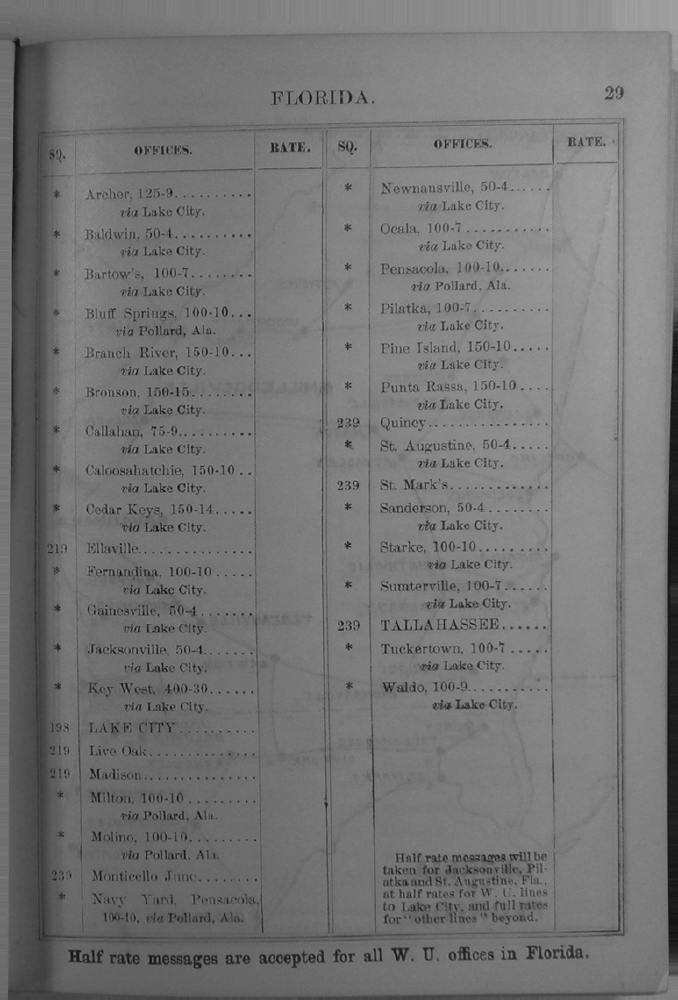

```{r, echo = F}
require(httr2)
require(rvest)
require(data.table)
require(magrittr)
require(knitr)
require(stringr)
```

# Web Scraping

## Exercise 1.a

Let's say I want to get data on ships in the Union Navy during the American Civil War.

Let's go to this page [https://en.wikipedia.org/w/index.php?title=Category:Ships_of_the_Union_Navy](https://en.wikipedia.org/w/index.php?title=Category:Ships_of_the_Union_Navy)

### Step 1: Find the data you want

On this page, we just want to get the list of ships and links to them.

### Step 2: Open developer tools

Hover over one of the ships, then right click > "Inspect".

Now we can explore the HTML tags that contain the data.

### Step 3: What request generates the data?

What "requests" show up?

- Main body of the page is created by a `GET` request
- Let's examine: 
    - what is the address for this request? ("Headers" tab)

### Step 4: Replicate the request

We can see that the `POST` request went to: `https://en.wikipedia.org/w/index.php?title=Category:Ships_of_the_Union_Navy`. 


```{r}
url = "https://en.wikipedia.org/w/index.php?title=Category:Ships_of_the_Union_Navy"
req = request(url)
response = req %>% req_perform()
page = response %>% resp_body_html()
```

### Step 5: Let's find the data on the page:

"Inspect the page", until you can highlight the entire list of ships.

We see this is in a `<div>` tag with the class `mw-category mw-category-columns`. Let's pull this feature out.

```{r}
div = page %>% html_nodes("div[class='mw-category mw-category-columns']")
div %>% print
```

We see that each ship an its link is in an `a` tag:

```{r}
ships = div %>% html_nodes("a")
print(ships)
```

We want to pull out the `href` and the text.

```{r}
ship_data = lapply(ships, function(s)
                    data.table(url = s %>% html_attr('href') %>% paste0("https://en.wikipedia.org", .),
                               ship_name = s %>% html_text)
                  ) %>% 
            rbindlist()
```

Now, we could loop over pages to get all ships.

We could also write code to open each ship URL to pull out the data in the information box

## Exercise 2

Let's go here: [http://www.dalbydata.com/user.php?action=civwarsearch](http://www.dalbydata.com/user.php?action=civwarsearch)

### Step 1: Find the data you want

This page lets us search for soldiers from Minnesota who served in the American Civil War. Let's search for last names starting with "A". 


### Step 2: Open developer tools

Now return to search page; open the developer tools (right click > "Inspect" > click to network tab). Let's search for soldiers with last names starting with "B".


### Step 3: What request generates the data?

What "requests" show up?

- Main body of the page is created by a `POST` request
- Let's examine: 
    - what is the address for this request? ("Headers" tab)
    - what is the content of this request? ("Request" tab)

### Step 4: Replicate the request

We can see that the `POST` request went to: `http://www.dalbydata.com/user.php?action=civwarsearchresults`. 

We can also see that the "request" contained several attributes (related to the original search options), but our request only had two filled in:

- `CivWarSearch:'Search'`
- `lastname:'b'`

As this is a POST request, 

We can use `httr2` to generate the request

```{r}
#Define request URL
url = 'http://www.dalbydata.com/user.php?action=civwarsearchresults'
#Request
req = request(url)
response = req %>% 
            #this req_body... make it a "POST" request
            req_body_form(CivWarSearch = 'Search',
                          lastname = 'b') %>%
            req_perform()
page = response %>% resp_body_html()

```

### Step 5: Process the data

We want to grab a table. We might just grab the `table` tags.

```{r}
page %>% html_nodes("table")
```

There are 7 `table` elements. So we want to look for what attributes uniquely identify the data.

Using the inspect tool, we see that our table has `cellspacing="1"`

```{r}
page %>% html_nodes("table[cellspacing='1']")
```


Now we can turn the HTML table into data in R:

```{r}
table_data = page %>% 
              html_nodes("table[cellspacing='1']") %>%
              html_table
table_data
```

Now we could loop over starting letters (e.g., "aa", "ab") to get all of the data.


# APIs

## Exercise 3

We want to geocode locations for a project (to, let's say, merge in additional data using spatial location).

### Step 1: Find an API

We can use the [OpenStreetMap API](https://nominatim.org/release-docs/latest/api/Search/), which is free. Google also has a geocoder, which is not free.

### Step 2: Sign up and get an API key

We don't need this for the OpenStreetMap API, but we [would for Google](https://developers.google.com/maps/get-started)

### Step 3: Find the API guide/documentation

The guide tells us that the "endpoint" for the API is `https://nominatim.openstreetmap.org/search`

```{r}
url = "https://nominatim.openstreetmap.org/search"
```

### Step 4: Structure a request

We have a number of options for query parameters

|  Parameter |            Value           |
|:----------:|:--------------------------:|
| q          | free form query            |
| amenity    | name and/or type of POI    |
| street     | housenumber and streetname |
| city       | city                       |
| county     | county                     |
| state      | state                      |
| country    | country                    |
| postalcode | postal code                |

We can also tell the API more information about how we want to format the response

`format` has many options (including `json`, `geojson`)
`limit` specifies the number of results to get.

Let's keep it simple, let's say we want to get the address of this building... we could do it two ways...

```{r}
#Free form
query_1 = list(q = "1866 Main Mall, Vancouver, BC V6T 1Z1",
               format = "geojson")
#Structured
query_2 = list(street = "1866 Main Mall",
               city = "Vancouver", 
               state = "BC",
               postalcode = "V6T 1Z1",
               country = "CA",
               format = 'geojson')


```

Then we can submit the request:

```{r}
url = "https://nominatim.openstreetmap.org/search"

#Request
req = request(url)
response = req %>% 
            req_url_query(!!!query_1) %>%
            req_perform()
parsed = response %>% resp_body_json()
```


```{r}
#Request
req = request(url)
response = req %>% 
            req_url_query(!!!query_2) %>%
            req_perform()
parsed = response %>% resp_body_json()

```

### Step 5: Parse/process the data

We can pull out latitude/longitude and name by match:

```{r}
lapply(parsed$features, function(f) data.table(name = f$properties$name,
                                               category = f$properties$category,
                                               type = f$properties$type,
                                               longitude = f$geometry$coordinates[[1]],
                                               latitude = f$geometry$coordinates[[2]])) %>%
  rbindlist()


```


With GeoJSON, we can directly load the data into R using `sf` package. Note, we need `resp_body_string` so that we read the JSON as a text file; not a list object.

```{r, eval = F}

require(sf)
require(ggplot2)
require(ggsf)
spatial_data = sf::st_read(response %>% resp_body_string())

ggplot(spatial_data) + geom_sf() + theme_bw()
```

# Extract Data from Documents

## Exercise 4

We have a pdf containing the 2023-2024 UBC Investigations Office Report. This contains both text and tables.

We first might be interested in gathering text from this report (for some kind of text analysis)...

We can use the `pdftools` to get the text from PDFs in this directory

```{r}
require(pdftools)

#Get pdf files
files = list.files(pattern = "pdf$")

report_text = lapply(files, pdf_text)

length(report_text[[1]]) #we index [[1]] to grab the first file in the list. If there were more files, we could index on subsequent files
```

We can see that there is text from each page in the report. A vector of strings that is length 14, one element for each of the 14 pages in the report.

If we wanted to get the TABLES from this report, we could use a different tool:

```{r}
require(tabulapdf)
extract_tables(files[1], method = "stream")
```

We got all of the tables from this document. We can select which table we want to save and use.


## Exercise 5

If data is from images, then we have to do more work. To get text from images, we can use `tesseract`:

Lets say we want to extract data from a list of biographical entries from 1874. There are thousands of people in pages like this, listing key attributes, including partisanship. These were published in books, the books were scanned, so all we have are images.


First, we need to install and load tessearct; and select a model for the right language.


```{r}
require(tesseract)

#Get the english OCR model
eng = tesseract('eng')

```

Then we can either just get the text, formatted as `tesseract` guesses is best:

```{r}

text = tesseract::ocr("0002.bin.png", engine = eng)
cat(text)

```

We could then process this data to extract each entry:

```{r}
text %>% #start with the text
  str_split("\\n\\n") %>% #split into "entries" separated by two new lines
  unlist %>% 
  str_extract("^[^;]+(?=;)") #extract "Names"... clearly there are issues here.
```

Or, if we don't think that the formatting will be correct, we can extract each word and its location on the page (in pixels).

```{r}
raw_text = tesseract::ocr_data("0002.bin.png", engine = eng)
raw_text
```

Then, we could use the bounding box to write code to split the page into entries.


## Exercise 6 

This will work well if you just need the text. If you need to preserve formatting (from a table), this can be a nightmare.

Let's take a different example



This page comes from an 1874 Western Union telegraph office list. The format is tricky and the quality of printing and scanning is worse.

Let's see how tesseract performs:

```{r}

text = tesseract::ocr("wu_1874.png", engine = eng)
cat(text)

```


Both the text and the formatting are a mess. We almost certainly cannot clean this with code.

In this situation, we either need to use a more sophisticated layout tool (e.g., [LayoutParser](https://layout-parser.github.io/)) or turn to GPT. 

I have found that GPT is way easier to work with, but that is for next session. See the text extracted below, using prompts to improve both the reading of text and formatting of the data.

```{r}
fread("wu_1874.csv") %>%
  kable
```

