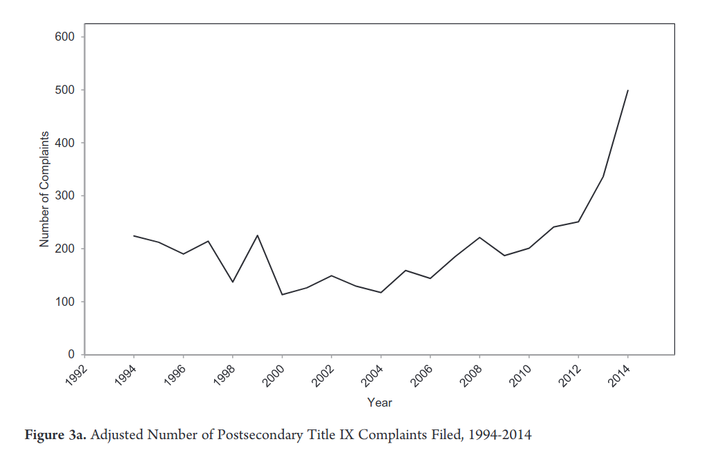
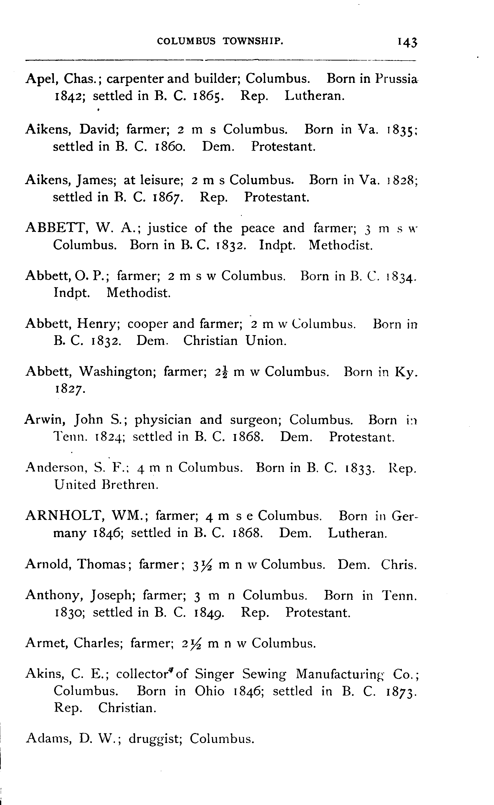
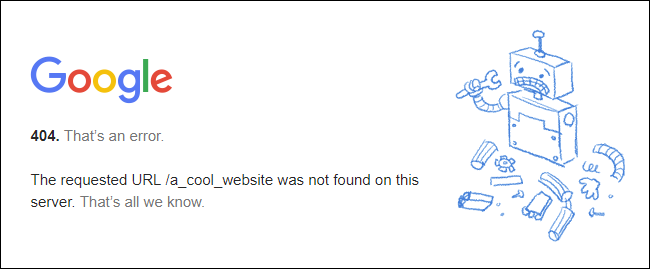

```{r setup, include=FALSE}
require(knitr)
require(magrittr)
knitr::opts_chunk$set(echo = TRUE)
```

<style type="text/css">
  .reveal h2,h3,h4,h5,h6 {
    text-align: left;
  }
  .reveal p {
    text-align: left;
  }
  .reveal ul {
    display: block;
  }
  .reveal ol {
    display: block;
  }
</style>

## Web Scraping for Political Science

#### A Primer

## Outline

1. What is scraping? (And why might it be useful?)

2. Ways of scraping

- Key Terms/Ideas
- APIs vs Scraping HTML

3. How to get data

4. How to process data

5. Common Issues

---

### A note on tools

#### Python

- Wide array of well-documented modules for webscraping (Stack Overflow) and clients for common APIs (Google, Facebook, Twitter)
- `requests`, `bs4`, `lxml`, `json`, `re`, `selenium`

#### R

- Tools in R do similar things; and clients for common APIs (Google, Facebook, Twitter)
- `httr`, `rvest`, `jsonlite`, etc.

I use Python (usually) by preference/habit. Not a requirement.

# What is Web Scraping?

## Historical newspaper content

> How and why did public discourse about lynching change over time?

>- Need a way of measuring discourse:
>- Full text of historical newspapers.

## Historical newspaper content

[Article on Sam Hose](https://www.newspapers.com/newspage/26956751/){target="_blank"}

- We can access OCR (optical character recognition/computer vision) text WITHOUT a login

## Historical newspaper content

But there are more than [1 million hits](https://www.newspapers.com/search/#dr_year=1880-1920&query=lynching&oquery=lynching+1880+to+1920){target="_blank"} for "lynching" from 1880 to 1920.

There are 600 million newspaper pages on this site alone.

How can we examine all of this text?

## Voting for Black Suffrage

How did white Northerners come to support black suffrage after the US Civil War?

>- One reason is may be that wartime experience transformed their racial attitudes and policy positions.

>- Look at military service and voting for black suffrage in state referenda, like those held in Minnesota.

## Voting for Black Suffrage

Historians have collected data on county votes for and against black suffrage.

But how do we get county-level estimates of military service?

[This random dude's website.](http://www.dalbydata.com/user.php?action=civwarsearch){target="_blank"}

## Voting for Black Suffrage

There are lots of results (more than 20 thousand men); we could copy and paste... but this is time consuming.

How can we extract this database for use?

## Title IX Complaints

Enforcement of federal laws against gender discrimination in American universities usually requires someone to file a Title IX complaint.

In recent years, the use of this complaint process has become more widespread. How did this diffusion happen?

---




## Title IX Complaints
 
One answer might be that knowledge of the Title IX complaint process  diffused among universities that are peers or by emulation of respected institutions. 
 
How do we construct a network of universities that shows which institutions see other institutions as peers or worthy of emulation?

>- Following on Twitter. We can look at official twitter accounts from each university and which other universities they follow.

## Title IX Complaints

There are nearly 2000 accredited universities and colleges, sometimes many official twitter accounts at each university. 

Lurking on Twitter to put this network together would take forever...

## Civil War and Partisanship

What are the effects of wartime experience during civil war on post-war political beliefs?

We can look at this in the context of the American Civil War: did exposure to combat and slavery cause a shift in partisanship?

>- We need individual data on partisanship in the 19th century... Good luck finding that!!!


---



## Civil War and Partisanship

There are 70,000+ names across a few thousand pages.

Rather than hire undergraduates, we can try [computer vision](https://cloud.google.com/vision/docs/drag-and-drop){target="_blank"}.

How do we use this tool on thousands of pages of text?

## Scraping

What do these examples have in common?

- Data that is useful is available through the internet (online databases, online tool)
- It is impossible/prohibitively expensive to collect this data manually
- Data can be obtained (relatively) easily using a programming language to automate the process.

## Scraping

"Scraping" refers to using some programming tools to **automate** the process of 

- accessing some website/service that is hosted on the internet (wide variety of possibilities)
- extracting the data we desire
- and processing that data to make it useful

## Scraping: Upsides

1. Makes a project **feasible** by access to necessary data
2. Makes a project **feasible** by reducing time/cost of data collection
3. **Multiplies** the return on your labor (work smarter, not harder)

Even with limited financial support, PhD/MA students can produce more high-quality, unique research.

## Scraping: Process

1. Find that data/tool you want
2. Figure out how to use programming language to access that data.
3. Use programming to structure the data for your needs
4. Scale up: automate the rest of the data collection

# Ways of Scraping

## Key Ideas

Mostly, we access resources on the internet using HTTP.

As internet **users**, the programs/apps we use send **[requests](https://en.wikipedia.org/wiki/Hypertext_Transfer_Protocol#Request_methods){target="_blank"}** of various types to a **server** (a computer somewhere else).

The **server** then sends us a **response** that indicates the **status** of our request (did it go OK?) and any data.

---



## Key Ideas

### Statuses

- **200** means OK
- Some indicate a problem (**404**)
- Other indicate that you have been blocked/do not have access

### Requests

In my experience, we only ever need to use:

- **GET** requests
- **POST** requests

## Key Ideas: Requests

### GET

1. Access some static content (you are scraping data on some specific html page)
2. Search/query database: usually uses a GET request with several search parameters

[example](http://chroniclingamerica.loc.gov/search/titles/results/?&page=2){target="_blank"}

## Key Ideas: Requests

### POST

Request includes a 'form' that is submitted:

* Submits some data (could be login information, post on message board, or search query)
* You must find the form (usually hidden) and insert the correct values

[example](https://www.newspapers.com/signon.php){target="_blank"}

## Key Ideas: Requests

**Requests** also have **headers** which contains information about where the request comes from and "cookies". (Used for tracking permission to content... and just tracking). 

- **SOMETIMES IMPORTANT** if content is behind a login

## Key Ideas: Responses

When we submit requests, the format of the **response** may vary:

1. **HTML**: a text markup language that is converted to a visual page in a browser.
2. **JSON**: a structured data object:
    - contains dictionaries (in "{}") of "keys" (labels), a ":", and values (things that are labeled), separated by commas.
    - lists of values (in "[]"), separated by commas.
    - {'Key1':'Value', 'Key2': ['Value1','Value2']}
3. Other formats: XML, CSV, PDF, etc.

## Key Ideas: Practice

To see what kinds of requests and responses are involved in accessing the data you want, need to use **developer tools** on your browser:

Chrome: 

- CTRL + Shift + C (PC) 
- CMD + Shift + C (Mac)

Firefox:

- CTRL + Shift + I (PC)
- CMD + Opt + I (Mac)

## Key Ideas: Practice

Let's practice:

Open your developer tools in a new tab; Click on the "Network" tab. Then open a webpage (ideally one you'd like to get data from)

Explore the different requests that are made on a page, and click and explore the headers, request, response

This is a great chance to ask questions.

---

Questions

---

## Ways of Scraping

Usually, I scrape in one of three ways:

1. API: a request that directly interacts with some database or tool and returns data in a friendly format (usually JSON). (59%)
    - E.g. pass image to Google Cloud Vision; Geolocating.
2. HTML: a request for an HTML page that contains some data. Data is unfriendly to use, because it is organized for visual inspection. (40%)
3. Webdriver: Websites wanting to protect proprietary data have more layers of protection. May need to code a "robot" using a browser. (1%) 

## Ways of Scraping: API

Need to locate places within unusual sets of boundaries (e.g. historical boundaries, electoral constituencies):

We can use APIs to do this:

1. Take list of place names, submit to [Google Geocoding API](https://developers.google.com/maps/documentation/geocoding/start){target="_blank"}, get latitude and longitude
2. Take list of lat/long coordinates and check point-in-polygon (in `R` or [carto.com](carto.com){target="_blank"})

## Ways of Scraping: API

If we use a web service API, it will have instructions on how to use it: [like this](https://developers.google.com/maps/documentation/geocoding/start){target="_blank"}

In this case, all we need is the URL of the API:

```https://maps.googleapis.com/maps/api/geocode/json```

an `address` field and a `key` (so they can charge you). And we learn that it is a GET request.

## Ways of Scraping: API

In Python

```python
import requests
import json
url = "https://maps.googleapis.com/maps/api/geocode/json"
query = {'address':'Diez Vistas Trail',
         'key':'YOUR_API_KEY'}
response = requests.get(url, params = query)
parsed = json.loads(response.text)
print parsed
```

## Ways of Scraping: API

In R

```{r eval=F}
require(httr)
url = "https://maps.googleapis.com/maps/api/geocode/json"
query = list(address  = 'Diez Vistas Trail',
         key = 'YOUR_API_KEY')
response = GET(url, query = query)
parsed = content(response)
```

## Ways of Scraping: API

Either way, we are writing code to open this URL and read the response:

[https://maps.googleapis.com/maps/api/geocode/json?address=Diez%20Vistas%20Trail&key=YOUR_API_KEY](https://maps.googleapis.com/maps/api/geocode/json?address=Diez%20Vistas%20Trail&key=YOUR_API_KEY){target="_blank"}

## Ways of Scraping: API

Sandbox time: 

- Try changing the key and see what happens
- Try changing the Address and see what happens

NOTE:

- `httr` package in `R` and `requests` package in Python covert plain text to URL encoding when submitting requests.

---

### Questions?

## Ways of Scraping: API

Lots of APIs; some are free, most cost money.

- Google (so many)
- Facebook (Graph)
- Twitter
- so many more

May have a "client": a package/module in R/Python that makes API easier to access.

## Ways of Scraping: API

### Steps

1. Find API Guide/Client (if available)
2. Obtain API Key (if needed)
3. Create programming code to send API request
4. Loop over all requests you need to make

## Ways of Scraping: HTML

When we want to extract data from an HTML page, things get a bit more complicated.

There is no documentation. We have to discover what's going on for ourselves. 


## Ways of Scraping: HTML

1. Open developer tools on your browser
2. Click on "Network" tab
3. Load page containing data you want
4. Look through each request  
    - (hint: filter by response type: usually want `html` or `xhr`)
    - check the "response" tab to see which request contains the data you need.
5. Look at the "headers" and "request" tabs to write code to produce the request.
6. Loop over all requests you need to make.

## Ways of Scraping: HTML

Let's revisit the [list of Civil War soldiers from Minnesota](http://www.dalbydata.com/user.php?action=civwarsearch){target="_blank"}:

Open the page; Open the developer tools; click on "Network"; search for last names that start with "b".

- Which request gives us the table of soldiers?
- What **kind** of request is it (GET or POST)?
- What is the **URL** we send the request to?
- What else goes into the request?

## Ways of Scraping: HTML

- We see that it is a POST request.
- The request URL is "http://www.dalbydata.com/user.php?action=civwarsearchresults"
- There is a form with several values.
    - we only need "lastname:'b'" and "CivWarSearch:'Search'"

## Ways of Scraping: HTML

In Python:

```python
import requests
form_url = 'http://www.dalbydata.com/user.php?action=civwarsearchresults'
form = {'CivWarSearch' : 'Search', 'lastname' : 'b'}
response = requests.post(form_url, data = form)
print response.text
```

## Ways of Scraping: HTML

In R:

```{r eval = F}
require(httr)
form_url = 'http://www.dalbydata.com/user.php?action=civwarsearchresults'
form = list(CivWarSearch = 'Search', lastname = 'b')
response = POST(form_url, data = form)
content(response)
```

## Ways of Scraping: HTML

We were able to get the HTML from the page containing the table by:

1. Using our browser developer tool to find what request generated the data we wanted.
2. Writing up code to make that request in R or Python.

If a POST request, we sometimes need to exract hidden fields in the form. Can be detected in the HTML on the search page using R/Python

## Ways of Scraping: HTML?

Let's return to our example of historical newspaper coverage of lynching. [This page](https://www.newspapers.com/search){target="_blank"} lets us search for words in newspaper pages (behind a paywall)

I'll open and search for "lynching" (you can too, but it will redirect you away from results), using the developer tools. 

## Ways of Scraping: HTML?

Let's explore the requests: what can we find?

## Ways of Scraping: HTML?

[This link](https://www.newspapers.com/search/aj_getresults?query_terms=%7B%22terms%22%3A%5B%7B%22type%22%3A%22keyword%22%2C%22values%22%3A%7B%22value%22%3A%22lynching%22%7D%7D%5D%7D&start=0&count=30&engine=solr&includeExtra=true&sort=score+desc&pqsid=&excludeClippings=false&highlight_terms=lynching){target="_blank"} returns a JSON object containing the matching newspaper pages (the first 30)

- This is an API, but we have to figure out how the parameters work: let's look at the request more closely.

- Note! You cannot look at the search results page without an account, BUT you can open the API request results without a login!

## Ways of Scraping: HTML?

Once we know how the API works, we can produce a script that finds the number of search results, and keeps pulling groups of 30 or more search results until we have them all.

(This is what the search results page does when you scroll down. I'll show you)

## Ways of Scraping: HTML?

Sandbox time: Try changing parts of the URL for the API call to see how it changes the results. (Change the search term, starting point, number of results)

Any questions?

## Practice

Go to [https://tracktherecovery.org/](https://tracktherecovery.org/){target="_blank"}

Open the developer tools, click on network.

Click on "explore the data"; under "public health" click on "time outside home"; click on "counties"

Can you find the request that gives us data on time spent outside the home by county?

# How do we process data?

## Processing Data

We have seen data returned as either JSON objects or as HTML.

We focus on HTML, because it requires more work.

## Processing JSON

In Python:

  - You need to read the raw text as data using the `json.loads()` function. Turns the JSON into a Python dictionary

In R:

  - `httr` will convert JSON to a `list` object.
  
You select data from the JSON object by selecting specific values corresponding to specific keys.

## Processing JSON

[open this JSON object](https://maps.googleapis.com/maps/api/geocode/json?address=Diez%20Vistas%20Trail&key=YOUR_API_KEY){target="_blank"}

<br>

In Python


```python
import requests
import json
url = "https://maps.googleapis.com/maps/api/geocode/json"
query = {'address':'Diez Vistas Trail',
         'key':'YOUR_API_KEY'}
response = requests.get(url, params = query)
parsed = json.loads(response.text)
parsed['results'][0]['geometry']['location']
```

## Processing JSON

In R

```{r eval=F}
require(httr)
url = "https://maps.googleapis.com/maps/api/geocode/json"
query = list(address  = 'Diez Vistas Trail',
         key = 'YOUR_API_KEY')
response = GET(url, query = query)
parsed = content(response)
parsed$results[[1]]$geometry$location
```

## Processing HTML

HTML is harder to use, because it organizes data for visual display.

Content in HTML is nested inside **tags** (<tag>content</tag>)

**Tags** have attributes (**class**, **id**, **style**, etc.) that take on specific values.

**Tags** can be nested within other tags.

## Processing HTML

When extracting content from HTML, it is useful to right click and select "Inspect Element". This will open the HTML and show the tag containing the data.

Let's do this with the [Minnesota Civil War soldiers](www.dalbydata.com/user.php?action=civwarsearchresults).

What tags contain the data? What tags contain data on individual soldiers?

## Processing HTML

In Python (for R [see here](https://github.com/tidyverse/rvest))

```python
from bs4 import BeautifulSoup

parsed = BeautifulSoup(r.text, 'lxml')
rows = parsed.findAll('table',{'class':'main'})[0].find('table').findAll('tr')
header = rows[0]
data = rows[1:len(rows)]
```

# Common Issues

## Access Denied

If your data is behind a paywall or a login, you may be unable to access pages without additional work.

- Need to create a "session" that preserves cookies and headers
- Need to login using POST request
- May need to edit request headers to gain access

## Access Denied

Requests use server resources: if you are making too many requests...

- API may deny you access because you are going too quickly. You can solve this problem by paying
- If you are accessing a paid resource that isn't an API (like a library subscription), you may have your IP blocked. Either ask for access or get proxy IP addresses.
- Some websites use more elaborate security measures to prevent automated scraping, you may need to use a webdriver like Selenium.

## Large Projects

Present a few difficulties:

- How to organize the tasks to be done? Data colleceted?
- Sometimes requests go wrong
- Speed

## Large Projects

Organize requests to be completed and response data using SQL

- relational database
- easy to constantly update (if you have to start and stop scraping)
- scales to very large datasets easily

I use SQLite for larger projects (examples)

## Large Projects

Error Handling:

Requests may fail or time out. You want to handle errors so that they don't stop the entire scraping project. This means writing code for what to do when errors occur.

- Saving data in a SQL database is good, because you can change your code to address errors without restarting your entire scraping code.

## Large Projects

If you have thousands of requests to make, it can take a long time. Computers are fast, but you have to wait for data to transfer.

One way to speed things up is to send multiple requests at once: parallel processing or running synchronous tasks.

- In Python: I use `gevent` (use case: Census, military records)

## Not quite scraping:

Many organizations release data as large PDFs. If the PDFs are natively digital (not scans), you can automate the extraction of these tables.

- `tabulizer` package in R ([see here](https://cran.r-project.org/web/packages/tabulizer/vignettes/tabulizer.html))

## Not quite scraping:

Even if I ask RAs to manually go through online search results:

- Use knowledge of GET requests to automatically set up a list of discrete searches to be done
- Efficiently divide labor into manageable tasks that can be allocated to multiple RAs
- Example: Searching for "Birth of a Nation" showings in newspapers by year and state.
